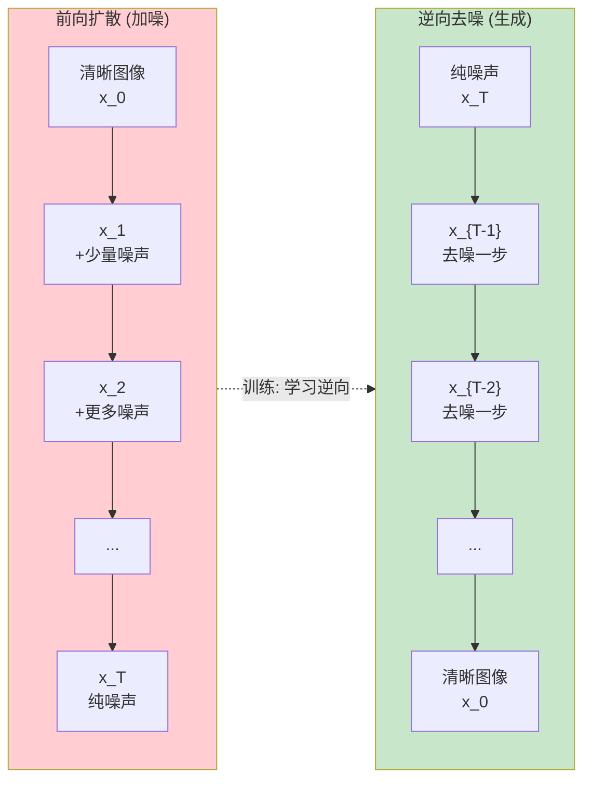
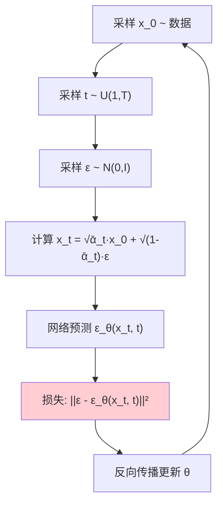
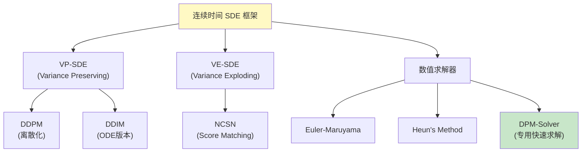
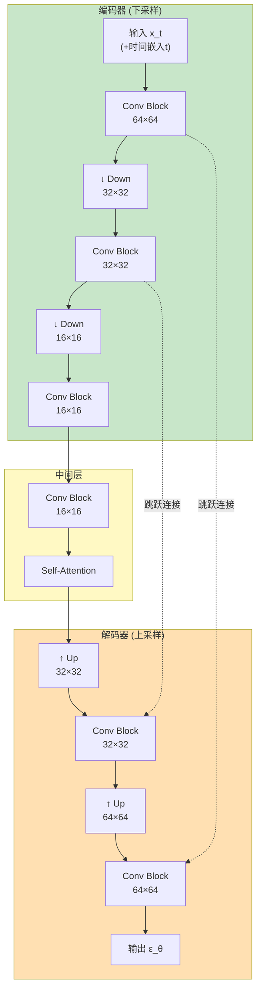
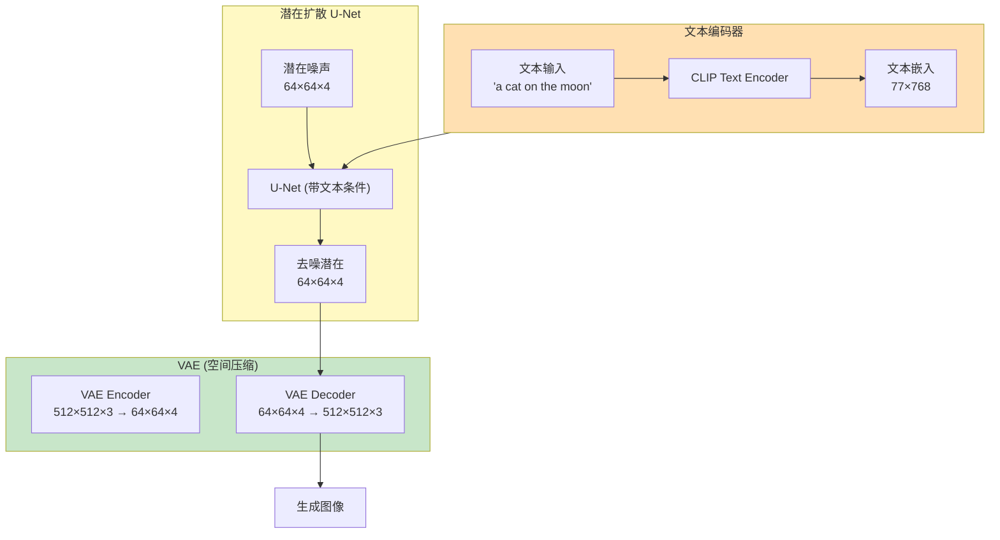

# 扩散模型深度解析 (Diffusion Models Deep Dive)

> **一句话理解**: 扩散模型就像修复古画——先在前向过程逐步给图像加噪直到变成纯噪声，然后训练一个神经网络学会一步步去噪，最终从随机噪声中"雕刻"出清晰的图像。

---

## 目录

- [论文信息](#论文信息)
- [1. 核心思想](#1-核心思想)
- [2. 前向扩散过程](#2-前向扩散过程)
- [3. 逆向去噪过程](#3-逆向去噪过程)
- [4. DDPM](#4-ddpm)
- [5. DDIM](#5-ddim)
- [6. Score-Based模型](#6-score-based模型)
- [7. U-Net架构](#7-u-net架构)
- [8. 条件扩散与Classifier Guidance](#8-条件扩散与classifier-guidance)
- [9. Classifier-Free Guidance](#9-classifier-free-guidance)
- [10. Stable Diffusion架构](#10-stable-diffusion架构)
- [11. 加速采样](#11-加速采样)
- [12. 代码实现](#12-代码实现)
- [13. 对比表格](#13-对比表格)
- [Related](#related)

---

## 论文信息

| 属性 | 内容 |
|------|------|
| **DDPM** | Ho et al., NeurIPS 2020 — 实用化扩散模型 |
| **Score-Based** | Song & Ermon, 2019 — 噪声条件分数网络 |
| **DDIM** | Song et al., ICLR 2021 — 非马尔可夫加速采样 |
| **Stable Diffusion** | Rombach et al., CVPR 2022 — 潜在扩散 |
| **Classifier-Free** | Ho & Salimans, 2022 — 无分类器引导 |

---

## 1. 核心思想

### 前向 + 逆向的直觉



### 扩散模型的两大过程

```
前向过程 (Forward / Diffusion):
  → 固定的 (不需要学习)
  → 逐步给数据加高斯噪声
  → x_0 → x_1 → x_2 → ... → x_T
  → x_T ~ N(0, I) (纯噪声)
  → 类似一滴墨水在水中扩散

逆向过程 (Reverse / Denoising):
  → 需要学习 (神经网络)
  → 逐步去除噪声
  → x_T → x_{T-1} → ... → x_0
  → 从噪声中恢复图像
  → 类似把扩散的墨水"收回"

核心洞察:
  如果我们知道每一步如何去噪
  → 就能从纯噪声生成任何图像
```

### 与其他生成模型的关系

| 模型 | 核心机制 | 关系 |
|------|----------|------|
| **VAE** | 1步编码→1步解码 | 扩散=T步VAE (层次VAE的连续极限) |
| **GAN** | 对抗博弈 | 扩散用去噪替代对抗 |
| **Flow** | 可逆变换 | 扩散是连续时间的Flow |
| **Score** | 分数匹配 | 扩散 = 离散化的Score模型 |
| **自回归** | 逐token生成 | 扩散是"逐去噪步"生成 |

---

## 2. 前向扩散过程

### 逐步加噪

```
前向过程定义:

每一步加少量高斯噪声:

  q(x_t | x_{t-1}) = N(x_t; √(1-β_t) · x_{t-1}, β_t · I)

其中:
  β_t ∈ (0, 1) 是预定义的噪声调度 (noise schedule)
  β_t 控制每步加多少噪声

等价形式:
  x_t = √(1-β_t) · x_{t-1} + √β_t · ε,  ε ~ N(0, I)

直觉:
  → √(1-β_t) < 1: 缩小原图 (保留部分信息)
  → +√β_t · ε: 加噪声
  → 每步丢失少量信息，加少量噪声
```

### 噪声调度 (Noise Schedule)

```
噪声调度 β_1, β_2, ..., β_T 的选择:

1. 线性调度 (DDPM原版):
   β_t = β_1 + (t-1)/(T-1) · (β_T - β_1)
   β_1 = 0.0001, β_T = 0.02, T = 1000

2. 余弦调度 (Improved DDPM):
   β_t 受余弦函数控制
   → 更平滑的噪声增长
   → 对高分辨率图像效果更好

3. Sigmoid调度:
   → 中间增长快，两端慢

定义:
  α_t = 1 - β_t
  ᾱ_t = α_1 · α_2 · ... · α_t (累积乘积)
```

### 直接跳转到任意步 (关键技巧)

```
最关键的数学性质:

q(x_t | x_0) = N(x_t; √ᾱ_t · x_0, (1-ᾱ_t) · I)

即: x_t = √ᾱ_t · x_0 + √(1-ᾱ_t) · ε,  ε ~ N(0, I)

意义:
  → 不需要逐步计算 x_1, x_2, ..., x_{t-1}
  → 可以直接从 x_0 跳到任意 x_t
  → 只需要 ᾱ_t 和一个随机噪声 ε

为什么重要:
  训练时:
  → 采样 (x_0, t, ε)
  → 计算 x_t = √ᾱ_t · x_0 + √(1-ᾱ_t) · ε
  → 训练网络预测 ε
  → 高效!

当 t = T (ᾱ_T ≈ 0):
  → x_T ≈ ε (纯噪声)
```

### 噪声调度的可视化

```
x_0 (清晰) → x_{T/4} → x_{T/2} → x_{3T/4} → x_T (噪声)

ᾱ_t 变化:
  t=0:    ᾱ=1.0    → x_0 完全清晰
  t=250:  ᾱ=0.8    → 轻微噪声
  t=500:  ᾱ=0.4    → 可见噪声
  t=750:  ᾱ=0.1    → 大量噪声
  t=1000: ᾱ≈0.0    → 纯噪声

关键: ᾱ_t 从1单调递减到0
     控制了"保留多少原始信息"
```

---

## 3. 逆向去噪过程

### 理想逆向

```
真正的逆向过程:
  p(x_{t-1} | x_t) = q(x_{t-1} | x_t, x_0)

但计算 q(x_{t-1} | x_t) 需要知道 x_0 (我们想生成的)
→ 无法直接使用

解决方案: 用神经网络近似
  p_θ(x_{t-1} | x_t) = N(x_{t-1}; μ_θ(x_t, t), Σ_θ(x_t, t))

→ 网络学习预测 μ_θ 和 Σ_θ
→ 从 x_t 去噪到 x_{t-1}
```

### 贝叶斯展开

```
利用贝叶斯定理:

q(x_{t-1} | x_t, x_0) ∝ q(x_t | x_{t-1}, x_0) · q(x_{t-1} | x_0)

已知 (高斯分布的乘积仍是高斯):

  q(x_{t-1} | x_t, x_0) = N(x_{t-1}; μ̃_t(x_t, x_0), β̃_t · I)

其中:

  μ̃_t = (√ᾱ_{t-1} · β_t)/(1-ᾱ_t) · x_0 + (√α_t · (1-ᾱ_{t-1}))/(1-ᾱ_t) · x_t

  β̃_t = (1-ᾱ_{t-1})/(1-ᾱ_t) · β_t

关键洞察:
  如果知道 x_0，就能算出最优的去噪均值 μ̃_t
  
  而 x_0 可以从 x_t 反推:
  x_0 = (x_t - √(1-ᾱ_t) · ε) / √ᾱ_t

  → 如果能预测 ε，就能算出 x_0，进而算出 μ̃_t
  → 这就是DDPM的核心: 训练网络预测 ε!
```

---

## 4. DDPM

**DDPM (Denoising Diffusion Probabilistic Models)** 是使扩散模型真正实用化的里程碑工作。

### DDPM的训练目标



### DDPM损失推导

```
变分下界 (ELBO的负数) 推导:

log p(x) ≥ ELBO = Σ_t E_q[D_KL(q(x_{t-1}|x_t,x_0) || p_θ(x_{t-1}|x_t))]

每项 KL 都是两个高斯的散度 → 有闭式解

DDPM的关键简化:
  → 不直接预测 μ_θ
  → 而是预测噪声 ε_θ
  → 设 Σ_θ = 固定的 σ²_t (不学习方差)

参数化:
  μ_θ(x_t, t) = 1/√α_t · (x_t - β_t/√(1-ᾱ_t) · ε_θ(x_t, t))

最终简化损失:
  L_simple = E_{t,x_0,ε} [ ||ε - ε_θ(√ᾱ_t·x_0 + √(1-ᾱ_t)·ε, t)||² ]

  就是简单的MSE! 预测噪声的MSE!
```

### DDPM采样算法

```
DDPM采样 (生成新图像):

输入: 训练好的 ε_θ
输出: 生成的图像 x_0

1. x_T ~ N(0, I)  ← 从纯噪声开始
2. for t = T, T-1, ..., 1:
     a. z ~ N(0, I)  if t > 1, else z = 0
     b. x_{t-1} = 1/√α_t · (x_t - β_t/√(1-ᾱ_t) · ε_θ(x_t, t)) + σ_t · z
3. return x_0

其中 σ_t = √β_t (或 √β̃_t)

关键:
  → 每步用 ε_θ 预测噪声
  → 从 x_t 中减去估计的噪声
  → 加少量随机噪声 (t>1时)
  → 重复T步
```

### 为什么DDPM有效

```
DDPM成功的三个关键:

1. ε参数化:
   → 预测噪声比预测原图更简单
   → 噪声的分布已知 (标准正态)
   → 网络只需要学习"去除什么样的噪声"

2. 简化损失:
   → 去掉了复杂的变分下界中的权重
   → 只保留 L_simple = ||ε - ε_θ||²
   → 虽然理论上不精确，但实际效果好很多

3. 固定方差:
   → 不学习方差 Σ_θ
   → 减少了需要学习的量
   → 提高稳定性
```

---

## 5. DDIM

**DDIM (Denoising Diffusion Implicit Models)** 解决了DDPM的最大缺点：**采样太慢**（需要1000步）。

### DDPM的问题

```
DDPM采样的速度问题:
  → T = 1000 步
  → 每步一次神经网络前向传播
  → 生成一张图需要几秒到几十秒
  → 无法实时应用

加速的想法:
  → 能不能跳步? 用更少的步骤?
  → 但DDPM是马尔可夫的 (每步依赖前一步)
  → 直接跳步会降低质量
```

### DDIM的核心创新

```
DDIM的思想:
  → 保留相同的前向过程
  → 保持相同的 ε_θ 网络
  → 但定义一个非马尔可夫的逆向过程
  → 允许跳步

关键: DDIM 不需要重新训练!
  → 用DDPM训练的模型
  → 直接用DDIM采样
  → 可以用更少的步数 (如50步)
  → 质量几乎不降

DDIM采样的数学:

给定子序列 τ = {τ_1, ..., τ_S} ⊂ {1, ..., T}

对 t = τ_S, τ_{S-1}, ..., τ_1:
  
  预测 x_0: x̂_0 = (x_t - √(1-ᾱ_t)·ε_θ(x_t)) / √ᾱ_t

  DDIM更新:
  x_{t-1} = √ᾱ_{t-1} · x̂_0 + √(1-ᾱ_{t-1} - σ²_t) · ε_θ(x_t) + σ_t · ε

  其中 σ_t 控制随机性:
    σ_t = 0  → DDIM (确定性)
    σ_t > 0  → 介于DDPM和DDIM之间
```

### DDIM vs DDPM对比

| 维度 | DDPM | DDIM |
|------|------|------|
| **采样步数** | ~1000 | ~50 |
| **采样时间** | 慢 | 快20倍 |
| **样本质量** | 🟢 高 | 🟢 高 |
| **需要重训** | — | ❌ 不需要 |
| **马尔可夫性** | ✅ | ❌ 非马尔可夫 |
| **确定性** | 随机 | 可选(σ=0时确定性) |
| **可重复性** | ❌ | ✅ (相同噪声→相同输出) |

### DDIM确定性采样的价值

```
DDIM (σ=0) 是确定性的:
  → 相同初始噪声 x_T → 相同输出 x_0
  → 这意味着可以在潜在空间中做插值

应用:
  1. 图像编辑: 
     → 采样到中间步 t
     → 编辑中间结果
     → 继续去噪到 x_0

  2. 插值:
     → 两个噪声 x_T^(1), x_T^(2) 线性插值
     → DDIM确定性地映射到图像空间
     → 图像之间平滑过渡

  3. 语义操作:
     → 在确定性的去噪轨迹上操作
```

---

## 6. Score-Based模型

**Score-Based Generative Models** (Song & Ermon) 提供了扩散模型的另一个视角，基于**分数匹配 (Score Matching)**。

### 分数函数

```
分数函数 (Score Function):
  s(x) = ∇_x log p(x)

直觉: 分数函数指向概率密度增长最快的方向
  → 在高概率区域，分数指向中心
  → 在低概率区域，分数指向高概率区域
```

### 朗之万动力学采样

```
从分数函数采样:

朗之万动力学 (Langevin Dynamics):

  x_{k+1} = x_k + (ε/2) · s(x_k) + √ε · z,  z ~ N(0, I)

直觉:
  1. 朝分数方向走一步 (向高概率区域)
  2. 加随机噪声 (探索)
  3. 重复

当 ε → 0, 步数 → ∞:
  x 的分布收敛到 p(x)

问题: 如果只有 p(x) 的非归一化形式
      → 我们不知道 s(x) = ∇ log p(x)
```

### 噪声条件分数网络 (NCSN)

```
问题: 数据流形上的分数估计不准确
  → 数据集中在低维流形上
  → 流形外的分数不可靠

解决方案: 加噪声!

  p_σ(x) = ∫ p_data(y) · N(x; y, σ²I) dy

  σ大: 数据被大幅平滑 → 分数好估计但细节丢失
  σ小: 保留细节 → 分数难估计

NCSN (Noise Conditioned Score Network):
  训练一个 s_θ(x, σ) 对多个噪声级别估计分数

  损失 (denoising score matching):
  L = E[λ(σ) · ||s_θ(x + σε, σ) + ε/σ||²]

  其中 ε ~ N(0, I)
```

### 统一视角: 扩散 = 分数模型

```
关键洞察 (Song et al., 2021):

DDPM 和 Score-Based 模型是等价的!

连接:
  ε_θ(x_t, t) ≈ -√(1-ᾱ_t) · s_θ(x_t, t)

  预测噪声 ↔ 估计分数

统一框架: SDE (随机微分方程)

  前向 SDE (连续时间扩散):
    dx = f(x,t)dt + g(t)dw

  逆向 SDE (从噪声生成):
    dx = [f(x,t) - g(t)² ∇log p_t(x)] dt + g(t) dw̄

其中 ∇log p_t(x) 就是分数函数!

→ DDPM = 离散化的逆向SDE
→ DDIM = 概率流ODE (无随机性的确定性版本)
→ NCSN = 分数匹配训练
```

### 统一框架的意义



---

## 7. U-Net架构

**U-Net** 是扩散模型中 ε_θ 网络的标准架构，具有**编码器-解码器 + 跳跃连接**的结构。

### U-Net结构



### U-Net的关键组件

#### 1. 残差块 (ResBlock) + 时间嵌入

```python
class ResBlock(nn.Module):
    """带时间嵌入的残差块"""
    def __init__(self, in_ch, out_ch, time_dim):
        super().__init__()
        self.norm1 = nn.GroupNorm(8, in_ch)
        self.conv1 = nn.Conv2d(in_ch, out_ch, 3, padding=1)
        
        self.time_mlp = nn.Linear(time_dim, out_ch)  # 时间嵌入
        
        self.norm2 = nn.GroupNorm(8, out_ch)
        self.conv2 = nn.Conv2d(out_ch, out_ch, 3, padding=1)
        
        if in_ch != out_ch:
            self.skip = nn.Conv2d(in_ch, out_ch, 1)
        else:
            self.skip = nn.Identity()

    def forward(self, x, t):
        h = self.conv1(F.silu(self.norm1(x)))
        
        # 注入时间信息
        h += self.time_mlp(silu(t))[:, :, None, None]
        
        h = self.conv2(F.silu(self.norm2(h)))
        return h + self.skip(x)
```

#### 2. 时间嵌入

```python
class SinusoidalPositionEmbedding(nn.Module):
    """正弦位置编码 (类似Transformer)"""
    def __init__(self, dim):
        super().__init__()
        self.dim = dim

    def forward(self, time):
        # time: (B,) 整数时间步
        device = time.device
        half_dim = self.dim // 2
        embeddings = math.log(10000) / (half_dim - 1)
        embeddings = torch.exp(torch.arange(
            half_dim, device=device) * -embeddings)
        embeddings = time[:, None] * embeddings[None, :]
        embeddings = torch.cat((
            embeddings.sin(), embeddings.cos()
        ), dim=-1)
        return embeddings
```

#### 3. 自注意力

```python
class SelfAttention(nn.Module):
    """中间层的自注意力"""
    def __init__(self, channels):
        super().__init__()
        self.norm = nn.GroupNorm(8, channels)
        self.qkv = nn.Conv2d(channels, channels * 3, 1)
        self.proj = nn.Conv2d(channels, channels, 1)

    def forward(self, x):
        b, c, h, w = x.shape
        h_norm = self.norm(x)
        qkv = self.qkv(h_norm)
        q, k, v = qkv.chunk(3, dim=1)
        
        # 注意力计算
        q = q.reshape(b, c, h * w).permute(0, 2, 1)
        k = k.reshape(b, c, h * w)
        v = v.reshape(b, c, h * w).permute(0, 2, 1)
        
        attn = F.softmax(q @ k / (c ** 0.5), dim=-1)
        out = (attn @ v).permute(0, 2, 1).reshape(b, c, h, w)
        
        return x + self.proj(out)
```

### 为什么U-Net适合扩散

```
U-Net 的优势:

1. 多尺度特征:
   → 编码器捕获不同分辨率的特征
   → 对于去噪任务很重要 (粗+细噪声)

2. 跳跃连接:
   → 保留原始空间信息
   → 帮助恢复细节

3. 时间条件:
   → 通过时间嵌入知道当前噪声级别
   → 不同t用不同的去噪策略

4. 容量与效率:
   → U-Net参数效率高
   → 适合大分辨率图像
```

---

## 8. 条件扩散与Classifier Guidance

### 条件扩散模型

```
无条件: p(x_{t-1} | x_t)
有条件: p(x_{t-1} | x_t, c)  其中 c 是条件

c 可以是:
  → 文本描述 (text-to-image)
  → 类别标签 (class-conditional)
  → 参考图像 (image-to-image)
  → 低分辨率图像 (super-resolution)
```

### Classifier Guidance

```
Classifier Guidance (Dhariwal & Nichol, 2021):

核心思想: 用分类器的梯度引导生成

条件分数:
  ∇log p(x_t | c) = ∇log p(x_t) + ∇log p(c | x_t)

直觉:
  → 无条件分数: ∇log p(x_t) (已学习)
  → 分类器梯度: ∇log p(c | x_t) (用分类器计算)
  → 两者相加 = 条件分数

采样修改:
  ε_θ_guided = ε_θ(x_t) - √(1-ᾱ_t) · s · ∇log p(c | x_t)

  其中 s 是引导强度 (guidance scale)

需要:
  → 训练一个噪声鲁棒的分类器 p(c | x_t)
  → 在每个噪声级别t都能分类
```

### Classifier Guidance的问题

```
局限:
1. 需要额外训练分类器
   → 在带噪图像上训练
   → 增加工程复杂度

2. 分类器可能在强噪声下失效
   → 高噪声时梯度不可靠

3. 引导强度需要调节
   → 太强: 生成不自然的图像
   → 太弱: 条件控制力不够
```

---

## 9. Classifier-Free Guidance

**Classifier-Free Guidance (CFG)** 是目前最常用的条件引导方法，**不需要额外的分类器**。

### 核心思想

```
Classifier-Free Guidance (Ho & Salimans, 2022):

不再训练分类器，而是同时训练条件和无条件模型:

训练:
  → 以一定概率丢弃条件 (如10%)
  → 有条件: ε_θ(x_t, c)
  → 无条件: ε_θ(x_t, ∅)
  → 同一个网络，只是输入不同

推理:
  ε_guided = ε_uncond + s · (ε_cond - ε_uncond)

  其中 s 是引导强度

直觉:
  → ε_cond - ε_uncond 是"条件方向"
  → 放大这个方向 s 倍
  → 更强的条件控制
```

### CFG的数学推导

```
从贝叶斯:
  ∇log p(x|c) = ∇log p(x) + ∇log p(c|x)

Classifier-Free 近似:
  用 ∇log p(c|x) ∝ ∇log p(x|c) - ∇log p(x)

  → 不需要显式分类器
  → 用条件和无条件分数的差

最终:
  ε_guided = (1+s) · ε_θ(x_t, c) - s · ε_θ(x_t, ∅)
  
  或等价地:
  ε_guided = ε_uncond + s · (ε_cond - ε_uncond)

引导强度 s:
  → s = 1: 标准条件采样
  → s > 1: 增强条件 (更忠实于条件)
  → s = 0: 无条件
  → s < 0: 反向条件
```

### CFG的效果

```
引导强度的影响:

s = 0:   无条件 → 随机图像
s = 1:   正常条件 → 准确但可能模糊
s = 3-7: 强引导 → 高质量、忠于条件 ← 实践推荐
s = 10+: 过度引导 → 可能扭曲/伪影

Stable Diffusion 默认:
  → s = 7.5 (text-to-image)

CFG的优势:
  → 不需要分类器
  → 只需一次训练
  → 条件控制力强
  → 生成质量高

CFG的代价:
  → 每步需要两次前向 (条件+无条件)
  → 2倍计算量
```

---

## 10. Stable Diffusion架构

**Stable Diffusion (Latent Diffusion)** 是最流行的开源文本到图像扩散模型，核心创新是在**潜在空间**中做扩散。

### 架构总览



### 为什么在潜在空间扩散

```
像素空间扩散的问题:
  → 512×512×3 = 786,432 维
  → U-Net在这个维度计算量大
  → 多次前向(去噪步)极其缓慢

潜在空间扩散的解决方案:
  → 用VAE压缩: 512×512×3 → 64×64×4
  → 压缩比: 48倍
  → 在64×64×4潜在空间做扩散
  → 计算量减少48倍
  → VAE解码器恢复到像素空间

结果:
  → 生成质量几乎不降
  → 速度大幅提升
  → 可以在消费级GPU上运行
```

### Stable Diffusion的组件

| 组件 | 作用 | 模型 |
|------|------|------|
| **文本编码器** | 编码文本提示 | CLIP ViT-L/14 |
| **VAE编码器** | 压缩图像到潜在空间 | KL-VAE |
| **U-Net** | 在潜在空间去噪 | 潜在U-Net |
| **VAE解码器** | 恢复潜在为图像 | KL-VAE |
| **调度器** | 控制去噪步数和方式 | DDIM/DPM++ |

### 交叉注意力 (Cross-Attention)

```
文本条件如何注入U-Net:

在U-Net的每个ResBlock后加 Cross-Attention:

  潜在特征 (Query): x ∈ R^{B×C×H×W}
  文本嵌入 (Key/Value): text ∈ R^{B×L×D}

  Cross-Attention:
    Q = W_q · x
    K = W_k · text
    V = W_v · text
    
    Attention(Q, K, V) = softmax(Q·K^T/√d) · V

效果:
  → 每个空间位置都"看"文本
  → 文本中的词影响对应的空间区域
  → "cat" → 猫的位置
  → "moon" → 月亮的位置
```

---

## 11. 加速采样

### 扩散模型的采样加速

| 方法 | 步数 | 质量 | 方法类型 |
|------|------|------|----------|
| **DDPM** | ~1000 | 🟢 高 | 马尔可夫 |
| **DDIM** | ~50 | 🟢 高 | 非马尔可夫 |
| **DPM-Solver** | ~20 | 🟢 高 | ODE求解 |
| **DPM++** | ~10-20 | 🟢 高 | 改进ODE |
| **UniPC** | ~10 | 🟢 高 | 统一求解 |
| **Consistency Model** | ~1-4 | 🟡 中 | 蒸馏 |
| **LCM** | ~1-4 | 🟡 中高 | 蒸馏 |

### DPM-Solver

```
DPM-Solver (Lu et al., 2022):

核心洞察:
  → 扩散模型的逆向过程是一个ODE
  → 可以用高效的ODE求解器
  → DPM-Solver是专门为扩散ODE设计的

效果:
  → 20步达到DDIM 100步的质量
  → 10步也可用
  → 目前Stable Diffusion默认调度器之一

变体:
  → DPM-Solver++ (更稳定)
  → DPM-Solver-v3 (最新)
```

### Consistency Models

```
Consistency Models (Song et al., 2023):

革命性思想:
  → 训练一个网络直接从 x_T 映射到 x_0
  → 1步生成!

两种训练方式:
1. 蒸馏: 从训练好的扩散模型蒸馏
2. 直接: 独立训练 (不需要扩散模型)

质量:
  → 1步: 可用但质量中等
  → 4步: 质量较好
  → 仍然不如100步扩散

意义:
  → 扩散模型的"实时"之路
  → LCM (Latent Consistency Model) 是其应用
```

---

## 12. 代码实现

### 完整DDPM实现

```python
import torch
import torch.nn as nn
import torch.nn.functional as F
import math
from tqdm import tqdm


class GaussianDiffusion:
    """高斯扩散过程"""

    def __init__(self, num_timesteps=1000, beta_start=1e-4,
                 beta_end=0.02, device='cuda'):
        self.T = num_timesteps
        self.device = device

        # 线性噪声调度
        self.betas = torch.linspace(
            beta_start, beta_end, num_timesteps, device=device
        )
        self.alphas = 1.0 - self.betas
        self.alpha_bars = torch.cumprod(self.alphas, dim=0)

    def q_sample(self, x_0, t, noise=None):
        """前向过程: 从x_0直接到x_t"""
        if noise is None:
            noise = torch.randn_like(x_0)

        sqrt_ab = torch.sqrt(self.alpha_bars[t])[:, None, None, None]
        sqrt_1mab = torch.sqrt(1.0 - self.alpha_bars[t])[:, None, None, None]

        return sqrt_ab * x_0 + sqrt_1mab * noise, noise

    @torch.no_grad()
    def p_sample(self, model, x_t, t, t_index):
        """逆向过程一步: 从x_t到x_{t-1}"""
        betas_t = self.betas[t][:, None, None, None]
        sqrt_1mab = torch.sqrt(1.0 - self.alpha_bars[t])[:, None, None, None]
        sqrt_recip_ab = torch.sqrt(1.0 / self.alphas[t])[:, None, None, None]

        # 预测噪声
        pred_noise = model(x_t, t)

        # 计算均值
        model_mean = sqrt_recip_ab * (
            x_t - betas_t / sqrt_1mab * pred_noise
        )

        if t_index == 0:
            return model_mean
        else:
            # 加随机噪声
            noise = torch.randn_like(x_t)
            sigma = torch.sqrt(betas_t)
            return model_mean + sigma * noise

    @torch.no_grad()
    def sample(self, model, image_size, batch_size=16, channels=3):
        """完整DDPM采样"""
        model.eval()
        img = torch.randn(batch_size, channels, image_size, image_size,
                          device=self.device)

        for i in tqdm(reversed(range(self.T)), total=self.T):
            t = torch.full((batch_size,), i, device=self.device,
                          dtype=torch.long)
            img = self.p_sample(model, img, t, i)

        return img


class DDPMTrainer:
    """DDPM训练器"""

    def __init__(self, model, diffusion, lr=2e-4):
        self.model = model
        self.diffusion = diffusion
        self.optimizer = torch.optim.AdamW(model.parameters(), lr=lr)

    def train_step(self, x_0):
        """一步训练"""
        self.optimizer.zero_grad()

        batch_size = x_0.shape[0]
        device = x_0.device

        # 1. 随机采样时间步
        t = torch.randint(0, self.diffusion.T, (batch_size,), device=device)

        # 2. 前向加噪
        x_t, noise = self.diffusion.q_sample(x_0, t)

        # 3. 预测噪声
        pred_noise = self.model(x_t, t)

        # 4. MSE损失
        loss = F.mse_loss(pred_noise, noise)

        # 5. 反向传播
        loss.backward()
        self.optimizer.step()

        return loss.item()
```

### DDIM采样器

```python
class DDIMSampler:
    """DDIM采样器 (支持跳步加速)"""

    def __init__(self, diffusion, ddim_steps=50, eta=0.0):
        """
        eta: 控制随机性
          0 = DDIM (确定性)
          1 = DDPM (随机)
        """
        self.diffusion = diffusion
        self.ddim_steps = ddim_steps
        self.eta = eta

        # 选择时间步子序列
        step_ratio = diffusion.T // ddim_steps
        self.timesteps = list(range(0, diffusion.T, step_ratio))
        self.timesteps = list(reversed(self.timesteps))

    @torch.no_grad()
    def sample(self, model, image_size, batch_size=16, channels=3):
        """DDIM采样"""
        device = self.diffusion.device
        img = torch.randn(batch_size, channels, image_size, image_size,
                         device=device)

        for i, t in enumerate(self.timesteps):
            t_batch = torch.full((batch_size,), t, device=device,
                                dtype=torch.long)

            # 预测噪声
            pred_noise = model(img, t_batch)

            # 预测x_0
            alpha_bar_t = self.diffusion.alpha_bars[t]
            x_0_pred = (img - torch.sqrt(1 - alpha_bar_t) * pred_noise) \
                       / torch.sqrt(alpha_bar_t)

            # 计算下一步
            if i < len(self.timesteps) - 1:
                t_prev = self.timesteps[i + 1]
                alpha_bar_prev = self.diffusion.alpha_bars[t_prev]
            else:
                alpha_bar_prev = torch.tensor(1.0, device=device)

            # DDIM更新
            sigma = self.eta * torch.sqrt(
                (1 - alpha_bar_prev) / (1 - alpha_bar_t) *
                (1 - alpha_bar_t / alpha_bar_prev)
            )

            direction = torch.sqrt(
                max(1 - alpha_bar_prev - sigma**2, 1e-10)
            ) * pred_noise

            noise = sigma * torch.randn_like(img) if sigma > 0 else 0

            img = torch.sqrt(alpha_bar_prev) * x_0_pred + direction + noise

        return img
```

### Classifier-Free Guidance实现

```python
class CFGDiffusion:
    """Classifier-Free Guidance 条件扩散"""

    def __init__(self, model, diffusion, guidance_scale=7.5):
        self.model = model
        self.diffusion = diffusion
        self.scale = guidance_scale

    def train_step(self, x_0, condition, uncond_prob=0.1):
        """
        训练: 以一定概率丢弃条件
        condition: 文本嵌入或类别
        """
        batch_size = x_0.shape[0]
        device = x_0.device

        # 随机决定哪些样本无条件
        uncond_mask = torch.rand(batch_size) < uncond_prob
        condition_train = condition.clone()
        condition_train[uncond_mask] = 0  # 无条件用0填充

        t = torch.randint(0, self.diffusion.T, (batch_size,), device=device)
        x_t, noise = self.diffusion.q_sample(x_0, t)

        pred_noise = self.model(x_t, t, condition_train)
        loss = F.mse_loss(pred_noise, noise)

        return loss

    @torch.no_grad()
    def sample(self, image_size, condition, batch_size=1, channels=3):
        """CFG采样"""
        device = self.diffusion.device
        img = torch.randn(batch_size, channels, image_size, image_size,
                         device=device)

        for i in reversed(range(self.diffusion.T)):
            t = torch.full((batch_size,), i, device=device, dtype=torch.long)

            # 条件和无条件各跑一次
            noise_cond = self.model(img, t, condition)
            noise_uncond = self.model(img, t, torch.zeros_like(condition))

            # CFG: 放大条件方向
            noise_guided = noise_uncond + self.scale * (
                noise_cond - noise_uncond
            )

            # DDPM去噪一步
            img = self.diffusion.p_sample_step(img, noise_guided, t, i)

        return img
```

---

## 13. 对比表格

### 扩散模型变体对比

| 模型 | 采样步数 | 质量(FID) | 条件 | 核心创新 |
|------|----------|-----------|------|----------|
| **DDPM** | 1000 | 🟢 高 | ❌ | ε参数化 |
| **DDIM** | 50 | 🟢 高 | ❌ | 非马尔可夫加速 |
| **Improved DDPM** | 1000 | 🟢 更高 | ✅ | 学习方差+余弦调度 |
| **Guided Diffusion** | 1000 | 🟢 极高 | ✅ | Classifier Guidance |
| **GLIDE** | 1000 | 🟢 极高 | ✅文本 | CFG文本条件 |
| **DALL-E 2** | 1000 | 🟢 高 | ✅文本 | CLIP+扩散 |
| **Stable Diffusion** | 20-50 | 🟢 高 | ✅文本 | 潜在扩散 |
| **Imagen** | 1000 | 🟢 极高 | ✅文本 | 大T5+级联 |
| **DALL-E 3** | — | 🟢 极高 | ✅文本 | 重描述+RLHF |
| **Consistency** | 1-4 | 🟡 中 | ❌ | 1步生成 |

### 采样方法对比

| 方法 | 步数 | 时间 | 质量 | 确定性 | 额外训练 |
|------|------|------|------|--------|----------|
| **DDPM** | 1000 | ~30s | 🟢 最高 | ❌ | — |
| **DDIM** | 50 | ~2s | 🟢 高 | ✅(σ=0) | ❌ |
| **DPM++ 2M** | 20 | ~0.8s | 🟢 高 | ✅ | ❌ |
| **UniPC** | 10 | ~0.4s | 🟢 高 | ✅ | ❌ |
| **LCM** | 4 | ~0.2s | 🟡 中高 | ❌ | ✅(蒸馏) |
| **Consistency** | 1 | ~0.05s | 🟡 中 | ✅ | ✅(蒸馏) |

### 文生图模型对比

| 模型 | 架构 | 空间 | 开源 | 分辨率 | 特色 |
|------|------|------|------|--------|------|
| **Stable Diffusion** | 潜在扩散 | 64×64×4 | ✅ | 512 | 最流行的开源 |
| **DALL-E 3** | 扩散 | 像素 | ❌ | 1024 | 最佳提示词理解 |
| **Midjourney v6** | 扩散 | 未知 | ❌ | 1024 | 最佳美学质量 |
| **Imagen 3** | 级联扩散 | 像素 | ❌ | 1024 | 最佳文字渲染 |
| **Flux** | Rectified Flow | 潜在 | ✅ | 1024 | 最新开源SOTA |

---

## Related

- [[深度学习/Generative_Models/GAN_Deep_Dive]] — GAN深度解析（对比生成模型）
- [[深度学习/Generative_Models/VAE_Deep_Dive]] — VAE深度解析（扩散的VAE组件）
- [[深度学习/DL_Fundamentals/DL_Fundamentals]] — 深度学习基础
- [[深度学习/Neural_Network_Core/Neural_Network_Core]] — 神经网络核心（U-Net/Attention）
- [[深度学习/State_Space_Models/State_Space_Models]] — 状态空间模型（与SDE的联系）
- [[深度学习/Transfer_Learning/Transfer_Learning]] — 迁移学习（预训练扩散模型）
- [[数学基础/Probability_Statistics/Probability_Statistics]] — 概率统计（扩散过程基础）
- [[数学基础/Information_Theory/Information_Theory]] — 信息论（ELBO/KL散度）
- [[概念/Safety/model-watermark]] — 模型水印（AI生成内容检测）
