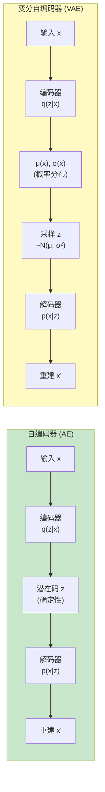
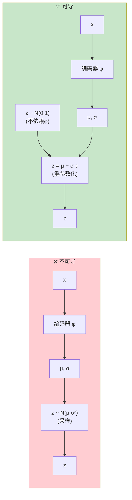
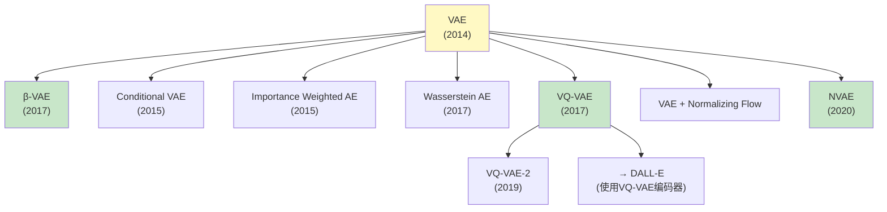
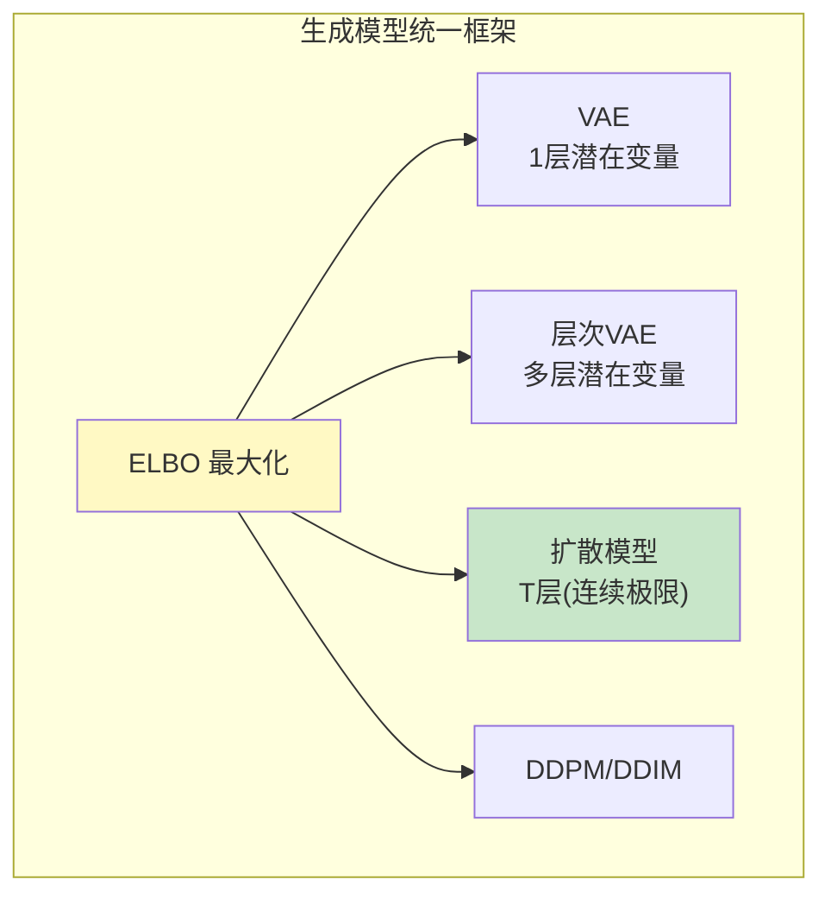

# VAE深度解析 (VAE Deep Dive)

> **一句话理解**: VAE就像一个学会'压缩-解压'的大脑——编码器把图像压缩成概率分布(均值+方差)，解码器再从这个分布采样重建图像，通过让重建尽可能准确、同时让分布接近标准正态，学会了数据的潜在结构。

---

## 目录

- [论文信息](#论文信息)
- [1. VAE核心思想](#1-vae核心思想)
- [2. 数学推导](#2-数学推导)
- [3. 重参数化技巧](#3-重参数化技巧)
- [4. ELBO详解](#4-elbo详解)
- [5. VAE架构](#5-vae架构)
- [6. β-VAE](#6-β-vae)
- [7. VAE变体](#7-vae变体)
- [8. VAE与扩散模型的关系](#8-vae与扩散模型的关系)
- [9. 代码实现](#9-代码实现)
- [10. 对比表格](#10-对比表格)
- [11. 应用场景](#11-应用场景)
- [Related](#related)

---

## 论文信息

| 属性 | 内容 |
|------|------|
| **论文** | Auto-Encoding Variational Bayes |
| **作者** | Kingma & Welling |
| **机构** | University of Amsterdam |
| **发表** | ICLR 2014 |
| **影响** | 开创深度生成模型+变分推断框架 |

---

## 1. VAE核心思想

### 从AE到VAE



### AE vs VAE 的本质区别

| 维度 | 自编码器 (AE) | 变分自编码器 (VAE) |
|------|---------------|-------------------|
| **潜在空间** | 确定点 z | 概率分布 N(μ,σ²) |
| **可生成性** | ❌ 无法从随机z生成 | ✅ 可从N(0,1)采样生成 |
| **潜在空间结构** | 不规则 | 近似标准正态 |
| **插值** | ❌ 不连续 | ✅ 平滑插值 |
| **概率框架** | ❌ 无 | ✅ 生成模型 |
| **训练目标** | 重建误差 | ELBO (重建+KL) |

### VAE的生成能力

```
为什么AE不能生成，VAE可以?

AE的潜在空间:
  → 训练数据的潜在码是离散点
  → 点之间的区域无意义
  → 随机采样的z可能解码出垃圾

VAE的潜在空间:
  → 每个数据点映射为一个分布
  → 分布互相重叠 → 填充潜在空间
  → KL项约束所有分布接近N(0,I)
  → 从N(0,I)随机采样 → 总能生成合理样本
```

---

## 2. 数学推导

### 问题设定

```
生成模型目标:
  学习数据的真实分布 p_data(x)
  使模型分布 p_θ(x) ≈ p_data(x)

  p_θ(x) = ∫ p_θ(x|z) p(z) dz

  其中:
  p(z) = N(0, I)  ← 先验 (标准正态)
  p_θ(x|z) ← 解码器 (似然)

问题: 这个积分无法解析求解 (z的维度高)
```

### 变分推断

```
引入编码器 q_φ(z|x) 来近似真实后验 p_θ(z|x):

  真实后验: p_θ(z|x) = p_θ(x|z)p(z) / p_θ(x)
  → 分母 p_θ(x) 无法计算 (就是那个积分)

  变分近似: q_φ(z|x) ≈ p_θ(z|x)
  → q_φ(z|x) = N(μ_φ(x), σ²_φ(x))
  → 编码器输出分布参数

目标: 让 q_φ(z|x) 尽可能接近 p_θ(z|x)
度量: KL散度

  KL(q_φ(z|x) || p_θ(z|x)) ≥ 0
```

### ELBO推导

```
从对数似然出发:

  log p_θ(x)
  = log ∫ p_θ(x,z) dz
  = log ∫ p_θ(x,z) · q_φ(z|x) / q_φ(z|x) dz
  = log E_{z~q_φ} [p_θ(x,z) / q_φ(z|x)]
  ≥ E_{z~q_φ} [log p_θ(x,z) / q_φ(z|x)]   (Jensen不等式)
  = E_{z~q_φ} [log p_θ(x|z) + log p(z) - log q_φ(z|x)]
  = E_{z~q_φ} [log p_θ(x|z)] - KL(q_φ(z|x) || p(z))

  = ELBO

所以:
  log p_θ(x) ≥ ELBO

  且 log p_θ(x) = ELBO + KL(q_φ(z|x) || p_θ(z|x))

  → 最大化ELBO 等价于:
     1. 最大化数据似然 log p_θ(x)
     2. 最小化 KL(q_φ(z|x) || p_θ(z|x))
```

### ELBO的直觉解读

```
ELBO = E_{z~q_φ}[log p_θ(x|z)] - KL(q_φ(z|x) || p(z))
       \________________________/   \______________________/
           重建项                      正则化项
       (Reconstruction Term)        (Regularization Term)

重建项:
  → 采样z，解码，看重建好不好
  → 越大 = 重建越准确

正则化项 (KL):
  → 让编码器输出的分布接近标准正态
  → 越小 = 潜在空间越规整

VAE训练: 最大化 ELBO
  = 最大化 重建项 - KL项
  = 平衡 重建准确度 和 潜在空间规整度
```

### KL散度的闭式解

```
当 q_φ(z|x) = N(μ_i, σ²_i) 和 p(z) = N(0, 1) 都是高斯时:

KL(q || p) = Σ_i ½ (μ_i² + σ²_i - log σ²_i - 1)

这个闭式解可以直接用PyTorch计算!

对于 d 维潜在空间:
KL = ½ Σ_{i=1}^{d} (μ_i² + σ²_i - log(σ²_i) - 1)
```

---

## 3. 重参数化技巧

### 问题的核心

```
VAE训练需要:
  最大化 ELBO = E_{z~q_φ(z|x)}[log p_θ(x|z)] - KL(q_φ(z|x)||p(z))

第一项需要对 z ~ N(μ_φ(x), σ²_φ(x)) 求期望
→ 需要从 q_φ 中采样 z
→ 但采样操作不可导!
→ 无法用反向传播更新 φ

z ~ N(μ_φ(x), σ²_φ(x))
↑ 这一步没有梯度
```

### 重参数化解决方案



### 数学表达

```
原来:  z ~ N(μ_φ(x), σ²_φ(x))     ← 不可导

重参数化:
  ε ~ N(0, 1)                     ← 从标准正态采样 (不依赖φ)
  z = μ_φ(x) + σ_φ(x) · ε          ← 确定性变换 (可导!)

现在:
  ∂z/∂φ = ∂μ/∂φ + ε · ∂σ/∂φ       ← 梯度可以流过
  → 反向传播正常工作!
```

### 为什么重参数化有效

```
数学上等价:
  z = μ + σ·ε, ε ~ N(0,1)
  → z ~ N(μ, σ²)   ✓ 与直接采样同分布

但梯度可以流过:
  z 的值取决于 μ 和 σ
  → log p_θ(x|z) 对 z 有梯度
  → z 对 μ,σ 有梯度 (通过重参数化)
  → μ,σ 对 φ 有梯度
  → 完整的反向传播链

直觉:
  把随机性"外化"到 ε
  ε 是固定的 (每次采样)
  φ 只控制 μ,σ → 梯度正常
```

---

## 4. ELBO详解

### ELBO的分解

```
ELBO 有多种等价分解方式:

1. 标准形式:
   ELBO = E_q[log p(x|z)] - KL(q(z|x) || p(z))

2. 熵分解:
   ELBO = E_q[log p(x,z)] + H(q(z|x))
   其中 H 是熵

3. 重要性加权:
   ELBO_IWAE = E_{z_1,...,z_k ~ q} [log (1/k Σ p(x,z_i)/q(z_i|x))]
   → k越大，上界越紧 → 似然估计越好
```

### 重建项详解

```
E_{z~q_φ}[log p_θ(x|z)]

对于不同类型的解码器:

1. 高斯解码器 p(x|z) = N(μ_θ(z), I):
   log p(x|z) = -½ ||x - μ_θ(z)||² + C
   → 重建项 = -MSE(x, μ_θ(z)) / 2
   → 等价于最小化MSE!

2. 伯努利解码器 p(x|z) = Bernoulli(π_θ(z)):
   log p(x|z) = x·log π + (1-x)·log(1-π)
   → 重建项 = -BCE(x, π_θ(z))
   → 等价于最小化二元交叉熵

实践:
  → 连续图像: 用MSE (或高斯NLL)
  → 二值图像: 用BCE
```

### KL项详解

```
KL(q_φ(z|x) || N(0,I))

作用:
1. 让每个 q_φ(z|x) 的均值 μ(x) → 0
   → 所有编码集中在原点附近

2. 让方差 σ²(x) → 1
   → 编码有合理的"覆盖范围"

3. 整体效果:
   → 潜在空间被"填满"
   → 从N(0,I)随机采样 → 落在合理区域

如果KL项太强 (β太大):
  → μ→0, σ→1
  → 所有编码都一样 → 忽略输入信息
  → 后验坍缩 (Posterior Collapse)

如果KL项太弱 (β太小):
  → 编码器记住每个样本
  → 潜在空间不规整 → 退化为AE
```

### 后验坍缩问题

```
后验坍缩 (Posterior Collapse / KL Vanishing):

当解码器很强时 (如自回归解码器):
  → 解码器可以不依赖z直接生成x
  → z没有提供额外信息
  → q_φ(z|x) → p(z) (编码器输出 = 先验)
  → KL → 0
  → z被忽略!

解决方案:
1. KL退火 (KL Annealing):
   → 训练初期 β=0, 逐渐增加到1
   → 先学好重建, 再正则化

2. Free-bits:
   → 每个维度的KL至少保留 λ bits
   → KL_i < λ 时不惩罚

3. 弱化解码器:
   → 使用较浅的解码器
   → 让它"需要"z的信息

4. β < 1 (β-VAE):
   → 降低KL权重
   → 保留更多信息
```

---

## 5. VAE架构

### 编码器 (推理网络)

```python
class Encoder(nn.Module):
    """VAE编码器: 输入x, 输出μ和log σ²"""
    def __init__(self, input_dim, hidden_dim, latent_dim):
        super().__init__()
        self.encoder = nn.Sequential(
            nn.Linear(input_dim, hidden_dim),
            nn.ReLU(),
            nn.Linear(hidden_dim, hidden_dim),
            nn.ReLU(),
        )
        # 输出μ和log σ² (注意: 用log是为了保证σ>0)
        self.fc_mu = nn.Linear(hidden_dim, latent_dim)
        self.fc_logvar = nn.Linear(hidden_dim, latent_dim)

    def forward(self, x):
        h = self.encoder(x)
        mu = self.fc_mu(h)
        logvar = self.fc_logvar(h)
        return mu, logvar
```

### 解码器 (生成网络)

```python
class Decoder(nn.Module):
    """VAE解码器: 输入z, 输出重建的x"""
    def __init__(self, latent_dim, hidden_dim, output_dim):
        super().__init__()
        self.decoder = nn.Sequential(
            nn.Linear(latent_dim, hidden_dim),
            nn.ReLU(),
            nn.Linear(hidden_dim, hidden_dim),
            nn.ReLU(),
            nn.Linear(hidden_dim, output_dim),
            nn.Sigmoid()  # 假设像素值在[0,1]
        )

    def forward(self, z):
        return self.decoder(z)
```

### 卷积VAE架构

```python
class ConvVAE(nn.Module):
    """用于图像的卷积VAE"""
    def __init__(self, latent_dim=128):
        super().__init__()
        
        # 编码器: 图像 → 潜在分布
        self.encoder = nn.Sequential(
            nn.Conv2d(3, 32, 4, 2, 1),    # 64→32
            nn.ReLU(),
            nn.Conv2d(32, 64, 4, 2, 1),   # 32→16
            nn.ReLU(),
            nn.Conv2d(64, 128, 4, 2, 1),  # 16→8
            nn.ReLU(),
            nn.Conv2d(128, 256, 4, 2, 1), # 8→4
            nn.ReLU(),
        )
        self.fc_mu = nn.Linear(256 * 4 * 4, latent_dim)
        self.fc_logvar = nn.Linear(256 * 4 * 4, latent_dim)
        
        self.fc_decode = nn.Linear(latent_dim, 256 * 4 * 4)
        
        # 解码器: 潜在 → 图像
        self.decoder = nn.Sequential(
            nn.ConvTranspose2d(256, 128, 4, 2, 1),  # 4→8
            nn.ReLU(),
            nn.ConvTranspose2d(128, 64, 4, 2, 1),   # 8→16
            nn.ReLU(),
            nn.ConvTranspose2d(64, 32, 4, 2, 1),    # 16→32
            nn.ReLU(),
            nn.ConvTranspose2d(32, 3, 4, 2, 1),     # 32→64
            nn.Sigmoid(),
        )

    def reparameterize(self, mu, logvar):
        """重参数化技巧"""
        std = torch.exp(0.5 * logvar)
        eps = torch.randn_like(std)  # ε ~ N(0,I)
        return mu + eps * std

    def forward(self, x):
        # 编码
        h = self.encoder(x)
        h = h.view(h.size(0), -1)
        mu = self.fc_mu(h)
        logvar = self.fc_logvar(h)
        
        # 重参数化采样
        z = self.reparameterize(mu, logvar)
        
        # 解码
        h_decoded = self.fc_decode(z).view(-1, 256, 4, 4)
        x_recon = self.decoder(h_decoded)
        
        return x_recon, mu, logvar
```

---

## 6. β-VAE

**β-VAE** (Higgins et al., ICLR 2017) 是VAE的重要变体，引入一个权重系数β来控制KL项，实现**解耦表征学习**。

### 核心思想

```
标准VAE ELBO:
  ELBO = E_q[log p(x|z)] - KL(q(z|x) || p(z))

β-VAE:
  ELBO_β = E_q[log p(x|z)] - β · KL(q(z|x) || p(z))

当 β > 1:
  → 更强调KL正则化
  → 潜在空间更规整
  → 鼓励解耦 (disentanglement)
  → 但重建质量下降

当 β = 1: 标准 VAE
当 β < 1: 更注重重建 (较少解耦)
```

### 什么是解耦表征

```
解耦表征 (Disentangled Representation):

潜在空间 z 的每个维度 z_i 控制数据的一个"语义因子":

示例 (人脸生成):
  z_1 → 控制发型
  z_2 → 控制表情
  z_3 → 控制肤色
  z_4 → 控制年龄
  z_5 → 控制光照
  ...

每个维度独立控制一个变化因子
→ 可解释的潜在空间
→ 可控生成
```

### β-VAE的解耦机制

```
为什么增大β能促进解耦?

直觉:
  → β大 → KL约束强
  → 编码器被迫用最"经济"的方式编码信息
  → 每个维度只编码一个独立的变化因子
  → 避免冗余编码

信息瓶颈视角:
  → KL项限制了 z 中的信息量
  → 当信息预算有限时
  → 最优策略是编码独立的因子
  → 因为独立因子的描述长度最短
```

### 解耦度量指标

| 指标 | 方法 | 描述 |
|------|------|------|
| **β-VAE metric** | 分类器 | 训练分类器识别每个z维度控制的因子 |
| **FactorVAE metric** | 投票 | 改变一个因子，看哪个z维度变化最大 |
| **DCI** | 互信息 | 分散性/完整性/简洁性 |
| **SAP** | 评分 | 分离属性可预测性 |
| **MIG** | 互信息 | 修正的互信息间隙 |

### 解耦的争议

```
解耦的局限性 (Locatello et al., ICML 2019):

理论结果:
  → 无监督的解耦是不可能的
  → 没有归纳偏置，无法确定哪个维度对应哪个因子

但有希望:
  → 在有监督/弱监督信号下可以解耦
  → 在特定数据集(如dSprites)上可以解耦
  → 解耦与下游性能的关系仍不确定
```

---

## 7. VAE变体

### 主要变体总览



### 变体详解

| 变体 | 核心创新 | 解决的问题 |
|------|----------|-----------|
| **β-VAE** | KL项加权β | 解耦表征 |
| **CVAE** | 条件输入c | 可控生成 |
| **IWAE** | 多采样重要性加权 | 更紧的ELBO |
| **WAE** | Wasserstein距离 | 更好生成质量 |
| **VQ-VAE** | 离散潜在空间 | 避免后验坍缩 |
| **NVAE** | 层次化卷积 | 高质量图像 |
| **InfoVAE** | 最大化互信息 | 改善生成 |
| **Semi-VAE** | 半监督 | 利用无标签数据 |

### VQ-VAE (向量量化VAE)

```
VQ-VAE 的核心创新: 离散潜在空间

传统VAE: z ~ N(μ,σ²) (连续)
VQ-VAE: z ∈ 代码本 {e_1, ..., e_K} (离散)

工作原理:
1. 编码器输出连续向量 z_e
2. 在代码本中查找最近的: z_q = nearest(z_e, codebook)
3. 解码器用 z_q 重建

优势:
  → 避免后验坍缩
  → 离散表示更适合语言/音频
  → 损失: 重建 + Codebook损失 + Commitment损失

应用:
  → DALL-E 用VQ-VAE编码图像为离散token
  → 音频生成 (Jukebox)
  → 分层图像生成 (VQ-VAE-2)
```

### NVAE (Nouveau VAE)

```
NVAE: 2020年的高质量VAE

核心改进:
1. 层次化潜在变量:
   → 多层级 z_1, z_2, ..., z_L
   → 从粗到细

2. 深度可分离卷积
   → 更高效的编码器/解码器

3. 谱归一化残差块

4. 大量训练技巧:
   → 谱归一化
   → BN正则化
   → 梯度平衡

结果:
  → CelebA 64: FID 2.1 (接近GAN!)
  → 首次证明VAE能达到GAN级别质量
```

---

## 8. VAE与扩散模型的关系

### 数学联系

```
扩散模型可以看作VAE的连续扩展:

标准VAE:
  → 一步编码: x → z (单层潜在变量)
  → 先验: z ~ N(0, I)
  → 解码: z → x

扩散模型:
  → 多步编码: x → x_1 → x_2 → ... → x_T (T层潜在变量)
  → 每步加少量噪声
  → 先验: x_T ~ N(0, I)
  → 解码: 逐步去噪 x_T → ... → x

 Hierarchical VAE:
  → 多层潜在变量 (与扩散的中间步骤类似)
  → 当层数 T → ∞, 步长 → 0
  → 退化为连续扩散过程!
```

### VAE vs 扩散模型

| 维度 | VAE | 扩散模型 |
|------|-----|----------|
| **潜在变量层数** | 1层 | T层 (典型T=1000) |
| **编码** | 神经网络 (1步) | 固定加噪 (T步) |
| **解码** | 神经网络 (1步) | 神经网络 (T步去噪) |
| **ELBO紧度** | 较松 | 很紧 |
| **样本质量** | 🟡 中 (模糊) | 🟢 高 |
| **采样速度** | 🟢 快 (1步) | 🔴 慢 (T步) |
| **训练稳定性** | 🟢 稳定 | 🟢 稳定 |
| **可解释性** | 🟡 中 | 🟢 好 |

### 统一视角



### Stable Diffusion中的VAE

```
Stable Diffusion 的架构中有一个VAE组件:

工作流程:
1. VAE编码器: 图像(512×512×3) → 潜在表示(64×64×4)
   → 压缩到低维潜在空间

2. 在潜在空间中做扩散:
   → 加噪/去噪都在潜在空间
   → 比像素空间高效8-64倍

3. VAE解码器: 潜在表示 → 图像

关键洞察:
  → VAE用于"空间压缩"
  → 扩散用于"生成建模"
  → 两者互补!
```

---

## 9. 代码实现

### 完整VAE训练流程

```python
import torch
import torch.nn as nn
import torch.nn.functional as F
from torch.utils.data import DataLoader
from torchvision import datasets, transforms

class VAE(nn.Module):
    """完整VAE实现"""

    def __init__(self, input_dim=784, hidden_dim=400, latent_dim=20):
        super().__init__()
        self.latent_dim = latent_dim

        # 编码器
        self.encoder = nn.Sequential(
            nn.Linear(input_dim, hidden_dim),
            nn.ReLU(),
            nn.Linear(hidden_dim, hidden_dim),
            nn.ReLU(),
        )
        self.fc_mu = nn.Linear(hidden_dim, latent_dim)
        self.fc_logvar = nn.Linear(hidden_dim, latent_dim)

        # 解码器
        self.decoder = nn.Sequential(
            nn.Linear(latent_dim, hidden_dim),
            nn.ReLU(),
            nn.Linear(hidden_dim, hidden_dim),
            nn.ReLU(),
            nn.Linear(hidden_dim, input_dim),
            nn.Sigmoid(),
        )

    def encode(self, x):
        """编码: x → (μ, log σ²)"""
        h = self.encoder(x)
        return self.fc_mu(h), self.fc_logvar(h)

    def reparameterize(self, mu, logvar):
        """重参数化: (μ, log σ²) → z"""
        std = torch.exp(0.5 * logvar)
        eps = torch.randn_like(std)
        return mu + eps * std

    def decode(self, z):
        """解码: z → x'"""
        return self.decoder(z)

    def forward(self, x):
        mu, logvar = self.encode(x)
        z = self.reparameterize(mu, logvar)
        x_recon = self.decode(z)
        return x_recon, mu, logvar


def vae_loss(x_recon, x, mu, logvar, beta=1.0):
    """
    VAE损失 = 重建损失 + β * KL散度

    注意: 最小化负ELBO = 重建损失 + KL
    """
    # 重建损失 (BCE, 假设像素是伯努利分布)
    recon_loss = F.binary_cross_entropy(
        x_recon, x, reduction='sum'
    )

    # KL散度 (高斯先验的闭式解)
    kl_div = -0.5 * torch.sum(
        1 + logvar - mu.pow(2) - logvar.exp()
    )

    return recon_loss + beta * kl_div, recon_loss, kl_div


def train_vae(model, dataloader, epochs=50, lr=1e-3,
              beta=1.0, beta_warmup=10, device='cuda'):
    """完整VAE训练循环"""
    optimizer = torch.optim.Adam(model.parameters(), lr=lr)
    model.train()

    for epoch in range(epochs):
        total_loss = 0
        total_recon = 0
        total_kl = 0

        # KL退火 (防止后验坍缩)
        current_beta = min(beta, beta * epoch / beta_warmup)

        for batch_idx, (x, _) in enumerate(dataloader):
            x = x.view(x.size(0), -1).to(device)

            optimizer.zero_grad()
            x_recon, mu, logvar = model(x)

            loss, recon, kl = vae_loss(
                x_recon, x, mu, logvar, beta=current_beta
            )

            loss.backward()
            optimizer.step()

            total_loss += loss.item()
            total_recon += recon.item()
            total_kl += kl.item()

        n = len(dataloader.dataset)
        print(f"Epoch {epoch}: "
              f"Loss={total_loss/n:.2f} "
              f"Recon={total_recon/n:.2f} "
              f"KL={total_kl/n:.2f} "
              f"β={current_beta:.3f}")


# ======== 生成新样本 ========
def generate_samples(model, n_samples=64, device='cuda'):
    """从训练好的VAE生成新样本"""
    model.eval()
    with torch.no_grad():
        # 从先验 N(0,I) 采样
        z = torch.randn(n_samples, model.latent_dim).to(device)
        samples = model.decode(z)
    return samples


# ======== 潜在空间插值 ========
def interpolate(model, x1, x2, n_steps=10, device='cuda'):
    """在潜在空间中线性插值"""
    model.eval()
    with torch.no_grad():
        # 编码到潜在空间
        mu1, _ = model.encode(x1)
        mu2, _ = model.encode(x2)

        # 线性插值
        alphas = torch.linspace(0, 1, n_steps).to(device)
        interpolations = []
        for alpha in alphas:
            z = alpha * mu1 + (1 - alpha) * mu2
            x_interp = model.decode(z)
            interpolations.append(x_interp)

    return torch.cat(interpolations, dim=0)
```

### β-VAE实现差异

```python
class BetaVAE(VAE):
    """β-VAE: 只需修改损失中的β"""

    def __init__(self, *args, beta=4.0, **kwargs):
        super().__init__(*args, **kwargs)
        self.beta = beta  # β > 1 促进解耦

    def loss_function(self, x_recon, x, mu, logvar):
        recon_loss = F.binary_cross_entropy(
            x_recon, x, reduction='sum'
        )
        kl_div = -0.5 * torch.sum(
            1 + logvar - mu.pow(2) - logvar.exp()
        )
        # β > 1 增强KL约束 → 促进解耦
        return recon_loss + self.beta * kl_div
```

### IWAE (重要性加权AE)

```python
def iwae_loss(model, x, k=5):
    """
    IWAE: 用k个样本的重要性加权估计ELBO
    → 比标准VAE(单个样本)的ELBO更紧
    """
    mu, logvar = model.encode(x)

    log_weights = []
    for _ in range(k):
        z = model.reparameterize(mu, logvar)
        x_recon = model.decode(z)

        # log p(x|z)
        log_px_z = -F.binary_cross_entropy(
            x_recon, x, reduction='none'
        ).sum(-1)

        # log q(z|x)
        log_q_z_x = -0.5 * torch.sum(
            logvar + z.pow(2) - mu.pow(2) - logvar.exp(), dim=-1
        )

        # log p(z) (标准正态先验)
        log_p_z = -0.5 * torch.sum(z.pow(2), dim=-1)

        # 重要性权重
        log_weight = log_px_z + log_p_z - log_q_z_x
        log_weights.append(log_weight)

    # log-sum-exp 聚合
    log_weights = torch.stack(log_weights, dim=0)
    loss = -torch.logsumexp(log_weights, dim=0).mean()

    return loss
```

---

## 10. 对比表格

### VAE变体综合对比

| 变体 | 潜在空间 | ELBO紧度 | 生成质量 | 解耦能力 | 训练难度 |
|------|----------|----------|----------|----------|----------|
| **VAE** | 连续高斯 | 松 | 🟡 中 | 🟠 低 | 🟢 易 |
| **β-VAE** | 连续高斯 | 松(β>1) | 🟡 中 | 🟢 高 | 🟢 易 |
| **IWAE** | 连续高斯 | 较紧 | 🟡 中高 | 🟡 中 | 🟡 中 |
| **VQ-VAE** | 离散 | N/A | 🟢 高 | 🟡 中 | 🟡 中 |
| **NVAE** | 层次连续 | 紧 | 🟢 高 | 🟠 低 | 🔴 难 |
| **WAE** | 连续 | — | 🟢 高 | 🟡 中 | 🟡 中 |
| **扩散模型** | 多步连续 | 很紧 | 🟢 极高 | 🟡 中 | 🟢 易 |

### VAE vs GAN vs Diffusion详细对比

| 维度 | VAE | GAN | Diffusion |
|------|-----|-----|-----------|
| **训练方式** | 变分推断(MAP) | 对抗博弈 | 去噪回归 |
| **损失函数** | ELBO | 对抗损失 | MSE(去噪) |
| **概率框架** | ✅ 显式 | ❌ 隐式 | ✅ 显式 |
| **潜在空间** | 连续(可插值) | 连续(不规整) | 多步(连续) |
| **样本锐度** | 🟠 模糊 | 🟢 锐利 | 🟢 锐利 |
| **模式覆盖** | 🟢 好 | 🟡 易崩溃 | 🟢 极好 |
| **训练稳定性** | 🟢 极稳定 | 🔴 不稳定 | 🟢 稳定 |
| **采样速度** | 🟢 快 | 🟢 快 | 🔴 慢 |
| **似然评估** | ✅ ELBO | ❌ | ✅ |
| **可控性** | 🟢 好 | 🟡 中 | 🟢 好 |

---

## 11. 应用场景

### VAE的实际应用

| 应用 | 具体场景 | 推荐变体 |
|------|----------|----------|
| **数据压缩** | 图像/音频压缩 | VQ-VAE |
| **数据增强** | 生成训练数据 | 标准VAE/WAE |
| **异常检测** | 重建误差检测异常 | 标准VAE |
| **图像编辑** | 潜在空间操作 | β-VAE |
| **药物发现** | 分子生成 | Graph VAE |
| **半监督学习** | 少标签学习 | Semi-VAE |
| ** Stable Diffusion** | 潜在空间压缩 | 标准VAE |
| **语音合成** | 语音表征 | VQ-VAE |

### VAE在Stable Diffusion中的角色

```
Stable Diffusion = VAE + 扩散模型 + 文本编码器

VAE的作用:
  → 将512×512×3图像压缩为64×64×4潜在表示
  → 扩散在压缩空间中进行 (高效8-64倍)
  → VAE解码器将潜在表示恢复为图像

  VAE在这里不是"生成模型"
  而是"空间压缩器"
  → 让扩散模型在低维空间工作
```

---

## Related

- [[深度学习/Generative_Models/GAN_Deep_Dive]] — GAN深度解析（对比生成模型）
- [[深度学习/Generative_Models/Diffusion_Models_Deep_Dive]] — 扩散模型深度解析（VAE的连续极限）
- [[深度学习/DL_Fundamentals/DL_Fundamentals]] — 深度学习基础
- [[深度学习/Neural_Network_Core/Neural_Network_Core]] — 神经网络核心
- [[深度学习/Self_Supervised_Learning/Self_Supervised_Learning]] — 自监督学习（表征学习）
- [[深度学习/Transfer_Learning/Transfer_Learning]] — 迁移学习
- [[数学基础/Probability_Statistics/Probability_Statistics]] — 概率统计（变分推断基础）
- [[数学基础/Information_Theory/Information_Theory]] — 信息论（KL散度/ELBO）
