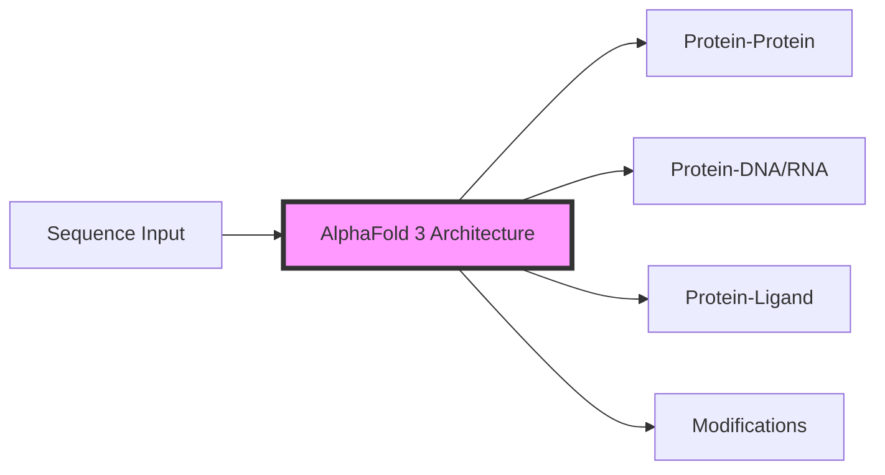
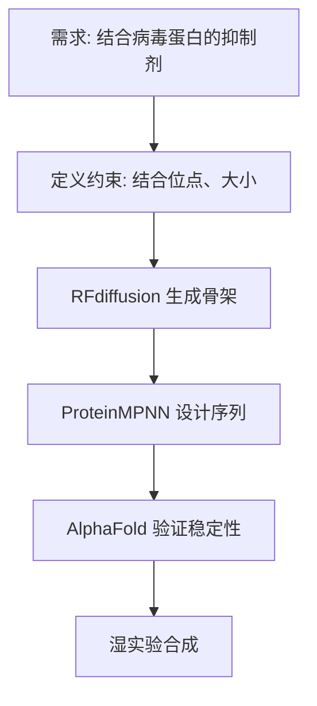

# AI for Science: Protein Folding and Drug Discovery 2026

> **一句话理解**: AI 正在将生物学从一门“观察学科”变为一门“预测学科”——如果说显微镜让我们看见了生命，那么 AI 正在让我们理解生命的“源代码”并能够重新编写它。

---

## 目录

| 章节 | 内容 | 难度 |
|------|------|------|
| [蛋白质折叠：从 AlphaFold 2 到 3](#1-蛋白质折叠从-alphafold-2-到-3) | 结构预测、多分子交互、全原子建模 | 进阶 |
| [药物研发流水线 AI 化](#2-药物研发流水线-ai-化) | 靶点发现、先导化合物筛选、ADMET 预测 | 进阶 |
| [生成式生物学 (Generative Biology)](#3-生成式生物学-generative-biology) | 蛋白质设计、De Novo 设计、RFdiffusion | 前沿 |
| [冷冻电镜 (Cryo-EM) 与 AI 融合](#4-冷冻电镜-cryo-em-与-ai-融合) | 三维重构、动态构象分析 | 专业 |
| [2026 行业趋势与里程碑](#5-2026-行业趋势与里程碑) | AI 药物进入三期临床、个性化癌症疫苗 | 洞察 |
| [实战工具与资源](#6-实战工具与资源) | RoseTTAFold, ESMFold, AlphaFold 3 访问 | 实战 |

---

## 1. 蛋白质折叠：从 AlphaFold 2 到 3

蛋白质是生命活动的执行者，其功能由其三维结构决定。

### 1.1 AlphaFold 2 的突破 (2021)

AlphaFold 2 解决了困扰生物学 50 年的“蛋白质折叠问题”，即仅根据氨基酸序列预测其三维结构。

- **核心架构**: Evoformer (基于 Transformer 的多序列比对) + 结构模块 (IPA)。
- **成就**: 准确预测了几乎所有已知蛋白质的结构，误差达到原子级别 (1Å)。

### 1.2 AlphaFold 3 的范式转移 (2024-2026)

AlphaFold 3 不再仅仅预测单个蛋白质，而是可以预测**几乎所有生命分子的交互**。

| 特性 | AlphaFold 2 | AlphaFold 3 |
|------|------------|------------|
| **预测对象** | 仅蛋白质 (单链或多链) | 蛋白质、DNA、RNA、配体、离子、化学修饰 |
| **核心算法** | Transformer (Evoformer) | **Diffusion Model (扩散模型)** |
| **全原子建模** | 需要特定的物理力场修正 | 直接生成所有原子的坐标 |
| **交互作用** | 较弱的配体预测能力 | 极强的蛋白质-配体 (药物) 交互预测 |

### 1.3 扩散模型在结构预测中的应用

AlphaFold 3 使用扩散模型代替了 AF2 中的复杂几何约束。
1. **加噪**: 将真实的分子结构逐渐模糊成随机噪声。
2. **去噪 (关键)**: 模型学习如何在给定化学约束和序列信息的条件下，从噪声中“还原”出最稳定的原子排列。
3. **优势**: 能够更好地处理分子间的灵活性和诱导契合 (Induced Fit)。

---

## 2. 药物研发流水线 AI 化

传统药物研发被称为“双十”：耗时 10 年，耗资 10 亿美元。AI 正在打破这一规律。

### 2.1 靶点发现 (Target Discovery)

- **AI 角色**: 知识图谱分析、单细胞测序数据挖掘。
- **2026 进展**: 利用 **Foundation Models for Single-Cell (scGPT)**，可以模拟特定药物对数百万个不同状态细胞的影响。

### 2.2 先导化合物筛选 (Virtual Screening)

- **传统**: 湿实验或物理模拟，速度慢，成本高。
- **AI**: 使用 **Geometric Deep Learning (几何深度学习)** 预测分子与蛋白质的亲和力。
- **工具**: DiffDock (基于扩散模型的对接)。

### 2.3 ADMET 预测 (毒理与动力学)

预测药物在人体内的：吸收 (A)、分布 (D)、代谢 (M)、排泄 (E) 和毒性 (T)。

| 维度 | AI 优化点 |
|------|----------|
| **毒性预测** | 模拟药物与人体非靶向蛋白的交互，预测脱靶效应 |
| **溶解度** | 预测分子在血液中的稳定性 |
| **血脑屏障** | 预测药物是否能进入中枢神经系统 (对于神经类药物至关重要) |

---

## 3. 生成式生物学 (Generative Biology)

与其从现有的分子库中寻找，不如直接“设计”最完美的蛋白质。

### 3.1 蛋白质 De Novo 设计

使用 **RFdiffusion** (来自 David Baker 实验室，2024 诺贝尔奖得主) 像生成图像一样生成全新的蛋白质。

### 3.2 2026 关键技术：通用生物大模型

类似 GPT-4 处理文本，**ESM-3** 等模型将蛋白质序列、结构和功能作为统一的标记 (Tokens) 进行训练。
- **能力**: 只要输入“设计一个在 60℃ 下分解塑料的酶”，模型即可直接输出序列。

---

## 4. 冷冻电镜 (Cryo-EM) 与 AI 融合

Cryo-EM 是观测分子结构的核心工具，但原始数据噪声极大。

- **AI 三维重构**: 利用扩散模型和隐空间表示，从数万张低质量的 2D 投影图中还原 3D 动态结构。
- **构象分析**: 捕捉蛋白质在工作时的“瞬间动作”，而不仅仅是静态照片。

---

## 5. 2026 行业趋势与里程碑

1. **AI 药物进入三期临床**: 多款由 AI 完全设计的药物（如针对特发性肺纤维化的药物）完成了大规模人体测试。
2. **个性化癌症疫苗**: AI 在几小时内分析患者肿瘤突变，并设计出最有效的 mRNA 疫苗序列。
3. **可编程合成细胞**: AI 辅助设计最小基因组细胞，用于工业生物合成（如生产可持续航空燃料）。
4. **计算生物学与湿实验的闭环 (Self-driving Lab)**: 机器人自动根据 AI 的预测进行实验，并将结果实时反馈给 AI 修正模型。

---

## 6. 实战工具与资源

### 6.1 核心模型库

- **AlphaFold 3 (Google DeepMind)**: 目前通过 Google 的交互式服务器提供研究访问。
- **ESM-3 (EvolutionaryScale)**: 具有 98B 参数的生物基础模型，支持结构、序列、功能联合生成。
- **OpenFold**: AlphaFold 2 的完全开源实现，支持自行训练。
- **Rosetta (University of Washington)**: 蛋白质设计的鼻祖，现结合了深度学习插件。

### 6.2 学习路径建议

1. **基础**: 理解氨基酸、肽键、蛋白质二级/三级结构。
2. **数学**: 学习坐标变换、SO(3) 群、SE(3) 等变神经网络。
3. **工具**: 熟悉 PyMOL (可视化), ChimeraX (结构分析), RDKit (化学计算)。
4. **前沿**: 关注 *Nature*, *Science* 的 AI4S 子刊，以及 Baker Lab, DeepMind 的博客。

---

## Related

- [[行业应用/AI_for_Science/AI_for_Science_Deep_Dive]] — AI for Science 概论
- [[深度学习/World_Models/JEPA_Architecture_2026]] — 联合嵌入预测架构
- [[计算机视觉/Generative_Models/Diffusion_Models_Deep_Dive]] — 扩散模型深度解析
- [[概念/protein-folding]] — 蛋白质折叠基础概念
- [[行业应用/Healthcare/AI_Healthcare_2026]] — 数字医疗与个性化用药

---

*Last updated: 2026-06-04*
