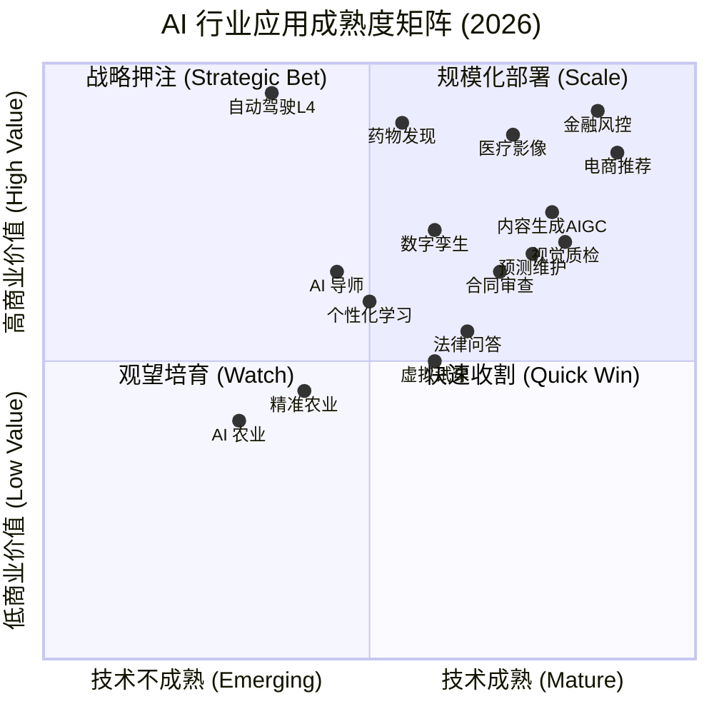
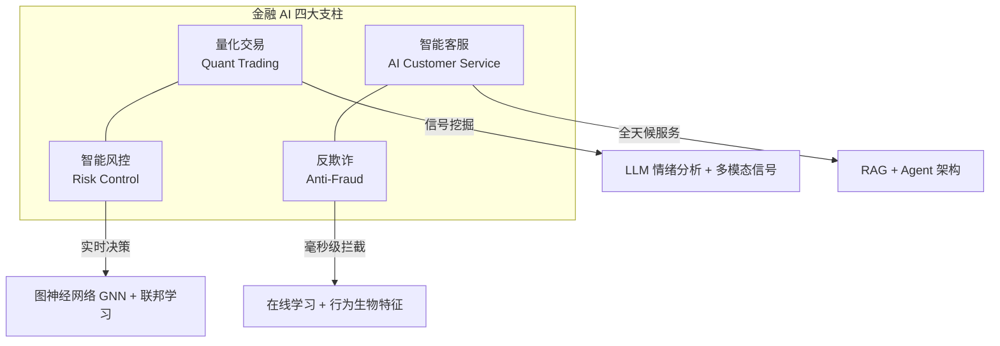
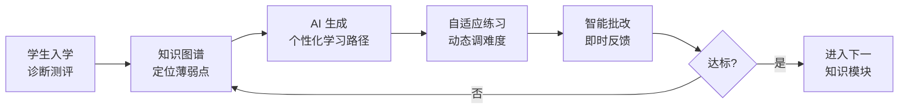
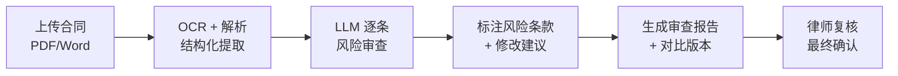
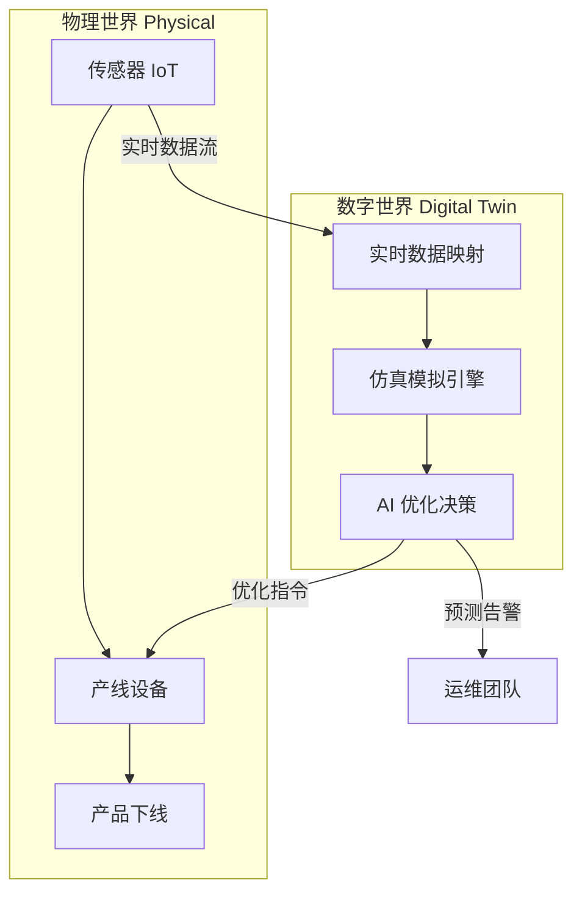
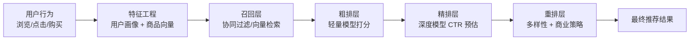
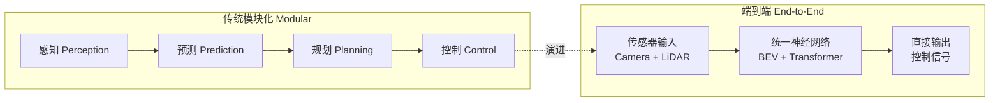
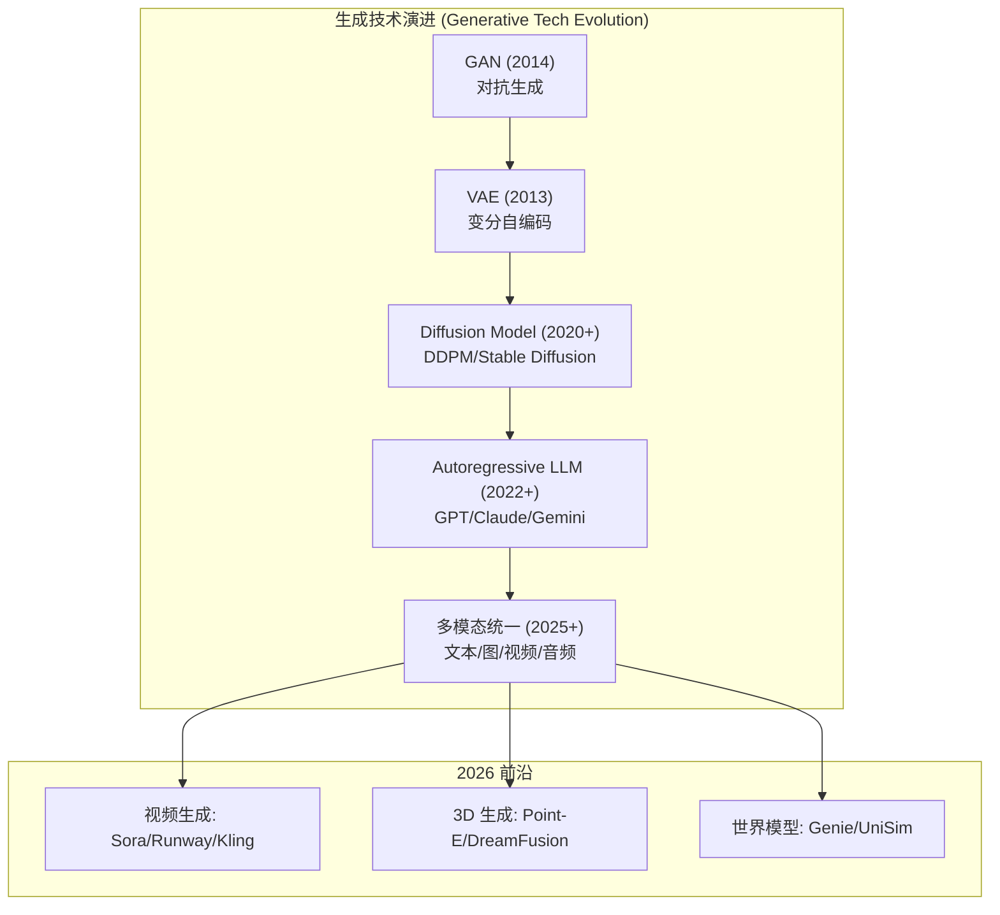
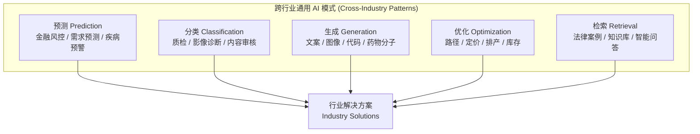

# AI 行业应用速览 (AI Industry Applications in a Nutshell)

> **一句话理解**: AI 在各行业中就像"电力"在第二次工业革命中的角色——它不是某一台机器，而是一种**通用赋能基础设施 (General-Purpose Enabling Infrastructure)**，正在重塑每一个行业的生产力边界。

---

## 目录 (Table of Contents)

1. [AI 应用成熟度矩阵](#1-ai-应用成熟度矩阵)
2. [金融 Finance](#2-金融-finance)
3. [医疗 Healthcare](#3-医疗-healthcare)
4. [教育 Education](#4-教育-education)
5. [法律 Legal](#5-法律-legal)
6. [制造业 Manufacturing](#6-制造业-manufacturing)
7. [零售电商 Retail & E-commerce](#7-零售电商-retail--e-commerce)
8. [自动驾驶 Autonomous Driving](#8-自动驾驶-autonomous-driving)
9. [内容创作 Content Creation](#9-内容创作-content-creation)
10. [各行业 AI 技术栈与成熟度对比表](#10-各行业-ai-技术栈与成熟度对比表)
11. [跨行业 AI 落地通用规律](#11-跨行业-ai-落地通用规律)

---

## 1. AI 应用成熟度矩阵

> 不同行业的 AI 落地进度差异巨大。以下象限图从**商业价值 (Business Value)** 和**技术成熟度 (Technical Maturity)** 两个维度定位各行业 AI 应用。



| 象限 | 含义 | 代表行业/场景 |
|------|------|--------------|
| **Q1 — 规模化部署** | 技术成熟 + 高价值 | 金融风控、电商推荐、智能客服 |
| **Q2 — 战略押注** | 技术尚在演进但价值巨大 | 自动驾驶 L4、药物发现 |
| **Q3 — 观望培育** | 技术和价值都需时间 | 精准农业、AI 教育 |
| **Q4 — 快速收割** | 技术已成熟但价值天花板有限 | 视觉质检、合同审查 |

---

## 2. 金融 Finance

> 金融是 AI 渗透率最高的行业之一 (75%+)，2026 年全球 AI 金融市场规模超 $610 亿。核心场景覆盖量化交易、风控、智能客服与反欺诈。

### 2.1 核心场景概览



### 2.2 关键数据

| 场景 | 成熟度 | 核心指标 | 标杆案例 | 2026 趋势 |
|------|--------|---------|---------|-----------|
| **量化交易** | 高 | Alpha 收益提升 15-30% | Citadel ($160 亿利润), Two Sigma | LLM 驱动的另类数据信号挖掘 |
| **智能风控** | 高 | <20ms 决策，数千维特征 | JPMorgan COIN, 蚂蚁 AlphaRisk | 跨机构联邦风控 |
| **智能客服** | 高 | 处理 80% 常见咨询，人力成本降 60-70% | 招行小招、BofA Erica | Agentic AI 全流程自主服务 |
| **反欺诈** | 高 | 欺诈识别率 99.6%，误报降 300% | Mastercard DI Pro | Deepfake 身份检测 |

### 2.3 量化交易 (Quant Trading) 速览

```
AI 量化交易演进:
├── 1.0 统计套利 (2000s): 因子模型 + 回归
├── 2.0 机器学习 (2015+): XGBoost + 深度学习
├── 3.0 LLM 驱动 (2024+): 新闻/财报/社交媒体实时语义
└── 4.0 Agentic (2026): AI Agent 自主构建策略 + 执行交易
```

- **Citadel**: 2025 年利润 $160 亿+，雇佣 500+ AI/ML 工程师
- **多模态信号**: 卫星图像 + 航运数据 + 信用卡消费记录
- **央行声明情绪解读**: 精度提升至 90%+

### 2.4 风控与反欺诈

| 技术 | 用途 | 典型延迟 |
|------|------|---------|
| 图神经网络 (GNN) | 识别团伙欺诈关联网络 | <20ms |
| 联邦学习 | 跨银行协同建模，数据不出域 | 离线训练 |
| 行为生物特征 | 击键节奏、鼠标轨迹识别真人 | 实时 |
| 合成数据 | 解决欺诈样本稀缺 | 离线生成 |

---

## 3. 医疗 Healthcare

> 2026 年医疗 AI 市场规模 $450 亿+，FDA 累计批准超 1000 款 AI/ML 医疗设备。AI 已从辅助工具进化为临床"副驾驶"。

### 3.1 四大核心场景

| 场景 | 成熟度 | 关键进展 | 代表案例 |
|------|--------|---------|---------|
| **影像诊断** | 高 | 肺癌筛查灵敏度 99.1%，多专科超越人类专家 | Google ARDA, Lunit INSIGHT, Viz.ai |
| **药物发现** | 中高 | AI 发现+设计的首个药物进入 II 期临床 | Insilico Medicine, Recursion |
| **电子病历 (EHR)** | 中高 | 文档错误减少 68%，医护工作量降 33% | Clinomic Mona, Nuance DAX |
| **AlphaFold** | 高 | 覆盖 2.14 亿蛋白质结构，190+ 国家使用 | DeepMind AlphaFold |

### 3.2 AlphaFold 里程碑

```
AlphaFold 演进:
├── AlphaFold 1 (2018): CASP13 竞赛第一名
├── AlphaFold 2 (2020): CASP14 原子级精度，GDT > 90
├── AlphaFold Database (2022): 2.14 亿蛋白质结构公开
├── AlphaFold 3 (2024): 蛋白质-小分子/DNA/RNA 复合物预测
└── 2025-2026: 药物设计直接应用，190+ 国家研究者使用
```

### 3.3 影像诊断准确率对比

| 专科 | AI 灵敏度 | 人类医生灵敏度 | 说明 |
|------|----------|--------------|------|
| 肺癌 CT 筛查 | 99.1% | 94% | Google ARDA 2025 |
| 乳腺癌 X 光 | 96.2% | 91% | Lunit INSIGHT MMG |
| 糖尿病视网膜 | 97.5% | 95% | IDx-DR / DeepMind |
| 脑卒中检测 | 96% | 88% | Viz.ai，通知时间缩短 52 分钟 |

---

## 4. 教育 Education

> AI 教育渗透率约 50%，核心价值在于将"一对多"教学变为"千人千面"的个性化学习。

### 4.1 三大场景

| 场景 | 成熟度 | 核心价值 | 代表产品 |
|------|--------|---------|---------|
| **个性化学习** | 中高 | 学习效果提升 30%，千人千面路径规划 | Khanmigo (Khan Academy), 松鼠 AI |
| **智能批改** | 高 | 教师批改时间减少 70%，即时反馈 | Gradescope, Turnitin AI |
| **AI 导师** | 中 | 24/7 苏格拉底式辅导 | Duolingo Max, ChatGPT Tutor |

### 4.2 个性化学习路径



### 4.3 AI 教育关键数据

- **Khanmigo**: 服务数百万学生，GPT-4 驱动的苏格拉底式 AI 导师
- **松鼠 AI**: 中国领先的自适应学习平台，覆盖 K12 全科
- **Duolingo Max**: GPT-4 驱动角色扮演对话，语言学习效率提升 40%
- **全球 AI 教育市场**: 2026 年预计超 $200 亿

---

## 5. 法律 Legal

> AI 法律渗透率约 45%。Harvey AI 服务全球 Top 100 律所中的 40+ 家，合同审查效率提升 80%。

### 5.1 三大场景

| 场景 | 成熟度 | 效率提升 | 代表产品 |
|------|--------|---------|---------|
| **合同审查** | 高 | 审查效率提升 80%，风险条款识别率 95%+ | Harvey AI, Kira Systems, LawGeex |
| **案例检索** | 高 | 检索时间从小时级降至分钟级 | CoCounsel (Casetext), Westlaw AI |
| **法律问答** | 中高 | 7x24 智能咨询，覆盖 80% 常见法律问题 | DoNotPay, 幂律智能 |

### 5.2 合同审查 AI 工作流



### 5.3 法律 AI 关键对比

| 维度 | 传统方式 | AI 辅助 |
|------|---------|--------|
| 合同审查耗时 | 4-8 小时/份 | 10-30 分钟/份 |
| 案例检索范围 | 人工关键词搜索 | 语义理解 + 全文检索 |
| 法律咨询覆盖 | 工作时间，高费用 | 7x24，低成本 |
| 合规检查 | 手动 checklist | 自动化规则引擎 + LLM |

---

## 6. 制造业 Manufacturing

> AI 制造渗透率约 55%，核心价值在于降本增效和质量控制。视觉质检漏检率降低 90%，预测性维护减少停机 30-50%。

### 6.1 三大场景

| 场景 | 成熟度 | 核心指标 | 代表案例 |
|------|--------|---------|---------|
| **视觉质检** | 高 | 漏检率降低 90%，检测速度提升 20x | 特斯拉产线、百度智能云质检 |
| **预测维护** | 高 | 停机减少 30-50%，维护成本降 25% | 西门子 MindSphere, GE Predix |
| **数字孪生** | 中高 | 产能提升 20%，试错成本降低 60% | PepsiCo, 波音, NVIDIA Omniverse |

### 6.2 数字孪生架构图



### 6.3 预测维护 vs 传统维护

| 维度 | 定期维护 (Preventive) | 预测维护 (Predictive AI) |
|------|---------------------|------------------------|
| 策略 | 按日历/里程固定更换 | 基于传感器数据预测故障 |
| 过度维护 | 30-40% 的维护是不必要的 | 减少 50% 不必要的维护 |
| 意外停机 | 仍可能发生 | 降低 30-50% |
| 成本模型 | 固定高成本 | 按需投入，ROI 更高 |

---

## 7. 零售电商 Retail & E-commerce

> AI 零售渗透率约 70%。亚马逊 35% 的销售额来自推荐系统，AI 客服处理 80% 的常见咨询。

### 7.1 四大场景

| 场景 | 成熟度 | 核心指标 | 代表案例 |
|------|--------|---------|---------|
| **推荐系统** | 高 | 转化率提升 10-30%，亚马逊 35% 销售来自推荐 | Amazon, 淘宝推荐引擎 |
| **动态定价** | 高 | 毛利率提升 5-15% | Uber Surge Pricing, 航空收益管理 |
| **库存优化** | 高 | 库存周转率提升 20-30%，缺货率降低 50% | Walmart, 京东智能供应链 |
| **虚拟试穿** | 中 | 退货率降低 25-40% | Nike Fit, Warby Parker AR 试戴 |

### 7.2 推荐系统架构速览



### 7.3 动态定价决策因素

| 因素 | 权重 | 数据源 |
|------|------|-------|
| 竞品价格 | 高 | 爬虫 + API 实时抓取 |
| 库存水位 | 高 | ERP/WMS 系统 |
| 需求弹性 | 中 | 历史价格-销量曲线 |
| 时段/季节 | 中 | 日历 + 节假日特征 |
| 用户画像 | 低 (合规限制) | CDP 平台 |

---

## 8. 自动驾驶 Autonomous Driving

> 2026 年自动驾驶正式进入"商业化拐点"。Waymo 日均 10 万+ 次付费乘车，Tesla FSD 累计行驶 30 亿+ 英里，百度萝卜快跑在武汉运营 1000+ 辆无人出租车。

### 8.1 自动驾驶分级 (SAE L1-L5)

| 级别 | 名称 | 驾驶者 | AI 角色 | 代表产品 | 2026 状态 |
|------|------|--------|--------|---------|-----------|
| **L1** | 辅助驾驶 | 人类 | 单项辅助 (转向/加减速) | ACC, LKA | 标配 |
| **L2** | 部分自动 | 人类监控 | 组合辅助 (转向 + 加减速) | Tesla Autopilot, 小鹏 NGP | 大规模量产 |
| **L2+** | 增强部分自动 | 人类接管 | 城市 NOA | 华为 ADS 3.0, 小鹏 XNGP | 新车搭载率 55%+ |
| **L3** | 有条件自动 | 系统请求时接管 | 限定场景自主驾驶 | Mercedes DRIVE PILOT | 法规逐步开放 |
| **L4** | 高度自动 | 无需介入 | 限定区域全自主 | Waymo, 百度 Apollo Go | Robotaxi 商业化 |
| **L5** | 完全自动 | 无需介入 | 全场景全自主 | 尚无量产 | 预计 2030+ |

### 8.2 端到端架构演进



### 8.3 三大玩家对比

| 维度 | Waymo (Alphabet) | Tesla FSD | 百度 Apollo Go |
|------|-----------------|-----------|----------------|
| **方案** | 多传感器融合 (LiDAR + Camera + Radar) | 纯视觉 (Camera Only) | 多传感器融合 |
| **运营城市** | SF, LA, Phoenix, Austin | 全美 (消费者车辆) | 武汉、北京等 11 城 |
| **日乘车量** | 10 万+ 次 (2025Q3) | 200 万+ FSD 订阅用户 | 800 万+ 累计出行 |
| **安全记录** | 事故率比人类低 85% | 干预间隔 2000+ 英里 | 零重大事故 |
| **估值/投入** | $450 亿+ (2025) | 作为 Tesla 核心卖点 | 2026 目标单城盈利 |
| **2026 计划** | 扩展至 Miami, Atlanta | Austin Robotaxi 运营 | 扩展更多城市 |

---

## 9. 内容创作 Content Creation

> AIGC (AI-Generated Content) 在 2024-2026 年爆发式增长，覆盖文本、图像、视频和音乐四大领域。内容创作门槛大幅降低，但也带来版权与真实性挑战。

### 9.1 四大模态生成

| 模态 | 成熟度 | 代表工具 | 关键能力 | 争议焦点 |
|------|--------|---------|---------|---------|
| **文本生成** | 高 | ChatGPT, Claude, Gemini, Jasper | 长文写作、代码、翻译、摘要 | 幻觉 (Hallucination)、学术诚信 |
| **图像生成** | 高 | Midjourney, DALL-E 3, Stable Diffusion | 文字到图、风格迁移、Inpainting | 版权、Deepfake |
| **视频生成** | 中高 | Runway Gen-3, Sora, Kling | 文字/图片到视频、运动控制 | 计算成本、真实性 |
| **音乐生成** | 中 | Suno, Udio, AIVA | 词曲生成、多风格、人声合成 | 音乐版权、艺术家权益 |

### 9.2 AIGC 技术栈演进



### 9.3 AIGC 市场与效率对比

| 内容类型 | 传统制作时间 | AI 生成时间 | 成本降幅 | 质量评估 |
|---------|------------|-----------|---------|---------|
| 营销文案 (1000 字) | 2-4 小时 | 10-30 秒 | 95%+ | 接近人类中等水平 |
| 商业插画 | 1-3 天 | 10-60 秒 | 90%+ | 高 (Midjourney v6) |
| 短视频 (30 秒) | 1-2 周 | 1-5 分钟 | 80%+ | 中 (快速提升中) |
| 背景音乐 (3 分钟) | 1-3 天 | 30-60 秒 | 85%+ | 中 (Suno v4) |

---

## 10. 各行业 AI 技术栈与成熟度对比表

### 10.1 技术栈全景对比

| 行业 | 核心模型类型 | 推荐框架 | 部署架构 | 数据管道 | 关键基础设施 |
|------|------------|---------|---------|---------|-------------|
| **金融** | GBDT + 小模型 + LLM | XGBoost, LightGBM, LangChain | 本地私有云，低延迟 | Kafka + Flink 实时流 | GPU 推理集群、风控引擎 |
| **医疗** | CNN + Transformer + GNN | PyTorch, MONAI, HuggingFace | 边缘 + 云端混合 | DICOM + PACS + FHIR | 合规存储 (HIPAA) |
| **教育** | 知识图谱 + LLM | LangChain, PyTorch | 云端 SaaS | 学习行为日志 | 个性化推理引擎 |
| **法律** | LLM + RAG | LangChain, LlamaIndex | 私有云 / 混合云 | 文档解析管道 | 向量数据库 (Pinecone/Weaviate) |
| **制造** | CNN + 时序模型 | OpenCV, PyTorch, TensorFlow | 边缘计算 (产线) | SCADA + MES 集成 | 工业 IoT 网关 |
| **零售** | 推荐系统 + LLM | TensorFlow Recommenders, PyTorch | 高并发在线服务 | CDP + 实时行为日志 | 推荐引擎 + AB 测试平台 |
| **自动驾驶** | 多模态 BEV + E2E | PyTorch, ONNX, TensorRT | 车端 + 云端协同 | 多传感器数据湖 | 大规模仿真平台 |
| **内容创作** | Diffusion + LLM + VAE | Diffusers, vLLM, ComfyUI | GPU 密集型云 | 多模态资产管理 | A100/H100 集群 |

### 10.2 综合成熟度雷达对比

| 行业 | AI 渗透率 | 技术成熟度 | 数据丰富度 | ROI 可见性 | 合规难度 | 综合评分 |
|------|----------|-----------|-----------|-----------|---------|---------|
| **金融** | 75% | 9/10 | 9/10 | 9/10 | 极高 | A |
| **零售电商** | 70% | 9/10 | 9/10 | 9/10 | 中 | A |
| **医疗健康** | 65% | 8/10 | 7/10 | 8/10 | 极高 | A- |
| **内容媒体** | 60%+ | 8/10 | 8/10 | 8/10 | 中高 | B+ |
| **制造业** | 55% | 8/10 | 7/10 | 8/10 | 中 | B+ |
| **教育** | 50% | 7/10 | 6/10 | 7/10 | 中 | B |
| **自动驾驶** | 45% | 6/10 | 8/10 | 5/10 | 极高 | B- |
| **法律政务** | 45% | 7/10 | 7/10 | 6/10 | 极高 | B- |
| **能源气候** | 45% | 7/10 | 7/10 | 8/10 | 中 | B |
| **农业** | 30% | 5/10 | 5/10 | 6/10 | 低 | C+ |

### 10.3 行业 AI 投资回报周期

| 行业 | 典型 PoC 周期 | 规模化周期 | 预期 ROI | 回本周期 |
|------|-------------|-----------|---------|---------|
| **智能客服** | 4-8 周 | 3-6 月 | 人力成本降 40-60% | 3-6 月 |
| **推荐系统** | 6-12 周 | 6-12 月 | 转化率升 10-30% | 6-12 月 |
| **反欺诈** | 8-12 周 | 6-12 月 | 欺诈损失降 50%+ | 6-12 月 |
| **视觉质检** | 8-12 周 | 6-12 月 | 漏检率降 80%+ | 6-12 月 |
| **预测维护** | 12-16 周 | 12-24 月 | 停机减少 30-50% | 12-18 月 |
| **药物发现** | 6-12 月 | 3-5 年 | 研发周期压缩 50% | 3-5 年 |
| **自动驾驶** | 12-24 月 | 5-10 年 | 运营成本降 40% | 5-8 年 |

---

## 11. 跨行业 AI 落地通用规律

### 11.1 五大通用 AI 模式



### 11.2 落地成功要素 vs 失败因素

| 成功因素 | 失败因素 |
|----------|----------|
| 业务方深度参与，痛点驱动 | 技术团队闭门造车，"拿着锤子找钉子" |
| 数据质量优先，先治理再建模 | 忽视数据治理，"Garbage in, Garbage out" |
| 小步快跑，2-3 月 PoC 验证 | 一上来就要做平台级项目 |
| 明确的量化成功指标 (KPI) | 没有 ROI 衡量，"感觉挺好" |
| 组织变革配套 (培训 + 流程改造) | 只买工具不改造流程 |
| 合规先行，提前与法务/监管对齐 | 上线后才发现合规问题 |

### 11.3 AI 落地 Checklist

```
评估一个行业 AI 项目是否值得投入:

[ ] 问题是否明确？  —— 不是"用 AI"，而是"解决 XX 业务问题"
[ ] 数据是否可得？  —— 有数据、能获取、质量可接受
[ ] 是否有衡量标准？—— 怎么算成功？ROI 怎么算？
[ ] 技术是否成熟？  —— 应用已知技术，不是做基础研究
[ ] 组织是否准备好？—— 有预算、有人、有耐心
[ ] 合规是否可行？  —— 不违反法规、不触碰伦理红线

6 个全满足 → 大胆投入
缺 1-2 个  → 补齐短板再启动
缺 3 个以上 → 暂缓，先做基础建设
```

### 11.4 2026 年行业 AI 趋势总结

| 趋势 | 说明 | 影响行业 |
|------|------|---------|
| **Agentic AI** | AI 从辅助工具升级为自主执行复杂业务流程的 Agent | 金融、法律、客服 |
| **多模态融合** | 文本/图像/视频/音频统一处理，一个模型多模态输入输出 | 内容、医疗、自动驾驶 |
| **边缘 AI 普及** | 模型轻量化部署到终端设备，实时响应 + 数据本地化 | 制造、自动驾驶、零售 |
| **联邦学习** | 跨机构协同建模，数据不出域，解决隐私与合规难题 | 金融、医疗 |
| **合成数据** | AI 生成训练数据，解决真实数据稀缺和隐私问题 | 金融 (欺诈)、医疗、自动驾驶 |
| **AI 监管加速** | 欧盟 AI Act 生效，各国跟进，合规成为准入门槛 | 全行业 |

---

## 相关主题 (Cross-References)

- [AI 应用与行业融合全景](./AI_Applications_Industry.md) -- 各行业深度案例与综合分析
- [AI 行业应用对比 2026](./Industry_Comparison_2026.md) -- 10 大行业横向对比详表
- [AI 金融深度报告](./Finance/AI_Finance_2026.md) -- 量化交易、风控、反欺诈技术细节
- [AI 医疗深度报告](./Healthcare/AI_Healthcare_2026.md) -- 影像诊断、AlphaFold、药物研发细节
- [AI 自动驾驶深度报告](./Autonomous_Driving/AI_Autonomous_Driving_2026.md) -- L1-L5 技术演进与 Waymo/Tesla/百度对比
- [AI 零售电商深度报告](./Retail_Ecommerce/AI_Retail_Ecommerce_2026.md) -- 推荐系统、动态定价、智能供应链
- [AI 制造业深度报告](./Manufacturing/AI_Manufacturing_2026.md) -- 视觉质检、数字孪生、黑灯工厂
- [AI 教育深度报告](./Education/AI_Education_2026.md) -- 个性化学习、AI 导师、编程教育
- [AI 内容媒体深度报告](./Content_Media/AI_Content_Media_2026.md) -- AIGC 文本/图像/视频/音乐生成
- [AI 法律政务深度报告](./Legal_Government/AI_Legal_Government_2026.md) -- 合同审查、诉讼预测、智能政务
- [AI 行业应用速成指南](./Industry-in-nutshell.md) -- 面向初学者的行业 AI 入门指南
- [AI 行业应用小白版](./AI_Applications_Industry_for_dummy.md) -- 零基础行业 AI 科普
- [AI 伦理安全速成指南](../伦理安全/Ethics-in-nutshell.md) -- 跨行业 AI 合规与伦理基础
- [Agent 产品化](../智能体/) -- Agentic AI 在各行业的产品化实践

---

*Last updated: 2026-06-05*

## 相关链接

- [[行业应用/index|行业应用首页]] — 行业应用知识总览
- [[行业应用/README|行业应用 README]] — 行业应用导览
- [[行业应用/Finance/index|金融行业]] — 重点行业应用
- [[行业应用/Healthcare/index|医疗行业]] — 重点行业应用
- [[行业应用/Autonomous_Driving_index|自动驾驶]] — 重点行业应用
- [[行业应用/Education/index|教育行业]] — 重点行业应用
