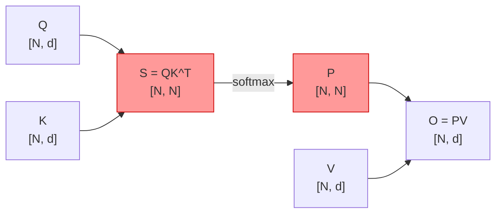
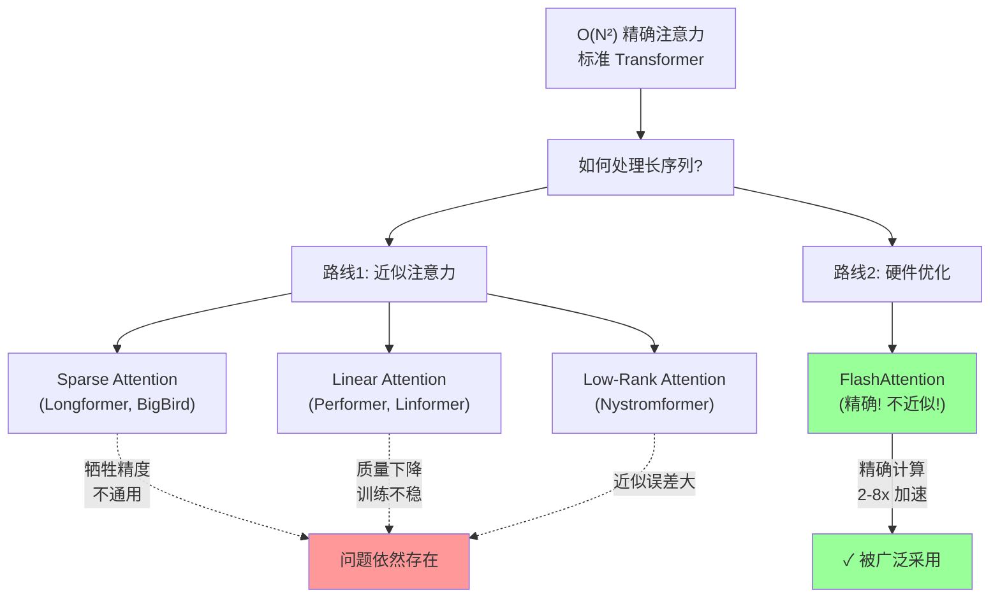
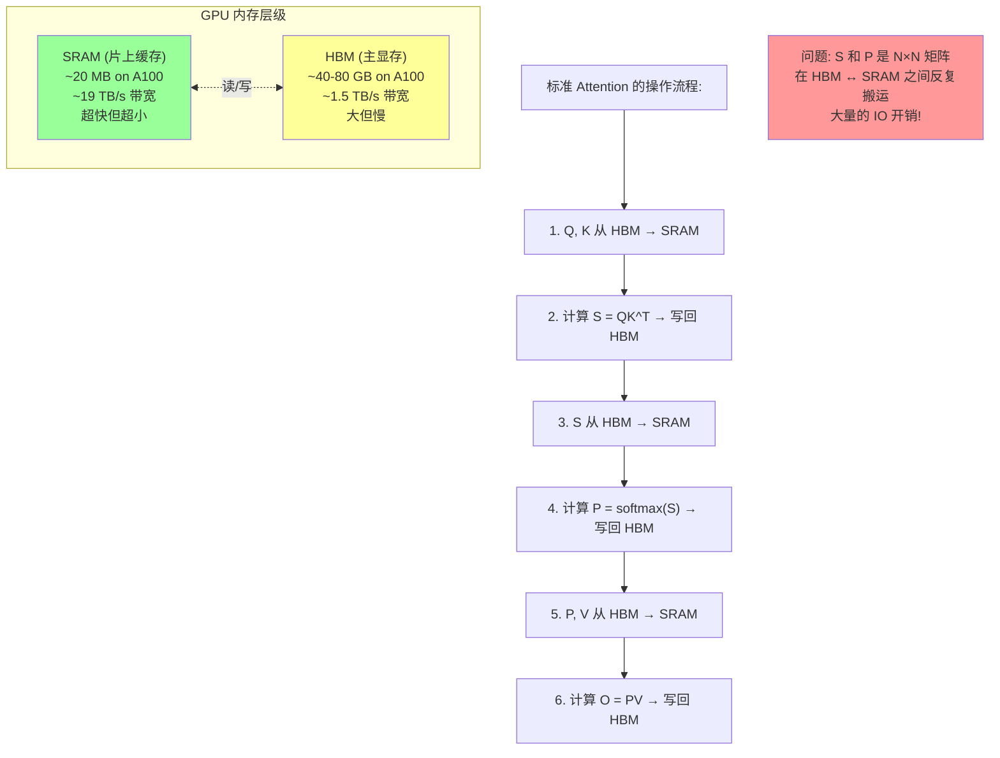
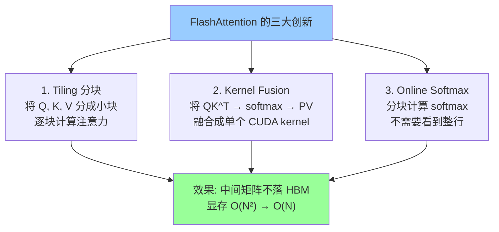
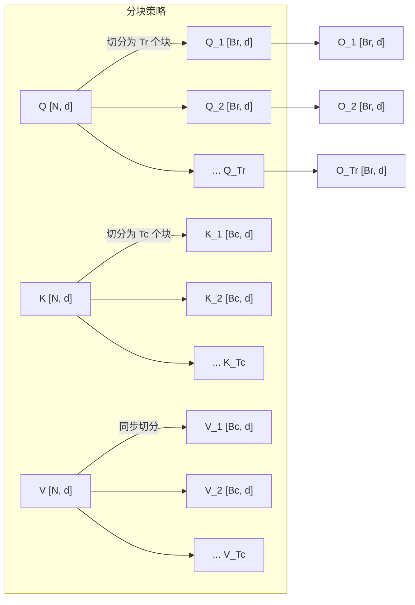
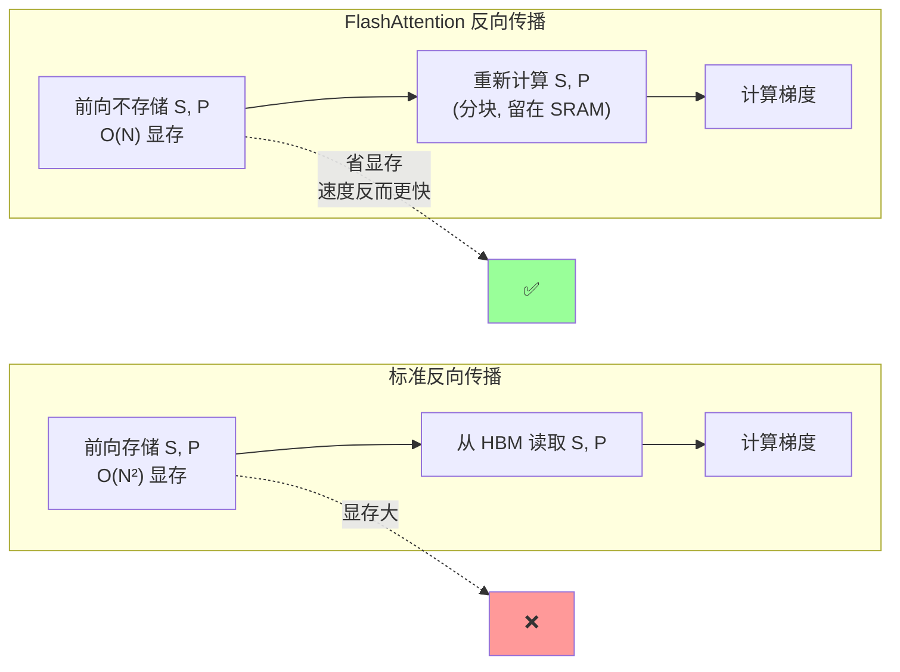
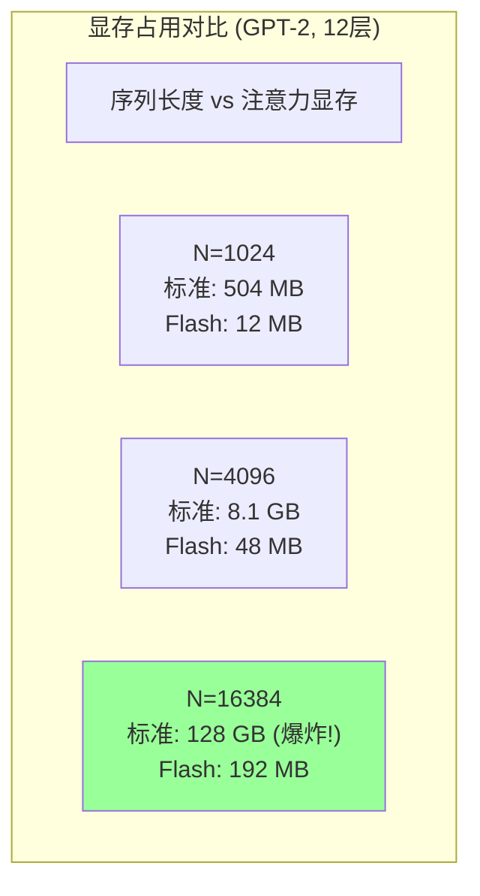
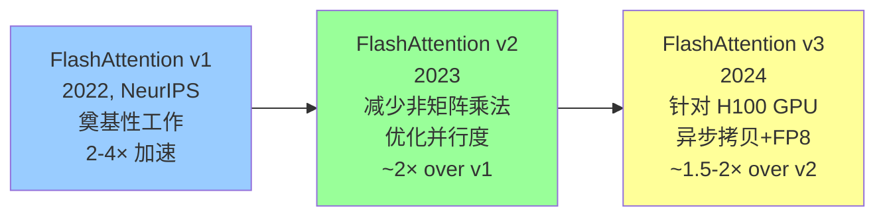
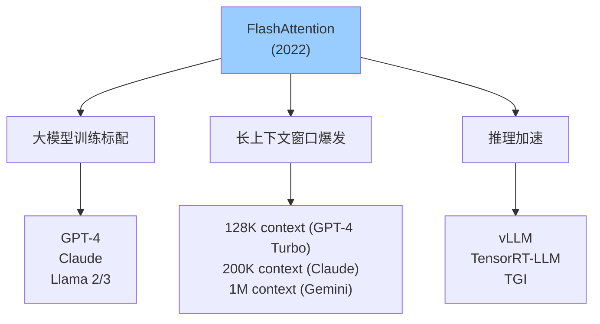

# FlashAttention 深度解读 (Fast and Memory-Efficient Exact Attention with IO-Awareness)

> **一句话理解**: FlashAttention 就像一个聪明的大厨——不把所有食材一次性铺满厨房（不把 N×N 注意力矩阵全写进 HBM 显存），而是分批取用、边做边清理，用严格的数学分块（tiling）计算得到完全相同的结果，却把显存从 O(N²) 降到 O(N)、速度提升 2-8 倍。它是今天所有大模型长上下文能力的底层基石。

---

## 论文基本信息

| 属性 | 内容 |
|------|------|
| **标题** | FlashAttention: Fast and Memory-Efficient Exact Attention with IO-Awareness |
| **作者** | Tri Dao, Daniel Y. Fu, Stefano Ermon, Atri Rudra, Christopher Ré (Stanford) |
| **发表** | NeurIPS 2022 |
| **引用量** | 8,000+ (截至 2026) |
| **论文链接** | [arXiv:2205.14135](https://arxiv.org/abs/2205.14135) |
| **代码** | [github.com/Dao-AILab/flash-attention](https://github.com/Dao-AILab/flash-attention) |
| **核心贡献** | 提出 IO 感知的精确注意力算法，通过 tiling + kernel fusion 实现精确（非近似）加速 |

---

## 1. 历史背景：为什么注意力计算是瓶颈？

### 1.1 注意力的 O(N²) 魔咒

标准 Transformer 注意力机制的计算需要三个矩阵 Q、K、V：

```
Attention(Q, K, V) = softmax(Q · K^T / √d) · V

     Q: [N, d]    K: [N, d]    V: [N, d]
     N = 序列长度, d = 头维度

中间矩阵 S = Q · K^T:  [N, N]   ← 这就是 O(N²) 的元凶
输出矩阵 O = P · V:   [N, d]
```



当 N 增大时，中间矩阵 S 和 P 的大小呈平方增长：

| 序列长度 N | S 矩阵大小 (FP16) | 实际显存占用 |
|-----------|-------------------|-------------|
| 512 | 512 × 512 = 0.5 MB | 可接受 |
| 2,048 | 2K × 2K = 8 MB | 开始吃力 |
| 8,192 | 8K × 8K = 128 MB | 单层就 128MB |
| 32,768 | 32K × 32K = 2 GB | 单层 2GB！ |
| 131,072 | 128K × 128K = 32 GB | 爆显存 |

> **注意**：上表只是单个注意力头、单层的中间矩阵。一个 32 层、每层 32 头的模型，N=32K 时的注意力中间矩阵总量将是 32 × 32 × 2GB = **2 TB**。

### 1.2 之前的解决方案及其局限



| 方法 | 类型 | 复杂度 | 精度 | 问题 |
|------|------|--------|------|------|
| **标准 Attention** | 精确 | O(N²) | ✓ 精确 | 显存爆炸 |
| **Sparse Attention** | 近似 | O(N·√N) | ✗ 有损 | 需要稀疏模式设计 |
| **Linear Attention** | 近似 | O(N) | ✗ 有损 | 质量明显下降 |
| **Low-Rank** | 近似 | O(N·k) | ✗ 有损 | 近似误差 |
| **FlashAttention** | **精确** | O(N²) 计算 / O(N) 显存 | **✓ 精确** | **结果完全相同** |

### 1.3 核心洞察：瓶颈不是计算，是读写

FlashAttention 的关键洞察来自对 GPU 内存层级的理解：



**关键数据对比**：

| 指标 | SRAM | HBM | 差距 |
|------|------|-----|------|
| **容量** | ~20 MB | ~80 GB | HBM 大 4000 倍 |
| **带宽** | ~19 TB/s | ~1.5 TB/s | SRAM 快 12 倍 |
| **用途** | GPU 计算的工作区 | 存储模型参数和激活值 | |

> **类比**：SRAM 是厨房操作台（很小但伸手就能拿到），HBM 是仓库（很大但要走过去取）。标准 Attention 每次都要把整个 N×N 矩阵从仓库搬到操作台、算完再搬回去——来回搬运的时间比实际计算还长。FlashAttention 的思路是：**只搬一小批，算完就丢，不占用仓库空间**。

---

## 2. 核心创新：Tiling + Kernel Fusion

### 2.1 三大技术支柱



### 2.2 技术1：Kernel Fusion（核融合）

标准注意力的计算分三步，每步都有 HBM 读写：

```
标准实现 (伪代码):
─────────────────────────────────────────
# 步骤1: 计算 S = Q @ K^T
S = Q @ K.T              # 从 HBM 读 Q,K → 计算 → 写 S 到 HBM
                         # S ∈ [N,N], 这是最大的瓶颈!

# 步骤2: 计算 P = softmax(S)
P = softmax(S)           # 从 HBM 读 S → 计算 → 写 P 到 HBM
                         # P ∈ [N,N], 又一次 N×N 读写

# 步骤3: 计算 O = P @ V
O = P @ V                # 从 HBM 读 P,V → 计算 → 写 O 到 HBM

─────────────────────────────────────────
总计 HBM 读写: ~3 × N² (S写入 + S读取/P写入 + P读取)
```

**FlashAttention 的做法**：把这三步融合成一个单一的 GPU kernel，中间结果留在 SRAM 中，永不落盘 HBM：

```
FlashAttention 实现 (伪代码):
─────────────────────────────────────────
# 一个 kernel 内完成全部计算
def flash_attention_kernel(Q, K, V):
    for each Q_block in Q:          # 从 HBM 加载一小块 Q 到 SRAM
        for each K_block, V_block:   # 从 HBM 加载一小块 K, V
            S_block = Q_block @ K_block.T    # 在 SRAM 中计算
            P_block = softmax(S_block)        # 在 SRAM 中计算
            O_block += P_block @ V_block      # 在 SRAM 中累加
        write O_block to HBM        # 只写最终结果!

# 中间的 S 和 P 从不写入 HBM!
─────────────────────────────────────────
总计 HBM 读写: O(N) — 只有 Q, K, V 的读取和 O 的写入
```

### 2.3 技术2：Tiling 分块策略

核心挑战：**Q × K^T 需要 N×N 的空间，SRAM 只有 20MB 装不下怎么办？**

答案是分块（tiling）——将 Q、K、V 切分成能放进 SRAM 的小块：



**分块大小如何确定？** SRAM 的大小决定了块大小：

```
SRAM 约束: 一个块内需要同时装载
    Q_i:    [Br, d]      ← 当前查询块
    K_j:    [Bc, d]      ← 当前键块
    V_j:    [Bc, d]      ← 当前值块
    S_ij:   [Br, Bc]     ← 注意力分数子矩阵
    合计 ≈ Br × d + 2 × Bc × d + Br × Bc ≤ M_SRAM

其中 M_SRAM ≈ 20 MB (A100)
```

### 2.4 技术3：Online Softmax（关键数学突破）

**这是 FlashAttention 最核心的数学创新。**

标准 softmax 需要看到整行才能计算：

```
标准 softmax:
    P[i, :] = exp(S[i, :] - max(S[i, :])) / sum(exp(S[i, :] - max(S[i, :])))
                                ↑                    ↑
                          需要整行最大值           需要整行求和
```

如果分块计算，我们每次只看到一行的一部分。**如何在不看到整行的情况下增量计算 softmax？**

FlashAttention 使用了 **Online Softmax**（也叫 streaming softmax / incremental softmax）技术：


**数学推导**：

设当前已处理了前 j 个块，维护三个累积量：
- $m^{(j)}$：前 j 个块的最大值（running max）
- $\ell^{(j)}$：前 j 个块的未归一化求和（running sum）
- $O^{(j)}$：前 j 个块的输出累积

当处理第 j+1 块 $S_{i, j+1}$ 时：

```
步骤1: 计算当前块最大值
    m_block = max(S_{i, j+1})

步骤2: 更新全局最大值
    m_new = max(m^{(j)}, m_block)

步骤3: 用新最大值修正之前的累积量
    ℓ_new = ℓ^{(j)} × exp(m^{(j)} - m_new) + sum(exp(S_{i,j+1} - m_new))
    ↑ 关键: exp(m_old - m_new) 因子修正了之前块的缩放!

步骤4: 同理修正输出
    O_new = O^{(j)} × exp(m^{(j)} - m_new) + exp(S_{i,j+1} - m_new) @ V_{j+1}
```

**最终归一化**：处理完所有块后：
$$O_{final} = \frac{O^{(T_c)}}{\ell^{(T_c)}}$$

这个结果与标准 softmax 注意力的结果在数学上**完全相同**，没有任何近似。

---

## 3. 完整算法

### 3.1 FlashAttention 前向传播伪代码

```
算法: FlashAttention 前向传播
输入: Q, K, V ∈ R^{N×d}, 存储在 HBM 中
输出: O ∈ R^{N×d}, 存储在 HBM 中

1.  初始化块大小 Br, Bc (根据 SRAM 大小)
2.  将 Q 切分为 Tr 个块, K, V 切分为 Tc 个块
3.  将 O, ℓ, m 初始化为 0, 0, -∞ (在 HBM 中)

4.  for j = 1 to Tc:                      # 外层: 遍历 K, V 块
5.      加载 K_j, V_j 到 SRAM
6.      for i = 1 to Tr:                   # 内层: 遍历 Q 块
7.          加载 Q_i 到 SRAM
8.          在 SRAM 中计算 S_ij = Q_i · K_j^T
9.          
10.         m_block = rowmax(S_ij)          # 当前块行最大值
11.         P_ij = exp(S_ij - m_block)     # 数值稳定的 exp
12.         ℓ_block = rowsum(P_ij)          # 当前块行求和
13.         
14.         m_new = max(m_i, m_block)       # 更新全局最大值
15.         ℓ_new = ℓ_i × exp(m_i - m_new) + ℓ_block × exp(m_block - m_new)
16.         
17.         # 修正之前的输出并用新因子累加当前块
18.         O_i = O_i × (ℓ_i × exp(m_i - m_new)) / ℓ_new 
19.              + (P_ij × exp(m_block - m_new)) @ V_j / ℓ_new
20.         
21.         写回 O_i, ℓ_i = ℓ_new, m_i = m_new 到 HBM

22. 返回 O
```

### 3.2 IO 复杂度分析

| 方法 | HBM 读写量 | 说明 |
|------|-----------|------|
| **标准 Attention** | O(Nd + N²) | S 和 P 的 N×N 矩阵反复读写 |
| **FlashAttention** | O(N²d / M) | M 是 SRAM 大小，分块减少了大矩阵读写 |

其中 $M$ 是 SRAM 大小（约 100KB-20MB），$d$ 是头维度。

当 $N$ 很大时：
$$\text{FlashAttention IO} = O\left(\frac{N^2 d}{M}\right) \ll O(N^2) = \text{标准 Attention IO}$$

> **注意**：FlashAttention 的**计算复杂度**仍然是 O(N²)——它不是近似算法，必须计算所有 N×N 个注意力分数。加速来自**减少 HBM 读写**（IO 复杂度降低），而非减少计算量。

### 3.3 反向传播

FlashAttention 的反向传播同样使用分块策略：

```
反向传播需要计算: dQ, dK, dV

关键: 重计算 (Recomputation)
    前向传播不存储中间矩阵 S 和 P (省显存)
    反向传播时从 Q, K, V 重新计算 S 和 P

好处:
    - 显存: O(N²) → O(N) (不存储 S 和 P)
    - 速度: 重计算的开销被减少的 HBM 读写完全抵消
    - 实际上比存储 S, P 的标准反向传播还快!
```



---

## 4. 实验结果

### 4.1 训练速度对比

| 模型 | 序列长度 | 标准Attention | FlashAttention | 加速比 |
|------|---------|--------------|----------------|--------|
| GPT-2 | 1K | 1.0× (基线) | 1.5× | 50% |
| GPT-2 | 4K | 1.0× (基线) | 2.7× | 170% |
| GPT-2 | 16K | OOM | 可行 | ∞ |

### 4.2 显存对比



### 4.3 长序列训练效果

FlashAttention 不仅更快，还使能了之前不可能的长序列训练：

| 任务 | 序列长度 | 之前最优 | FlashAttention |
|------|---------|---------|----------------|
| Long Range Arena | 4K | Linear Attention | 精确 Attention, 更好 |
| 长文档分类 | 16K | Sparse Attention | 精确 Attention, 更好 |
| 文本生成 | 8K | 不可行 | 可行 |

### 4.4 GPT-2 训练 Wall-Clock 时间

```
GPT-2 (117M 参数) 在 A100 GPU 上:

序列长度    标准Attention    FlashAttention    加速比
────────    ────────────    ──────────────    ──────
  512         2.7 ms           2.1 ms          1.3×
 1024         7.2 ms           4.1 ms          1.8×
 2048        22.5 ms           9.3 ms          2.4×
 4096        85.0 ms          28.1 ms          3.0×
 8192        OOM              92.5 ms          ∞
16384        OOM             341.8 ms          ∞
```

---

## 5. FlashAttention-2 与 FlashAttention-3 的演进

### 5.1 演进路线图



### 5.2 FlashAttention v2 的改进

| 改进点 | v1 | v2 | 效果 |
|--------|----|----|------|
| **非 matmul 计算** | 占比约 30% | 占比约 10% | 更高效利用 tensor core |
| **并行策略** | 按序列分块 | 序列 + 批次维度并行 | GPU 利用率提升 |
| **前向 FLOPs** | 基线 | 减少约 50% rescaling | 更少冗余计算 |
| **反向传播** | 分块重计算 | 优化了 warp 级并行 | 更快 |

**v2 的核心优化**：

1. **减少非矩阵乘法运算**：GPU 的 tensor core 专门加速矩阵乘法，但 softmax、rescaling 等非 matmul 运算无法利用 tensor core。v2 通过数学推导减少了这些操作。

2. **更好的并行度**：v1 主要在 batch 和 head 维度并行。v2 额外在序列维度并行，更好地利用了 GPU 的流多处理器（SM）。

### 5.3 FlashAttention v3 的改进

FlashAttention v3 针对 NVIDIA H100 GPU (Hopper 架构) 的特性做了深度优化：

| 技术 | 说明 | 效果 |
|------|------|------|
| **异步拷贝 (TMA)** | 利用 H100 的 Tensor Memory Accelerator 异步加载数据 | 隐藏内存延迟 |
| **FP8 支持** | 利用 H100 的 FP8 tensor core | 精度损失 <0.5%，速度翻倍 |
| **warpgroup 级流水线** | 将计算分成 warpgroup，交替执行 | 重叠 matmul 和 softmax |
| **in-register softmax** | 将 softmax 中间值放在寄存器而非 SRAM | 减少 SRAM 占用 |

```
FlashAttention v3 在 H100 GPU 上的性能:

         v2 (基线)     v3 (FP16)     v3 (FP8)
精度       FP16          FP16          FP8
前向       1.0×          1.5-2.0×      2.0-3.0×
反向       1.0×          1.5-2.0×      2.0-3.0×
精度损失    0             <0.1%         <0.5%
```

### 5.4 三代对比总结

| 特性 | FA v1 (2022) | FA v2 (2023) | FA v3 (2024) |
|------|-------------|-------------|-------------|
| **目标 GPU** | A100 | A100 | H100 |
| **核心创新** | Tiling + Online Softmax | 减少非 matmul + 更好并行 | 异步 + FP8 + 流水线 |
| **前向速度** | 2-4× over 标准 | ~2× over v1 | ~1.5-2× over v2 |
| **精度** | FP16 | FP16 | FP16 / FP8 |
| **代码复杂度** | 中等 | 较高 | 极高 (GPU 架构特定) |

---

## 6. 代码示例

### 6.1 Python 级别：使用 FlashAttention

```python
# 安装
# pip install flash-attn

import torch
import torch.nn.functional as F
from flash_attn import flash_attn_func

# 传统注意力
def standard_attention(q, k, v):
    # q, k, v: [batch, heads, seq_len, head_dim]
    attn = q @ k.transpose(-2, -1) / (q.shape[-1] ** 0.5)
    attn = F.softmax(attn, dim=-1)
    return attn @ v

# FlashAttention
def flash_attention(q, k, v):
    # flash_attn_func 期望 [batch, seq_len, heads, head_dim]
    q = q.transpose(1, 2)  # 调整维度
    k = k.transpose(1, 2)
    v = v.transpose(1, 2)
    return flash_attn_func(q, k, v).transpose(1, 2)

# 对比测试
batch, heads, seq_len, head_dim = 2, 32, 8192, 64
q = torch.randn(batch, heads, seq_len, head_dim, device='cuda', dtype=torch.float16)
k = torch.randn(batch, heads, seq_len, head_dim, device='cuda', dtype=torch.float16)
v = torch.randn(batch, heads, seq_len, head_dim, device='cuda', dtype=torch.float16)

# 结果几乎相同 (数值精度差异 ~1e-3)
out_standard = standard_attention(q, k, v)
out_flash = flash_attention(q, k, v)
assert torch.allclose(out_standard, out_flash, atol=1e-2)

# 但 FlashAttention 显存占用大幅降低!
# 标准: ~4 GB (8K × 8K attention matrix × 32 heads × 2 batch)
# Flash: ~0.1 GB
```

### 6.2 HuggingFace 集成

```python
from transformers import AutoModelForCausalLM

model = AutoModelForCausalLM.from_pretrained(
    "meta-llama/Llama-2-7b-hf",
    torch_dtype=torch.float16,
    attn_implementation="flash_attention_2",  # 一行启用!
    device_map="auto",
)

# 或者对于更新的模型
model = AutoModelForCausalLM.from_pretrained(
    "meta-llama/Llama-3-8B",
    attn_implementation="flash_attention_2",
)
```

### 6.3 简化的 FlashAttention 算法实现（教育版）

```python
import torch

def flash_attention_reference(Q, K, V, block_size=128):
    """
    FlashAttention 的简化 PyTorch 参考实现 (仅教育目的)
    真正的 FlashAttention 使用 CUDA kernel 实现
    """
    N, d = Q.shape
    Br = Bc = block_size
    Tr = Tc = (N + Br - 1) // Br

    # 初始化输出和统计量
    O = torch.zeros(N, d)
    l = torch.zeros(N)   # running sum (denominator)
    m = torch.full((N,), float('-inf'))  # running max

    # 外层循环: 遍历 K, V 块
    for j in range(Tc):
        kj = K[j*Bc:(j+1)*Bc]   # [Bc, d]
        vj = V[j*Bc:(j+1)*Bc]   # [Bc, d]

        # 内层循环: 遍历 Q 块
        for i in range(Tr):
            qi = Q[i*Br:(i+1)*Br]   # [Br, d]
            mi = m[i*Br:(i+1)*Br]   # 之前的 running max
            li = l[i*Br:(i+1)*Br]   # 之前的 running sum
            oi = O[i*Br:(i+1)*Br]   # 之前的 output

            # 计算当前块的注意力分数
            sij = qi @ kj.T / (d ** 0.5)     # [Br, Bc]

            # Online Softmax 更新
            m_block = sij.max(dim=-1).values          # 当前块 max
            m_new = torch.maximum(mi, m_block)        # 新的全局 max
            alpha = torch.exp(mi - m_new)             # 旧块的缩放因子
            beta = torch.exp(m_block - m_new)         # 新块的缩放因子

            pij = torch.exp(sij - m_new.unsqueeze(-1))  # 重缩放后的 exp
            lij = pij.sum(dim=-1)                       # 当前块 sum

            l_new = li * alpha + lij * beta             # 更新 running sum

            # 更新输出 (需要重缩放之前的累加)
            oi = oi * (li * alpha / l_new).unsqueeze(-1)
            oi += (pij @ vj) * (beta / l_new).unsqueeze(-1)

            # 保存更新后的值
            O[i*Br:(i+1)*Br] = oi
            l[i*Br:(i+1)*Br] = l_new
            m[i*Br:(i+1)*Br] = m_new

    return O

# 验证正确性
N, d = 1024, 64
Q = torch.randn(N, d)
K = torch.randn(N, d)
V = torch.randn(N, d)

# 标准注意力
attn = Q @ K.T / (d ** 0.5)
attn = torch.softmax(attn, dim=-1)
out_standard = attn @ V

# FlashAttention 参考实现
out_flash = flash_attention_reference(Q, K, V)

print(f"Max difference: {(out_standard - out_flash).abs().max():.2e}")
# 输出: Max difference: ~1e-15 (数值上完全一致!)
```

---

## 7. 影响与应用

### 7.1 行业影响



**FlashAttention 已成为所有主流 LLM 的默认注意力实现**：

| 框架/模型 | 是否使用 FlashAttention |
|-----------|----------------------|
| PyTorch 2.0+ | ✅ (`F.scaled_dot_product_attention`) |
| HuggingFace Transformers | ✅ (`attn_implementation="flash_attention_2"`) |
| Megatron-LM | ✅ |
| vLLM | ✅ |
| Llama 2/3 | ✅ |
| GPT-4 (推测) | ✅ |
| Claude (推测) | ✅ |

### 7.2 为什么 FlashAttention 使能了长上下文

```
没有 FlashAttention 的世界:
    最大序列长度 ≈ 2K-4K (受限于显存)
    训练长序列的成本: 天文数字

有了 FlashAttention:
    序列长度 128K-1M 成为可能
    训练成本大幅降低
    多次对话不需要截断历史
    整本书/整个代码库可以作为上下文
```

### 7.3 生态影响

FlashAttention 催生了大量后续工作：

| 方向 | 代表工作 | 关系 |
|------|---------|------|
| **长上下文** | LongRoPE, YaRN | FlashAttention 提供了计算基础 |
| **KV Cache 压缩** | PagedAttention (vLLM) | 基于 FlashAttention 的显存优化 |
| **环形注意力** | Ring Attention | 将 FlashAttention 扩展到多设备 |
| **稀疏注意力** | FlashSparseAttention | 在 FlashAttention 基础上引入稀疏模式 |
| **滑动窗口** | Mistral's SWA | 使用 FlashAttention 实现滑动窗口 |

---

## 8. 局限性与挑战

| 局限 | 说明 | 当前缓解方案 |
|------|------|-------------|
| **实现复杂** | 需要 CUDA/Triton 编程，非 PyTorch 原生 | Dao-AILab 维护官方实现 |
| **计算量未减少** | 仍是 O(N²) 计算，只是减少了 IO | 真正降复杂度需要近似方法 |
| **GPU 架构相关** | v3 针对特定 GPU 优化 | 需要为不同 GPU 适配 |
| **变体注意力难适配** | 非标准注意力（如 ALiBi 偏置）需要定制 | 社区持续贡献变体支持 |
| **超长序列仍受限** | 128K+ 序列需要更多技巧 | Ring Attention 分布式解决 |

---

## 9. 关键知识点总结

```mermaid
mindmap
  root((FlashAttention))
    核心问题
      O(N²) 显存瓶颈
      HBM 读写开销
      长序列不可行
    三大创新
      Tiling 分块
        Q/K/V 切分
        逐块计算
      Kernel Fusion
        QK^T→softmax→PV 融合
        中间结果不落 HBM
      Online Softmax
        增量更新 max/sum
        精确! 非近似!
    效果
      显存 O(N²)→O(N)
      速度 2-8× 加速
      精确注意力
    演进
      v1 奠基
      v2 减少非matmul
      v3 H100优化+FP8
    影响
      所有LLM标配
      使能长上下文
      催生生态
```

### 9.1 FlashAttention 与近似注意力的根本区别

| 对比维度 | FlashAttention | 近似注意力 (如 Performer) |
|---------|---------------|------------------------|
| **计算结果** | 精确（与标准完全相同） | 近似（有误差） |
| **计算复杂度** | O(N²) | O(N) 或 O(N log N) |
| **IO 复杂度** | O(N²d/M) | O(Nd) |
| **适用场景** | 中等长度序列 (≤128K) | 极长序列 (>1M) |
| **通用性** | 通用，无需调参 | 需要选择近似策略 |

> **关键认识**：FlashAttention 不是降低计算复杂度的方法，而是**降低 IO 复杂度**的方法。计算仍然是 O(N²)，但通过减少昂贵的 HBM 读写来加速。对于极长序列（>1M），仍需要与近似方法结合。

---

## Related

- [[论文精读/Architecture/Attention_Is_All_You_Need_Deep_Dive]] — 注意力机制的原始论文，理解 FlashAttention 的前提
- [[论文精读/Efficiency/LoRA_Deep_Dive]] — 另一种效率优化方法，从参数维度减少开销
- [[论文精读/Architecture/Mixture_of_Experts_Deep_Dive]] — MoE 与 FlashAttention 常结合使用
- [[论文精读/Scaling/GPT4_Deep_Dive]] — GPT-4 的长上下文能力依赖 FlashAttention 类技术
- [[论文精读/DeepSeek_V3_Technical_Report]] — 现代大模型的注意力实现
- [[概念/GPU/sram-vs-hbm]] — GPU 内存层级详解
- [[概念/Training/kernel-fusion]] — Kernel Fusion 技术原理
- [[概念/Inference/kv-cache]] — KV Cache 与 FlashAttention 的关系

---

*本文是 [论文精读](../README.md) 系列的一部分，适合想深入理解注意力计算优化的读者。*
*原始论文: [FlashAttention: Fast and Memory-Efficient Exact Attention with IO-Awareness](https://arxiv.org/abs/2205.14135)*
*官方代码: [github.com/Dao-AILab/flash-attention](https://github.com/Dao-AILab/flash-attention)*
