# DQN 深度解读 (Human-level Control through Deep Reinforcement Learning)

> **一句话理解**: DQN 就像一个能在 49 款 Atari 游戏上只用屏幕像素和分数就达到人类水平的"游戏天才"——它将深度学习的感知能力与 Q-Learning 的决策框架结合，通过经验回放和目标网络两大技巧解决了深度 RL 的不稳定性，开创了整个深度强化学习领域。

---

## 论文基本信息

| 属性 | 内容 |
|------|------|
| **标题** | Human-level control through deep reinforcement learning |
| **作者** | Volodymyr Mnih, Koray Kavukcuoglu, David Silver, Andrei A. Rusu, Joel Veness 等 (DeepMind) |
| **发表** | Nature, 2015 (封面论文) |
| **引用量** | 25,000+ (截至 2026) |
| **论文链接** | [Nature DOI](https://www.nature.com/articles/nature14236) / [arXiv:1312.5602](https://arxiv.org/abs/1312.5602) (2013 初版) |
| **代码** | [DeepMind 官方](https://github.com/deepmind/dqn) |
| **核心贡献** | 首次证明单一深度网络可以在多种任务上从原始像素学习到超越人类的控制策略 |

---

## 1. 历史背景：为什么 DQN 是突破？

### 1.1 深度学习与强化学习的鸿沟

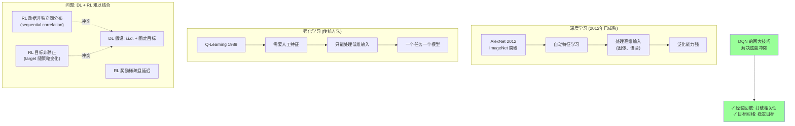

### 1.2 DL + RL 结合的根本困难

| 困难 | 深度学习的要求 | 强化学习的现实 | DQN 的解决方案 |
|------|--------------|--------------|--------------|
| **数据相关性** | 样本需要独立同分布 (i.i.d.) | 连续状态高度相关 | **经验回放** |
| **目标移动** | 目标 (label) 固定 | 目标值依赖自身参数 | **目标网络** |
| **数据分布** | 训练分布固定 | 策略变化导致数据分布变化 | **经验回放** (近似 i.i.d.) |
| **奖励稀疏** | 梯度信号充足 | 可能几百步才有一个奖励 | 奖励裁剪 + Q 值传播 |

### 1.3 Atari 2600：通用 AI 的基准

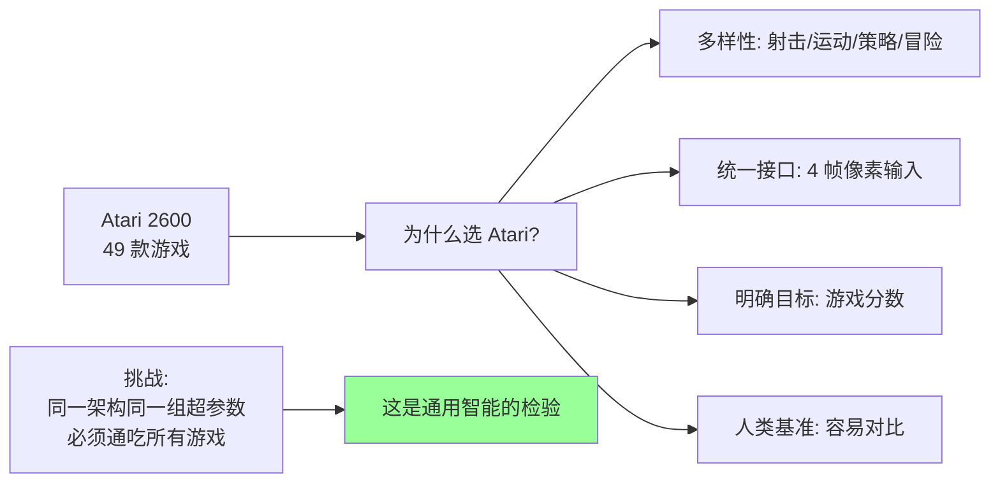

| 特点 | 说明 | 为什么重要 |
|------|------|-----------|
| **原始像素输入** | 84×84×4 帧灰度图 | 不需要人工特征工程 |
| **统一动作空间** | 最多 18 种操作 | 测试通用性 |
| **即时分数反馈** | 每步都有分数变化 | 奖励信号明确 |
| **需要长期规划** | 很多游戏需要策略 | 不仅是简单反射 |
| **49 款不同游戏** | 射击、运动、迷宫、策略 | 泛化能力的终极测试 |

---

## 2. 核心技术：从 Q-Learning 到 DQN

### 2.1 Q-Learning 回顾

DQN 的基础是经典的 Q-Learning 算法。我们先理解 Q-Learning 的核心思想：

```
Q-Learning 的核心思想:
    "学习每个状态-动作对的价值 Q(s, a)
     在每个状态下选择 Q 值最高的动作"

Q 值的定义:
    Q(s, a) = 在状态 s 执行动作 a 后，
              预期能获得的累积折扣奖励

    Q(s,a) = E[r + γr' + γ²r'' + ... | s, a]
```

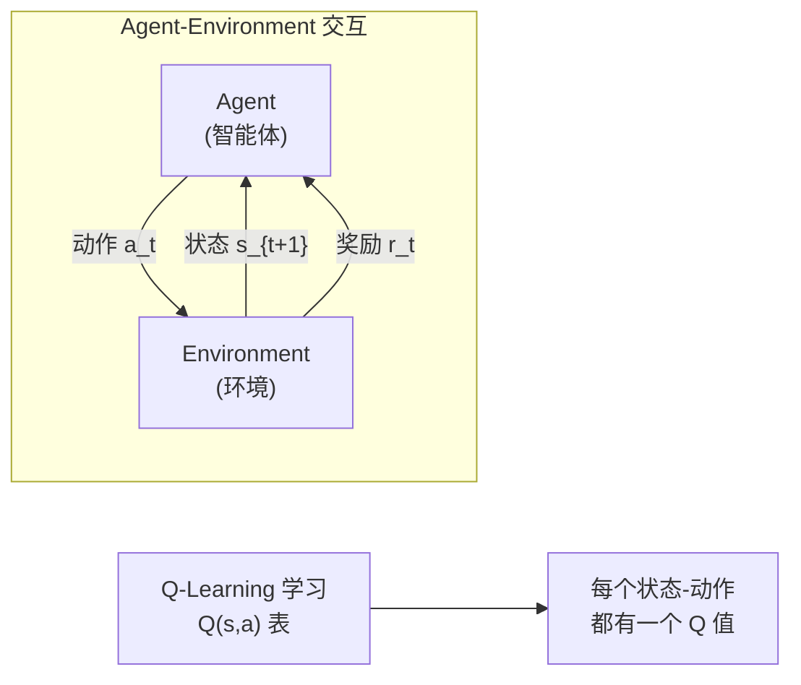

**Q-Learning 的更新规则（Bellman 方程）**：

$$Q(s_t, a_t) \leftarrow Q(s_t, a_t) + \alpha\left[r_t + \gamma \max_{a'} Q(s_{t+1}, a') - Q(s_t, a_t)\right]$$

| 符号 | 含义 | 类比 |
|------|------|------|
| $Q(s, a)$ | 状态-动作价值 | "在状态 s 做动作 a 值多少分" |
| $\alpha$ | 学习率 | "每次调整多少" |
| $\gamma$ | 折扣因子 (0-1) | "眼前的奖励 vs 未来的奖励" |
| $r_t$ | 即时奖励 | "这一步得了多少分" |
| $\max_{a'} Q(s_{t+1}, a')$ | 下一状态最佳价值 | "下一步最好能得多少分" |
| $r_t + \gamma \max Q$ | TD Target | "目标值" |

### 2.2 Q-Learning 的致命局限

```
传统 Q-Learning 使用表格 (Q-Table):

状态 \ 动作    左    右    上    下    开火
─────────────────────────────────────────
画面1          0.3   0.9   0.1   0.2   0.0
画面2          0.1   0.2   0.8   0.1   0.3
...

问题:
    Atari 状态空间 = 所有可能的 84×84 像素组合
    状态数 ≈ 256^(84×84) ≈ 天文数字

    Q-Table 不可能存得下!
    即使存得下, 也无法泛化到未见过的状态
```

### 2.3 DQN 的核心思想：用神经网络逼近 Q 函数

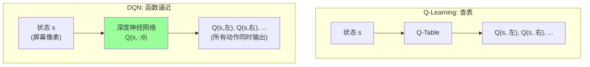

**DQN 的核心公式**：

$$Q(s, a; \theta) \approx Q^*(s, a)$$

用一个参数为 $\theta$ 的深度神经网络来逼近最优 Q 函数 $Q^*$。

### 2.4 DQN 的损失函数

DQN 使用**均方误差**作为损失函数：

$$L(\theta) = \mathbb{E}_{(s,a,r,s') \sim U(D)}\left[\left(r + \gamma \max_{a'} Q(s', a'; \theta^-) - Q(s, a; \theta)\right)^2\right]$$

| 符号 | 含义 |
|------|------|
| $\theta$ | 在线网络参数（不断更新） |
| $\theta^-$ | 目标网络参数（延迟更新） |
| $D$ | 经验回放池 |
| $U(D)$ | 从经验池中均匀采样 |
| $r + \gamma \max Q(s', a'; \theta^-)$ | TD Target（目标值） |
| $Q(s, a; \theta)$ | 当前预测值 |

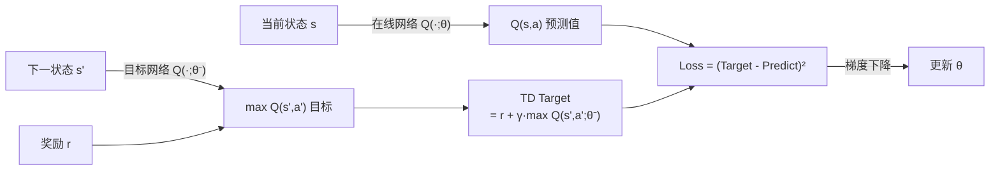

---

## 3. 两大核心技术

### 3.1 技术一：经验回放 (Experience Replay)

#### 3.1.1 为什么需要经验回放

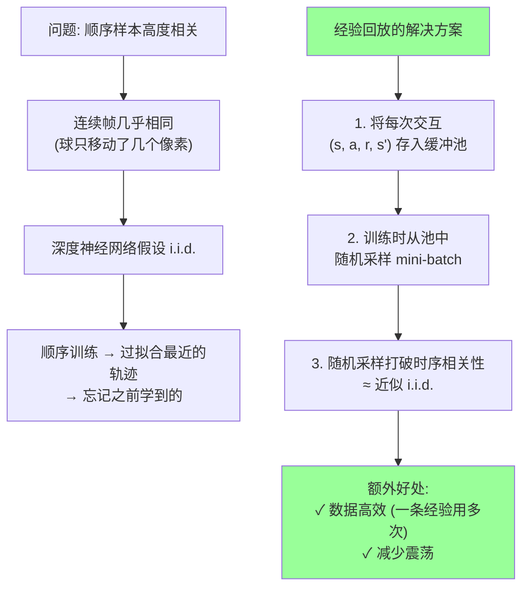

#### 3.1.2 经验回放的实现

```
经验回放池 D:
    存储: D = {(s₁,a₁,r₁,s₂), (s₂,a₃,r₂,s₃), (s₅,a₇,r₁,s₃), ...}
    容量: 通常 1,000,000 条
    采样: 均匀随机采样 mini-batch (通常 32 条)

交互流程:
    1. Agent 与环境交互, 产生 (s, a, r, s')
    2. 将 (s, a, r, s') 存入 D
    3. 从 D 随机采样 mini-batch
    4. 用 mini-batch 更新网络
    5. 重复
```

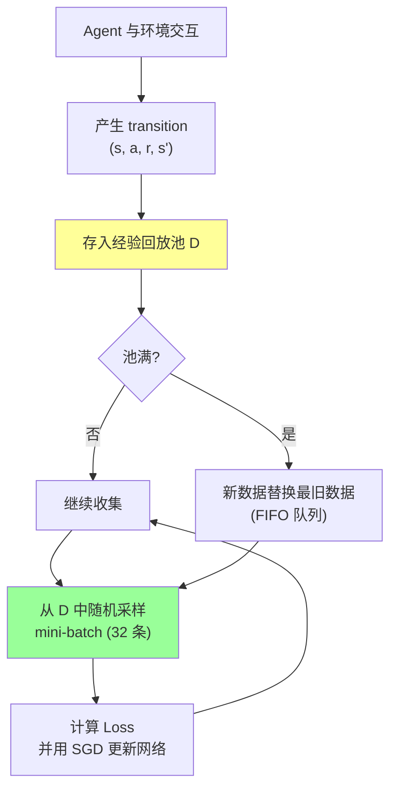

### 3.2 技术二：目标网络 (Target Network)

#### 3.2.1 为什么需要目标网络

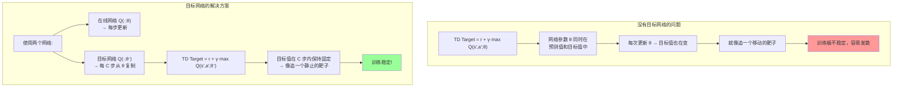

#### 3.2.2 目标网络的更新策略

```
目标网络的更新频率:
    每 C 步 (论文中 C=10,000) 将在线网络的参数复制到目标网络

    θ⁻ ← θ  (硬更新 / hard copy)

在两次复制之间:
    θ⁻ 保持不变
    目标值 r + γ·max Q(s',a';θ⁻) 保持固定
    → 可以稳定地优化在线网络 θ
```

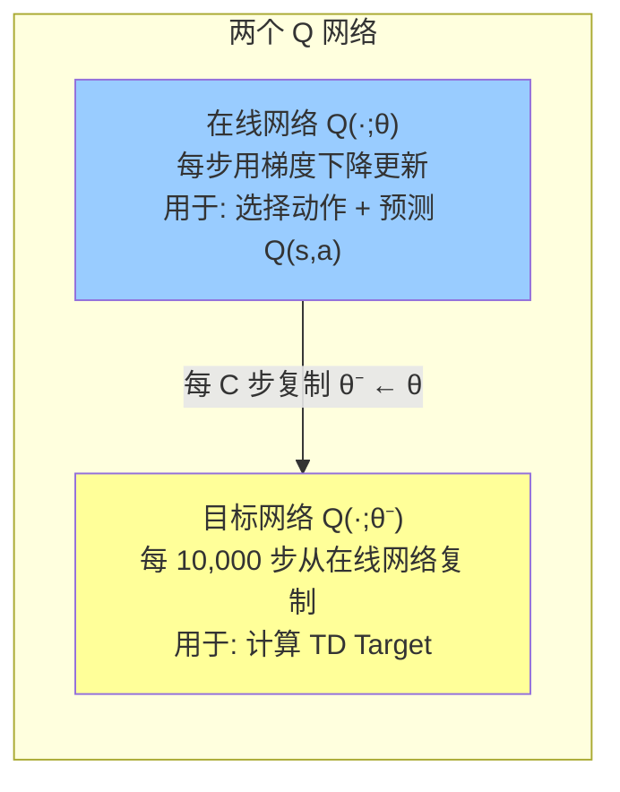

### 3.3 两大技术的协同效应

| 问题 | 经验回放解决 | 目标网络解决 |
|------|------------|------------|
| **数据相关性** | ✅ 随机采样打破时序相关 | — |
| **目标移动** | — | ✅ 固定目标 C 步不变 |
| **数据分布变化** | ✅ 池中混合新旧经验 | ✅ 缓解分布漂移影响 |
| **训练稳定性** | ✅ | ✅ |

> **关键洞察**：经验回放和目标网络单独使用都不够稳定，两者**结合**才能让深度 RL 收敛。这是 DQN 论文最重要的贡献。

---

## 4. DQN 完整架构

### 4.1 网络结构

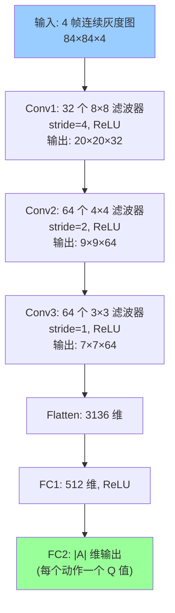

**网络设计的关键决策**：

| 设计选择 | 说明 | 原因 |
|---------|------|------|
| **输入 4 帧** | 4 帧堆叠 | 单帧无法判断运动方向和速度 |
| **共享网络** | 所有动作共享底层特征 | 不同动作有共同特征（场景理解） |
| **输出 |A| 维** | 每个动作一个 Q 值 | 一次前向传播得到所有 Q 值 |
| **CNN 架构** | 类似 AlexNet 简化版 | 自动从像素学习层次化特征 |

### 4.2 动作选择：ε-Greedy 策略

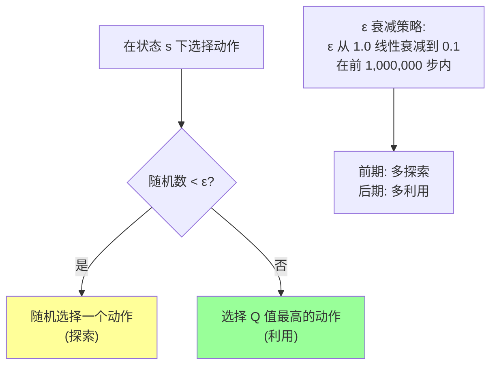

### 4.3 完整训练流程

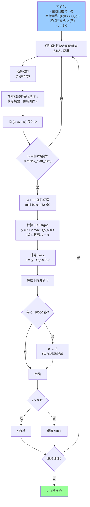

### 4.4 关键预处理细节

| 步骤 | 操作 | 原因 |
|------|------|------|
| **灰度化** | RGB → 灰度 | 颜色对游戏策略不重要 |
| **降采样** | 210×160 → 84×84 | 减少计算量 |
| **帧堆叠** | 4 帧堆叠为 1 个状态 | 提供运动信息 |
| **帧跳过** | 每 4 帧选择一次动作 | 减少决策频率，加速训练 |
| **奖励裁剪** | 所有奖励裁剪到 {-1, 0, 1} | 统一不同游戏的奖励尺度 |

### 4.5 关键超参数

| 超参数 | 值 | 说明 |
|--------|-----|------|
| **经验池大小** | 1,000,000 | 存储最近的 100 万次 transition |
| **Mini-batch** | 32 | 每次更新的样本数 |
| **折扣因子 γ** | 0.99 | 未来奖励的重要性 |
| **ε 初始值** | 1.0 | 初始探索率 (100% 随机) |
| **ε 最终值** | 0.1 | 最终探索率 (10% 随机) |
| **ε 衰减步数** | 1,000,000 | ε 线性衰减的步数 |
| **目标网络更新 C** | 10,000 | 目标网络更新频率 |
| **学习率** | 0.00025 | RMSProp 优化器 |
| **训练帧数** | 200,000,000 | 总训练帧数（约 38 天 GPU） |

---

## 5. 代码实现

### 5.1 DQN 完整 PyTorch 实现

```python
import torch
import torch.nn as nn
import torch.optim as optim
import numpy as np
from collections import deque
import random

class DQN_Network(nn.Module):
    """DQN 的卷积神经网络"""
    def __init__(self, input_shape, n_actions):
        super().__init__()
        self.conv = nn.Sequential(
            nn.Conv2d(input_shape[0], 32, kernel_size=8, stride=4),
            nn.ReLU(),
            nn.Conv2d(32, 64, kernel_size=4, stride=2),
            nn.ReLU(),
            nn.Conv2d(64, 64, kernel_size=3, stride=1),
            nn.ReLU()
        )
        conv_out = self._get_conv_out(input_shape)
        self.fc = nn.Sequential(
            nn.Linear(conv_out, 512),
            nn.ReLU(),
            nn.Linear(512, n_actions)
        )

    def _get_conv_out(self, shape):
        o = self.conv(torch.zeros(1, *shape))
        return int(np.prod(o.size()))

    def forward(self, x):
        conv_out = self.conv(x).view(x.size()[0], -1)
        return self.fc(conv_out)


class ReplayBuffer:
    """经验回放缓冲区"""
    def __init__(self, capacity):
        self.buffer = deque(maxlen=capacity)

    def push(self, state, action, reward, next_state, done):
        self.buffer.append((state, action, reward, next_state, done))

    def sample(self, batch_size):
        batch = random.sample(self.buffer, batch_size)
        states, actions, rewards, next_states, dones = zip(*batch)
        return (np.array(states), actions, rewards,
                np.array(next_states), dones)

    def __len__(self):
        return len(self.buffer)


class DQN_Agent:
    """DQN 智能体"""
    def __init__(self, input_shape, n_actions, 
                 lr=2.5e-4, gamma=0.99,
                 buffer_size=1_000_000, batch_size=32,
                 target_update=10_000, epsilon_start=1.0,
                 epsilon_final=0.1, epsilon_decay=1_000_000):
        self.device = torch.device("cuda" if torch.cuda.is_available() else "cpu")
        self.n_actions = n_actions
        self.gamma = gamma
        self.batch_size = batch_size
        self.target_update = target_update

        # 两个网络
        self.online_net = DQN_Network(input_shape, n_actions).to(self.device)
        self.target_net = DQN_Network(input_shape, n_actions).to(self.device)
        self.target_net.load_state_dict(self.online_net.state_dict())
        self.target_net.eval()  # 目标网络不训练

        # 优化器
        self.optimizer = optim.RMSprop(
            self.online_net.parameters(), lr=lr, eps=0.01)

        # 经验回放
        self.replay_buffer = ReplayBuffer(buffer_size)

        # epsilon 衰减
        self.epsilon_by_frame = lambda frame: max(
            epsilon_final,
            epsilon_start - (epsilon_start - epsilon_final) * frame / epsilon_decay
        )

    def select_action(self, state, frame_idx):
        epsilon = self.epsilon_by_frame(frame_idx)
        if random.random() < epsilon:
            return random.randrange(self.n_actions)  # 探索
        with torch.no_grad():
            state_t = torch.FloatTensor(state).unsqueeze(0).to(self.device)
            q_values = self.online_net(state_t)
            return q_values.argmax().item()  # 利用

    def update(self, frame_idx):
        if len(self.replay_buffer) < self.batch_size * 10:
            return None  # 经验不够，跳过

        # 1. 从回放池采样
        states, actions, rewards, next_states, dones = \
            self.replay_buffer.sample(self.batch_size)
        states_t = torch.FloatTensor(states).to(self.device)
        actions_t = torch.LongTensor(actions).to(self.device)
        rewards_t = torch.FloatTensor(rewards).to(self.device)
        next_states_t = torch.FloatTensor(next_states).to(self.device)
        dones_t = torch.BoolTensor(dones).to(self.device)

        # 2. 计算当前 Q 值
        current_q = self.online_net(states_t).gather(
            1, actions_t.unsqueeze(1)).squeeze(1)

        # 3. 计算目标 Q 值 (用目标网络!)
        with torch.no_grad():
            next_q = self.target_net(next_states_t).max(dim=1)[0]
            target_q = rewards_t + self.gamma * next_q * (~dones_t)

        # 4. 计算损失并更新
        loss = nn.functional.smooth_l1_loss(current_q, target_q)
        self.optimizer.zero_grad()
        loss.backward()
        # 梯度裁剪 (论文中的细节)
        nn.utils.clip_grad_norm_(self.online_net.parameters(), 10)
        self.optimizer.step()

        # 5. 定期更新目标网络
        if frame_idx % self.target_update == 0:
            self.target_net.load_state_dict(
                self.online_net.state_dict())

        return loss.item()
```

### 5.2 使用 Stable-Baselines3

```python
# pip install stable-baselines3[extra] gymnasium[atari]
from stable_baselines3 import DQN
from stable_baselines3.common.atari_wrappers import AtariWrapper
import gymnasium as gym

# 创建环境 (自动处理预处理)
env = gym.make("ALE/Breakout-v5")
env = AtariWrapper(env)  # 灰度化、降采样、帧堆叠

# 创建 DQN 模型
model = DQN(
    "CnnPolicy", env,
    learning_rate=2.5e-4,
    buffer_size=1_000_000,
    learning_starts=100_000,
    batch_size=32,
    gamma=0.99,
    target_update_interval=10_000,
    exploration_fraction=0.1,  # ε 衰减占总步数比例
    exploration_initial_eps=1.0,
    exploration_final_eps=0.1,
    verbose=1
)

# 训练
model.learn(total_timesteps=10_000_000)

# 评估
mean_reward, std_reward = evaluate_policy(model, env, n_eval_episodes=10)
print(f"Mean reward: {mean_reward:.2f} ± {std_reward:.2f}")
```

---

## 6. 实验结果

### 6.1 49 款 Atari 游戏的结果

DQN 在 49 款 Atari 游戏中的表现（以人类水平的百分比衡量）：

```
相对人类水平 (DQN 得分 / 人类专家得分 × 100%):

超过人类水平 (>100%):
  Boxing (1707%)    Breakout (1327%)   Enduro (846%)
  Pong (212%)       Space Invaders (1225%)  Video Pinball (3708%)
  ...

接近人类水平 (50-100%):
  Asterix (100%)    Beam Rider (176%)   Crazy Climber (266%)
  ...

低于人类水平 (<50%):
  Atlantis (37%)    Centipede (26%)     Montezuma's Revenge (0%)
  ...

统计:
  ≥ 75% 人类水平: 29/49 款游戏 (59%)
  ≥ 100% 人类水平: 22/49 款游戏 (45%)
  平均: 人类水平的 ~200%
```

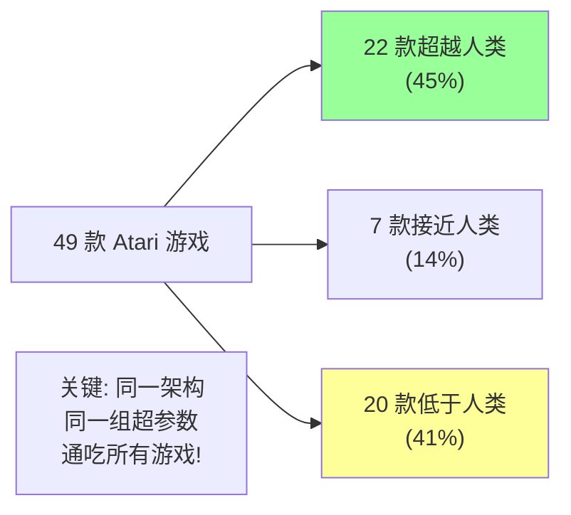

### 6.2 失败案例分析

| 游戏 | DQN 表现 | 失败原因 |
|------|---------|---------|
| **Montezuma's Revenge** | 0% | 稀疏奖励 + 需要长期规划 |
| **Private Eye** | 2% | 需要复杂的序列推理 |
| **Pitfall** | 0% | 需要精确的时序控制 |
| **Skiing** | 31% | 需要精确的路径规划 |

> **关键认识**：DQN 的失败案例揭示了 RL 的根本挑战——**探索**。在奖励极稀疏的环境中，ε-greedy 这种简单探索策略远远不够。

### 6.3 消融实验

| 配置 | 平均得分 (7 游戏) | 说明 |
|------|-----------------|------|
| **完整 DQN** | 100% (基线) | 两个技巧都用 |
| **去掉经验回放** | -40% | 性能严重下降 |
| **去掉目标网络** | -35% | 训练不稳定 |
| **去掉两者** | -80% | 几乎学不到东西 |

> **结论**：经验回放和目标网络缺一不可。

### 6.4 学到的表征可视化

```
DQN 的卷积层学到了什么?

Conv1 (第一层): 
  → 边缘、颜色块等低级特征
  → 类似视觉皮层的简单细胞

Conv2 (第二层):
  → 物体部件 (球拍、球、砖块)
  → 简单形状的组合

Conv3 (第三层):
  → 完整物体和空间关系
  → "球在这个位置，球拍在那个位置"

FC 层:
  → 抽象的游戏状态
  → 动作价值的评估

类似于大脑视觉通路: V1 → V2 → V4 → IT
```

---

## 7. DQN 的变体与演进

### 7.1 DQN 家族谱系

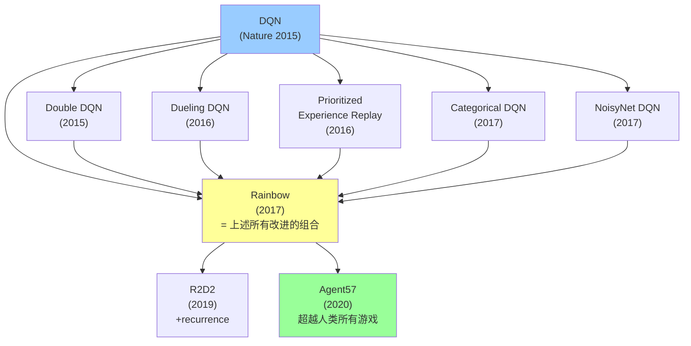

### 7.2 Double DQN (DDQN)

**问题**：标准 DQN 系统性地**高估** Q 值。

```
标准 DQN 的 Q 值过高估计问题:

TD Target = r + γ · max_a' Q(s', a'; θ⁻)

max 操作的偏差:
    E[max X] ≥ max E[X]  (Jensen 不等式)
    
    即使 Q 值估计是无偏的,
    max 操作也会引入正向偏差
    → Q 值被系统性高估
    → 次优动作被错误选为"最优"
```

**Double DQN 的解决方案**：用两个网络分别选择动作和评估价值：

| 步骤 | 标准 DQN | Double DQN |
|------|---------|------------|
| **选择动作** | 目标网络 $\arg\max Q(s', a'; \theta^-)$ | 在线网络 $\arg\max Q(s', a'; \theta)$ |
| **评估价值** | 目标网络 $Q(s', a^*; \theta^-)$ | 目标网络 $Q(s', a^*; \theta^-)$ |

$$\text{DDQN Target} = r + \gamma \cdot Q\left(s', \arg\max_{a'} Q(s', a'; \theta); \theta^-\right)$$

> **效果**：减少过高估计，性能提升约 10-15%。

### 7.3 Dueling DQN

**核心思想**：将 Q 值分解为状态价值 V(s) 和动作优势 A(s,a)。

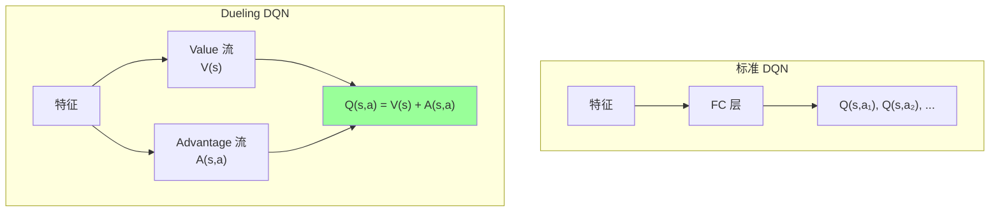

$$Q(s, a) = V(s) + \left(A(s, a) - \frac{1}{|A|}\sum_{a'} A(s, a')\right)$$

> **好处**：在动作影响不大的状态下（如等待场景），Value 流可以更快学习状态价值。

### 7.4 Prioritized Experience Replay (PER)

**核心思想**：不是均匀采样，而是优先采样 TD 误差大的经验（学得更多的经验）。

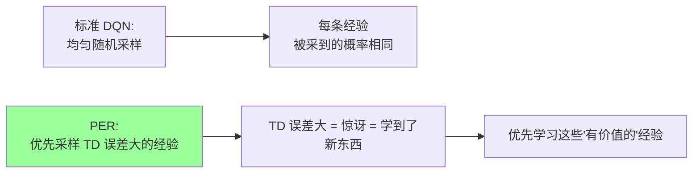

$$P(i) = \frac{|\delta_i|^\alpha}{\sum_j |\delta_j|^\alpha}$$

其中 $\delta_i$ 是第 i 条经验的 TD 误差，$\alpha$ 控制优先程度。

> **效果**：数据效率提升约 2 倍，训练收敛更快。

### 7.5 Rainbow DQN

Rainbow (Hessel et al., 2017) 将六种改进组合在一起：

| 改进 | 解决什么问题 |
|------|------------|
| **Double DQN** | Q 值过高估计 |
| **Dueling DQN** | V 和 A 分离 |
| **Prioritized Replay** | 采样效率 |
| **Categorical DQN** | 学习 Q 值分布而非期望 |
| **NoisyNet** | 更好的探索（替代 ε-greedy） |
| **Multi-step Learning** | 多步回报（偏差-方差权衡） |

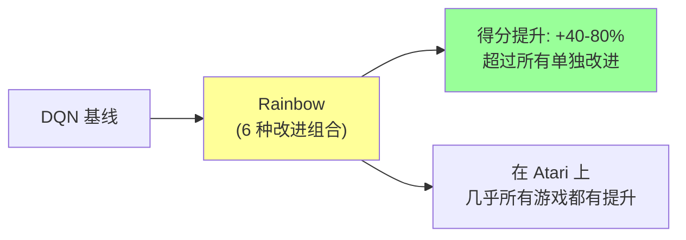

### 7.6 Agent57：超越人类所有游戏

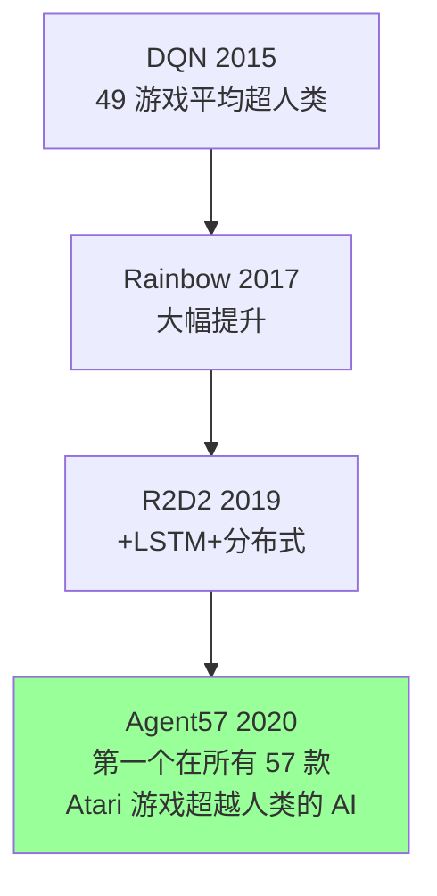

> Agent57 是 DQN 系列的集大成者，解决了 Montezuma's Revenge 等稀疏奖励游戏的探索难题。

### 7.7 DQN 变体总结表

| 变体 | 年份 | 核心改进 | 额外提升 |
|------|------|---------|---------|
| DQN | 2015 | 经验回放 + 目标网络 | 基线 |
| Double DQN | 2015 | 解耦动作选择和价值评估 | +10-15% |
| Dueling DQN | 2016 | V(s) + A(s,a) 分解 | +5-10% |
| PER | 2016 | 优先经验回放 | +15-20% |
| Categorical DQN | 2017 | Q 值分布学习 | +10-15% |
| NoisyNet | 2017 | 参数空间探索 | +5-10% |
| **Rainbow** | **2017** | **以上全部组合** | **+40-80%** |
| R2D2 | 2019 | +LSTM + 分布式训练 | +100%+ |
| **Agent57** | **2020** | **+自适应探索** | **超人类所有游戏** |

---

## 8. DQN 对后续工作的影响

### 8.1 开创的技术范式

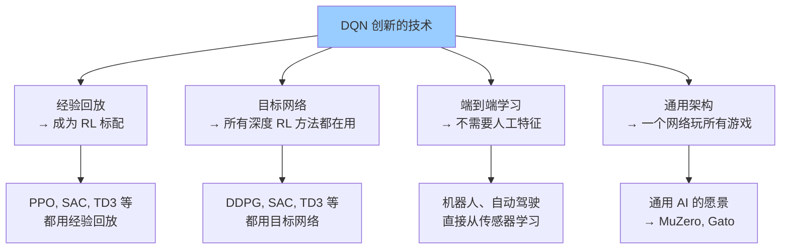

### 8.2 影响 AlphaGo

DQN 的成功直接启发了 AlphaGo（2016）：

| 共享技术 | DQN | AlphaGo |
|---------|-----|---------|
| **深度网络估值** | CNN 逼近 Q 函数 | CNN 评估棋盘 |
| **自我对弈训练** | 经验回放 | 自我对弈生成棋谱 |
| **蒙特卡洛方法** | — | MCTS + 深度网络 |

> **详见**: [[论文精读/RL/AlphaGo_Deep_Dive]]

### 8.3 影响 PPO 和现代 RL

DQN → PPO 的演进路径：

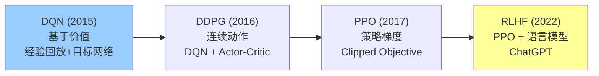

---

## 9. 局限性与挑战

| 局限 | 说明 | 后续改进 |
|------|------|---------|
| **样本效率极低** | 需要约 2 亿帧（38 天 GPU）才能学会 | PER, World Models |
| **仅离散动作** | 无法处理连续控制 | DDPG, PPO, SAC |
| **稀疏奖励困难** | Montezuma's Revenge = 0% | Intrinsic motivation, ICM |
| **ε-greedy 探索弱** | 随机探索无法发现复杂策略 | NoisyNet, curiosity |
| **灾难性遗忘** | 网络参数更新可能覆盖旧知识 |  continual learning |
| **没有规划能力** | 只能做反应式决策 | MCTS, MuZero |
| **无法处理部分可观测** | 只看 4 帧，无法长期记忆 | DRQN, R2D2 (LSTM) |

---

## 10. 关键知识点总结

```mermaid
mindmap
  root((DQN))
    历史地位
      深度RL的开山之作
      Nature 2015封面
      开创通用AI范式
    核心思想
      Q-Learning + 深度网络
      从像素到策略端到端
      同一架构玩49款游戏
    两大创新
      经验回放
        打破时序相关
        近似i.i.d.
        数据高效
      目标网络
        固定TD目标
        稳定训练
        每10000步复制
    算法细节
      CNN架构
      ε-greedy探索
      奖励裁剪
      帧堆叠
    演进路线
      Double DQN
      Dueling DQN
      PER
      Rainbow
      Agent57
    影响
      经验回放成标配
      目标网络成标配
      启发AlphaGo
      →PPO→RLHF→ChatGPT
```

### 10.1 DQN 的核心直觉

```
DQN 的"一句话哲学":

    "把强化学习当作有监督学习来做"

    Q-Learning: 把 RL 变成回归问题
        Target = r + γ · max Q(s', a')
        Predict = Q(s, a)
        Loss = (Target - Predict)²

    深度学习: 用 CNN 做这个回归
        输入: 屏幕像素
        输出: Q 值

    两大 trick 让这个回归问题变得可学:
        1. 经验回放: 让数据像 i.i.d. (DL 的假设)
        2. 目标网络: 让 target 像固定标签 (DL 的假设)
```

### 10.2 从 DQN 到现代 RL 的技术传承

| 技术 | 起源 | 现代应用 |
|------|------|---------|
| **经验回放** | DQN | 所有 off-policy RL 方法 (DDPG, SAC, TD3) |
| **目标网络** | DQN | 所有基于价值的深度 RL |
| **CNN 特征提取** | DQN | 视觉 RL, 自动驾驶, 机器人 |
| **奖励裁剪** | DQN | RL 训练标准化 |
| **帧堆叠** | DQN | 视觉时序建模 |

---

## Related

- [[论文精读/RL/PPO_Deep_Dive]] — PPO: DQN 之后 RL 领域的另一里程碑，策略梯度方法
- [[论文精读/RL/AlphaGo_Deep_Dive]] — AlphaGo: 受 DQN 启发的围棋 AI
- [[论文精读/Alignment/DPO_Deep_Dive]] — DPO: RLHF 中 PPO 的替代方案
- [[论文精读/Vision/AlexNet_Deep_Dive]] — AlexNet: DQN CNN 架构的灵感来源
- [[论文精读/Architecture/Attention_Is_All_You_Need_Deep_Dive]] — 注意力机制: 与 DQN 的 CNN 形成对比
- [[概念/Training/experience-replay]] — 经验回放技术详解
- [[概念/Training/target-network]] — 目标网络详解
- [[概念/General/q-learning]] — Q-Learning 基础

---

*本文是 [论文精读](../README.md) 系列的一部分，适合想深入理解深度强化学习基础的读者。*
*原始论文: [Human-level control through deep reinforcement learning](https://www.nature.com/articles/nature14236) (Nature 2015)*
*初版论文: [Playing Atari with Deep Reinforcement Learning](https://arxiv.org/abs/1312.5602) (NIPS Workshop 2013)*
