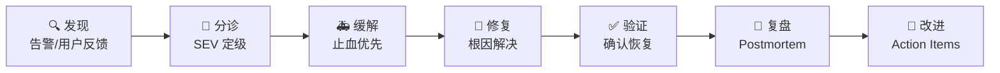
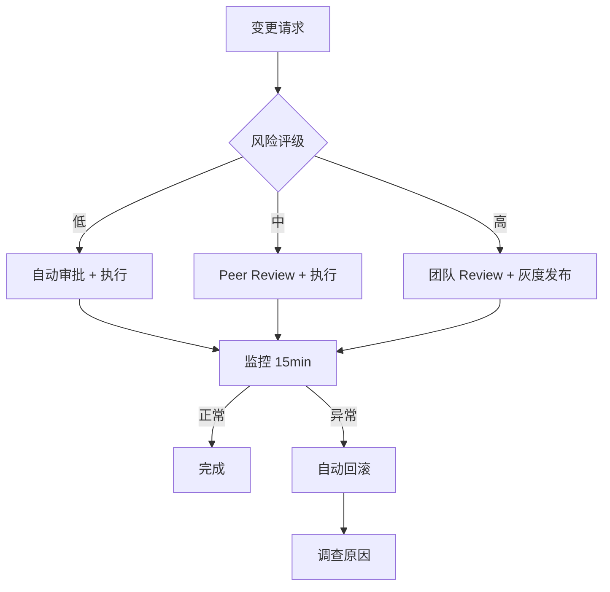

# AI 系统的 SRE 实践指南

> 🎯 **目标**：将 Google SRE 方法论应用于 AI/LLM 生产系统，建立可靠性工程体系 —— SLI/SLO 定义、错误预算、On-Call、事故响应和 Postmortem 文化。

---

## 一、为什么 AI 系统需要专属 SRE

### 传统 SRE vs AI SRE

```
传统 Web 服务                    AI/LLM 服务
═══════════════                  ═══════════════
确定性请求/响应                  非确定性输出（同一输入，不同结果）
固定延迟分布                     Token 生成延迟变化大（首 token vs 续 token）
二元成功/失败                    质量谱系（正确/部分正确/幻觉/拒绝）
资源消耗可预测                   GPU 显存/Token 吞吐量波动剧烈
部署 = 代码发布                  部署 = 代码 + 模型权重 + Prompt 版本
回滚简单                         回滚涉及模型版本、缓存失效、排队清理
```

### AI 系统的六大可靠性挑战

| # | 挑战 | 传统系统类比 | 影响 |
|---|------|------------|------|
| 1 | **模型退化** | 无——传统代码不变质 | 数据漂移导致输出质量缓慢下降 |
| 2 | **延迟方差** | 正常网络抖动 | 首 Token 延迟 (TTFT) 与续 Token 延迟差异巨大 |
| 3 | **幻觉输出** | 不会发生 | 看似正确实则错误的输出，难检测 |
| 4 | **成本爆炸** | CPU/Memory 可预测 | Token 消耗/推理成本可能突增 |
| 5 | **级联故障** | 服务依赖 | RAG → Embedding → LLM → 输出，链路长 |
| 6 | **安全边界** | WAF/权限 | Prompt 注入、越狱、数据泄漏 |

---

## 二、SLI/SLO 设计框架

### 2.1 核心概念

```
SLI (Service Level Indicator)  →  你测量什么
  "P95 首 Token 延迟 = 1.2s"

SLO (Service Level Objective)  →  你承诺什么
  "P95 首 Token 延迟 < 2s，连续 30 天"

SLA (Service Level Agreement)  →  你违约赔什么
  "SLO 未达成 → 客户获 10% 账单折扣"
```

### 2.2 AI 系统专属 SLI 目录

#### 延迟类 SLI

| SLI 名称 | 定义 | 采样方式 | 典型 SLO |
|----------|------|---------|---------|
| **TTFT** (Time To First Token) | 请求发出到首 Token 返回的时间 | 每请求日志 | P95 < 2s |
| **TPS** (Tokens Per Second) | 生成阶段每秒输出 Token 数 | 每请求日志 | P50 > 30 tok/s |
| **E2E Latency** (端到端延迟) | 用户请求到完整响应的总时间 | 客户端测量 | P99 < 30s |
| **Embedding Latency** | 向量化延迟 | 每请求日志 | P95 < 200ms |
| **RAG Retrieval Latency** | 知识检索延迟 | 每查询日志 | P95 < 500ms |

#### 质量类 SLI

| SLI 名称 | 定义 | 采样方式 | 典型 SLO |
|----------|------|---------|---------|
| **Hallucination Rate** | 幻觉输出占比 | 抽样人工评估 + LLM-as-Judge | < 5% |
| **Relevance Score** | 回答与问题相关度 | 用户反馈 + 自动评估 | > 85% |
| **Groundedness** | 回答基于提供上下文的比例 | 自动化检测 | > 90% |
| **Tool Call Success Rate** | Agent 工具调用成功率 | 执行日志 | > 95% |
| **Task Completion Rate** | 多步任务完成率 | 端到端测试 | > 80% |

#### 可用性类 SLI

| SLI 名称 | 定义 | 典型 SLO |
|----------|------|---------|
| **Request Success Rate** | 非 5xx 响应占比 | 99.9% |
| **Model Availability** | 模型服务可用时间 | 99.95% |
| **Rate Limit Rejection** | 因限流被拒请求占比 | < 0.1% |
| **Queue Overflow** | 排队溢出导致丢弃请求占比 | < 0.01% |

#### 成本类 SLI

| SLI 名称 | 定义 | 典型 SLO |
|----------|------|---------|
| **Cost Per Query** | 每次查询平均 Token 成本 | < $0.02 |
| **GPU Utilization** | GPU 计算利用率 | > 60% |
| **Cache Hit Rate** | Prompt/结果缓存命中率 | > 40% |

### 2.3 SLO 制定方法论

#### 金字塔法

```
              ┌──────────┐
              │  SLA     │  ← 商业承诺（法律约束）
              │ 99.9%    │
              ├──────────┤
              │  外部 SLO │  ← 面向客户（发布在 status page）
              │ 99.95%   │
              ├──────────┤
              │  内部 SLO │  ← 团队目标（比外部更严格）
              │ 99.99%   │
              ├──────────┤
              │  告警阈值 │  ← 触发 On-Call（最早预警）
              │ 99.995%  │
              └──────────┘
```

#### SLO 设置模板

```yaml
# SLO 定义模板
slo:
  name: "Chat API 首 Token 延迟"
  sli:
    type: "latency"
    metric: "llm_inference_time_to_first_token_seconds"
    measurement: "percentile"
    percentile: 95
  target: 2.0          # 秒
  window: "rolling_30d"
  owner: "platform-infra-team"
  
  error_budget:
    total_minutes_per_month: 43.2    # (1 - 0.999) × 43200 分钟
    remaining: "{{ computed }}"
    
  alerts:
    - name: "TTFT_SLO_burn_rate_fast"
      condition: "burn_rate > 14.4x"   # 1 小时内耗尽预算
      severity: "P1"
    - name: "TTFT_SLO_burn_rate_slow"
      condition: "burn_rate > 6x"      # 6 小时内耗尽预算
      severity: "P2"
```

### 2.4 错误预算策略

```
错误预算 = 100% - SLO 目标

例如 SLO = 99.9%（30天窗口）
错误预算 = 0.1% × 43,200 分钟 = 43.2 分钟/月

错误预算消耗决策树:
├── 预算剩余 > 50%
│   └── 正常发布节奏，无需特别行动
├── 预算剩余 20-50%
│   ├── 暂停非紧急变更
│   └── 优先处理影响 SLO 的 Bug
├── 预算剩余 < 20%
│   ├── 冻结发布（仅允许紧急修复）
│   ├── 全力投入到可靠性工作
│   └── 通知利益相关方
└── 预算耗尽
    ├── 完全冻结发布
    ├── 启动可靠性冲刺 (Reliability Sprint)
    └── Postmortem + 行动项
```

---

## 三、On-Call 体系设计

### 3.1 分级响应架构

```
┌─────────────────────────────────────────────────────┐
│                    On-Call 层级                      │
├──────────┬──────────────────┬───────────┬────────────┤
│  Level   │   响应时间       │  职责     │  典型岗位  │
├──────────┼──────────────────┼───────────┼────────────┤
│  L1      │  5 分钟          │  分诊+缓解│  值班运维  │
│  L2      │  15 分钟         │  诊断+修复│  平台工程师│
│  L3      │  30 分钟         │  深度分析 │  ML/AI工程师│
│  L4      │  按需（日常待命）│  架构决策 │  Tech Lead │
└──────────┴──────────────────┴───────────┴────────────┘
```

### 3.2 AI 系统专属告警规则

```yaml
# Prometheus 告警规则示例
groups:
  - name: llm_slo_burn_rate
    rules:
      - alert: LLMTTFTSLOBurnRateFast
        expr: |
          (
            sum(rate(llm_request_duration_seconds_bucket{le="2.0"}[1h]))
            /
            sum(rate(llm_request_duration_seconds_count[1h]))
          ) < 0.95
          and
          (
            1 - (
              sum(rate(llm_request_duration_seconds_bucket{le="2.0"}[1h]))
              /
              sum(rate(llm_request_duration_seconds_count[1h]))
            )
          ) > (1 - 0.95) * 14.4
        for: 5m
        labels:
          severity: critical
          team: platform-infra
        annotations:
          summary: "LLM TTFT SLO 快速消耗（1h 窗口）"
          runbook_url: "https://wiki/runbooks/llm-ttft-slo"

      - alert: LLMHighHallucinationRate
        expr: |
          (
            sum(rate(llm_hallucination_detected_total[1h]))
            /
            sum(rate(llm_evaluated_total[1h]))
          ) > 0.08
        for: 15m
        labels:
          severity: warning
          team: ai-quality
        annotations:
          summary: "LLM 幻觉率超过 8%（SLO < 5%）"
```

### 3.3 On-Call 交接检查清单

```markdown
## On-Call 交接清单

### 交接前（交出方）
- [ ] 所有活跃事故已记录在事故看板
- [ ] 进行中的修复有明确的 Next Step
- [ ] 近 24h 内的异常趋势已标注
- [ ] 暂时性 workaround 已文档化

### 接收后（接收方）
- [ ] 确认告警通道正常接收
- [ ] 审阅活跃事故状态
- [ ] 确认已知计划变更（deploy/maintenance）
- [ ] 确认值班通讯录已更新
```

---

## 四、事故响应流程

### 4.1 SEV 分级标准（AI 系统定制）

| SEV | 定义 | 响应时间 | 升级条件 | 示例 |
|-----|------|---------|---------|------|
| **SEV1** | 完全服务中断或严重质量退化 | 5 min | 立即升级 L3 | 模型推理全量超时；大量幻觉输出流入生产 |
| **SEV2** | 部分功能降级，SLO 违规中 | 15 min | 30min 无缓解升级 L3 | TTFT P95 > SLO；特定模型不可用 |
| **SEV3** | 性能波动，可能影响 SLO | 30 min | 2h 无缓解升级 L2 | 缓存命中率下降；成本突增 |
| **SEV4** | 观察到的异常，暂无影响 | 下一工作日 | N/A | 监控指标漂移；非关键日志异常 |

### 4.2 事故生命周期



### 4.3 事故沟通模板

#### 内部更新（每 15-30 min）

```
【事故更新】#INC-2026-0411-001

SEV: 1
状态: 调查中
影响: Chat API TTFT P95 > 8s（SLO: < 2s）
范围: 约 35% 用户请求受影响
当前进展:
  - 14:05 确认 GPU 集群 A 利用率 100%
  - 14:12 排除模型变更（无近期部署）
  - 14:18 怀疑 Batch Job 占用推理资源
  - 14:22 正在迁移 Batch Job 到集群 B
下一步:
  - 等待迁移完成（预计 10 min）
  - 验证 TTFT 恢复
```

#### 外部更新（Status Page）

```
[Investigating] Elevated API Latency

We are investigating reports of increased response times for
our Chat API. Approximately 35% of requests are experiencing
delays exceeding normal levels.

Our engineering team is actively working to resolve the issue.
We will provide an update within 30 minutes.

Apr 11, 2026 - 14:25 UTC
```

---

## 五、Postmortem 文化

### 5.1 Blameless 原则

```
❌ 错误态度："谁搞砸了？"
✅ 正确态度："系统为什么没能防止这个错误？"
```

### 5.2 Postmortem 模板

```markdown
# Postmortem: #INC-2026-0411-001 — Chat API 延迟飙升

## 基本信息
| 项 | 内容 |
|---|------|
| 日期 | 2026-04-11 |
| 持续时间 | 14:00 - 14:47 (47 min) |
| 影响 | 35% 用户请求 TTFT > 8s |
| SEV | SEV1 |
| 作者 | @oncall-platform |

## 时间线 (UTC)
| 时间 | 事件 |
|------|------|
| 14:00 | 告警: TTFT P95 > 5s |
| 14:03 | L1 确认, 升级 L2 |
| 14:05 | 发现 GPU 集群 A 利用率 100% |
| 14:12 | 排除模型变更 |
| 14:18 | 确认 Batch Job 抢占推理资源 |
| 14:22 | 开始迁移 Batch Job |
| 14:35 | 迁移完成 |
| 14:40 | TTFT 恢复到 P95 1.8s |
| 14:47 | 确认稳定, 关闭事故 |

## 根因分析 (5 Whys)
1. TTFT 为什么飙升？ → GPU 集群 A 利用率 100%
2. 为什么利用率 100%？ → Batch 训练任务占用推理 GPU
3. 为什么 Batch 任务在推理集群？ → 资源调度器配置缺少隔离策略
4. 为什么缺少隔离策略？ → 新集群扩容时未同步调度配置
5. 为什么扩容流程没有检查项？ → 扩容 Checklist 中缺少资源隔离检查

## Action Items
| # | 行动 | 负责人 | 优先级 | 截止日期 |
|---|------|--------|--------|---------|
| 1 | 推理/训练 GPU 资源池隔离 | @infra-lead | P0 | 4/14 |
| 2 | 扩容 Checklist 增加资源隔离检查项 | @sre-lead | P0 | 4/12 |
| 3 | 添加 GPU 资源池利用率告警 | @monitoring | P1 | 4/18 |
| 4 | Batch Job 优先级调度策略 | @ml-platform | P1 | 4/21 |

## 经验教训
✅ 做得好的：快速定位、沟通及时
❌ 需要改进的：扩容流程缺少资源隔离验证
🔄 流程变更：扩容 SOP 增加 GPU 隔离检查
```

### 5.3 AI 系统常见根因模式

| 根因模式 | 出现频率 | 预防措施 |
|---------|---------|---------|
| **模型退化** | 高 | 自动化质量评估 + 漂移监控 |
| **Prompt 注入** | 高 | 输入清洗 + 输出过滤 + 红队测试 |
| **GPU 资源争抢** | 中 | 训练/推理资源池隔离 |
| **缓存失效风暴** | 中 | 缓存预热 + 渐进式失效 |
| **上游 API 限流** | 中 | 多供应商降级 + Token 池管理 |
| **数据管道延迟** | 中 | RAG 索引新鲜度监控 |
| **模型版本回退** | 低 | 蓝/绿部署 + 影子流量验证 |

---

## 六、变更管理

### 6.1 AI 系统的变更类型

```
变更风险矩阵（从低到高）
═══════════════════════════════════════════════════════════

低风险:
  ├── Prompt 文案微调（A/B 测试保护）
  ├── 监控规则更新
  └── 非关键配置变更

中风险:
  ├── 模型热更新（同架构，新版权重）
  ├── RAG 知识库更新
  ├── Temperature / Top-P 参数调整
  └── 缓存策略变更

高风险:
  ├── 模型架构切换（如 GPT-4 → Claude）
  ├── 推理框架升级（vLLM 版本升级）
  ├── GPU 驱动更新
  ├── 数据库 Schema 变更
  └── 网络拓扑变更
```

### 6.2 变更审批流程



### 6.3 模型部署安全检查清单

```markdown
## 模型部署 Checklist

### 部署前
- [ ] 模型在 Staging 环境通过 E2E 测试
- [ ] 评估集上质量指标符合基线（无退化）
- [ ] 延迟/吞吐 Bench 符合预期
- [ ] GPU 显存占用已验证
- [ ] 回滚方案已准备（前一版本权重已存档）
- [ ] 相关 Runbook 已更新

### 部署中
- [ ] 使用灰度发布（先 5% → 25% → 50% → 100%）
- [ ] 每阶段观察至少 15 分钟
- [ ] 关键 SLI 仪表板已打开
- [ ] On-Call 已知晓

### 部署后
- [ ] 验证所有 SLO 正常
- [ ] 抽样检查输出质量
- [ ] 成本指标在预期范围
- [ ] 部署记录已更新到变更日志
```

---

## 七、可靠性工程实践

### 7.1 混沌工程（AI 系统版）

| 故障注入 | 验证目标 | 预期自动响应 |
|---------|---------|------------|
| 杀掉推理节点 | 多副本高可用 | 流量自动切换，延迟波动 < 2x |
| 模拟上游 API 限流 | 降级策略 | 自动切换备用供应商 |
| 注入畸形 Prompt | 输入验证 | 拒绝/清洗，不崩溃 |
| 模拟 GPU OOM | 内存管理 | 请求排队/降级到小模型 |
| RAG 索引不可用 | 缓解策略 | 降级到无 RAG 模式 |
| 模拟 Token 突增 | 成本控制 | 自动限流 + 告警 |

### 7.2 容量规划公式

```
GPU 需求 = (峰值 QPS × 平均输入 Token × 单 Token 计算量) / GPU 算力 × 安全系数

其中:
- 安全系数 = 1.3（预留 30% 余量应对突发和滚动更新）
- 单 Token 计算量 ≈ 2 × 模型参数量（Transformer 前向传播 FLOPs）
- GPU 算力 = GPU TFLOPS × 利用率（通常 40-60%）

示例（7B 模型，FP16，A100）:
= (100 QPS × 512 tok × 2 × 7B FLOPs/tok) / (312 TFLOPS × 0.5) × 1.3
= (100 × 512 × 14G) / 156G × 1.3
= 716.8 / 156 × 1.3
≈ 6 张 A100
```

### 7.3 SLO 看板设计

```
┌─────────────────────────────────────────────────────┐
│              AI 服务可靠性看板                        │
├─────────────┬─────────────┬─────────────┬────────────┤
│ SLO 目标    │ 30d 错误预算 │ 剩余预算    │ 趋势       │
├─────────────┼─────────────┼─────────────┼────────────┤
│ TTFT < 2s   │ 43.2 min    │ 28.1 min ✅ │ ↗ 恢复中   │
│ 可用性 99.9%│ 43.2 min    │ 5.3 min  ⚠️ │ ↘ 预算紧张 │
│ 幻觉 < 5%   │ N/A         │ 2.1% 当前   │ → 稳定     │
│ TPS > 30    │ 43.2 min    │ 41.0 min ✅ │ → 稳定     │
│ 成本 < $0.02│ $864/mo     │ $412 剩余 ✅│ → 稳定     │
├─────────────┴─────────────┴─────────────┴────────────┤
│ 近 7 天事故: SEV1: 0 | SEV2: 1 | SEV3: 3            │
│ 平均 MTTR: 22 min | P75 MTTR: 35 min                 │
│ 变更成功率: 97.2% | 本月部署: 43                      │
└──────────────────────────────────────────────────────┘
```

---

## 八、工具链参考

### 8.1 AI SRE 工具矩阵

| 层级 | 工具 | 用途 |
|------|------|------|
| **指标采集** | Prometheus + OTel | 推理指标、延迟直方图 |
| **日志聚合** | Loki / ELK | 请求/响应日志、审计日志 |
| **链路追踪** | Jaeger / Tempo | RAG → Embedding → LLM 全链路 |
| **告警管理** | Alertmanager / PagerDuty | 分级路由、On-Call 轮值 |
| **SLO 追踪** | Sloth / Pyrra | 错误预算自动计算 |
| **混沌工程** | Chaos Mesh / Litmus | GPU/网络/依赖故障注入 |
| **质量评估** | Phoenix / Langfuse | 幻觉检测、质量打分 |
| **成本追踪** | OpenMeter / Vantage | Token 粒度成本分配 |

### 8.2 关键指标采集埋点

```python
from prometheus_client import Histogram, Counter, Gauge

ttft_seconds = Histogram(
    "llm_time_to_first_token_seconds",
    "Time to first token",
    buckets=[0.5, 1.0, 1.5, 2.0, 3.0, 5.0, 10.0, 30.0],
    labelnames=["model", "provider"]
)

tokens_per_second = Histogram(
    "llm_output_tokens_per_second",
    "Token generation throughput",
    buckets=[5, 10, 20, 30, 50, 80, 100],
    labelnames=["model"]
)

hallucination_total = Counter(
    "llm_hallucination_detected_total",
    "Detected hallucination responses",
    labelnames=["model", "detection_method"]
)

gpu_memory_utilization = Gauge(
    "gpu_memory_utilization_ratio",
    "GPU memory utilization",
    labelnames=["gpu_id", "cluster"]
)

request_cost_dollars = Counter(
    "llm_request_cost_dollars_total",
    "Accumulated request cost in USD",
    labelnames=["model", "team", "environment"]
)
```

---

## 九、组织实践

### 9.1 SRE 团队嵌入模式

| 模式 | 描述 | 适用规模 |
|------|------|---------|
| **嵌入式** | SRE 工程师加入 AI 产品团队 | 中小规模 |
| **中心式** | 专职 SRE 团队服务多个 AI 产品 | 大规模 |
| **混合式** | 中心制定标准 + 嵌入执行 | 推荐（大规模） |

### 9.2 SRE 参与 AI 系统生命周期的时机

```
设计阶段 → SRE 参与 SLI/SLO 设计、容量预估、架构评审
开发阶段 → SRE 审查可观测性埋点、设计 Runbook
测试阶段 → SRE 执行混沌实验、验证降级策略
部署阶段 → SRE 审批变更、监控灰度
运行阶段 → SRE 响应事故、执行 Postmortem
优化阶段 → SRE 分析错误预算、推动可靠性改进
```

---

## 🔗 相关主题

- [AI Ops 2026](../AIOps_Fundamentals/AI_Ops_2026.md) — 智能运维完整体系
- [AI Ops 速成](../AIOps_Fundamentals/AIOps-in-nutshell.md) — AI Ops 核心概念
- [Cloud Ops 2026](../../模型运维/Cloud_Ops_Agent/Cloud_Product_Ops_2026.md) — 云产品运维
- [部署与推理](../../部署推理/Deployment_Fundamentals/Inference-in-nutshell.md) — 推理优化
- [AI 成本优化](../../架构基建/Architecture_Overview/AI_Cost_Optimization_2026.md) — Token 经济学
- [AI 安全](../../伦理安全/AI_Security_2026/) — 安全红队

> 📅 **最后更新**：2026-04-11 | **方法论**：Google SRE Book + AI 生产实践

## Related

- [[运维/AIOps_Fundamentals/AIOps-in-nutshell]] — AI Ops 速成指南 (共享: ai-ops, incident-response, monitoring, observability)
- [[运维/SRE_Reliability/AI_Incident_Response_Playbook]] — AI 系统事故响应手册 (共享: ai-ops, incident-response, monitoring, observability)
- [[运维/AIOps_Fundamentals/AI_Ops_for_dummy]] — AI Ops 入门指南 (for Dummies) (共享: ai-ops, incident-response, monitoring, observability)
- [[运维/README]] — AI 运维与可观测性 (AI Ops) (共享: ai-ops, incident-response, monitoring, observability)
